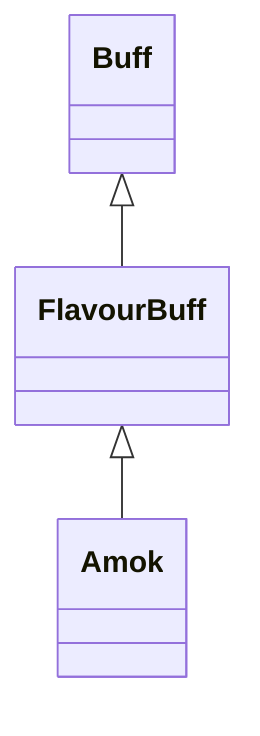

# Amok 类文档

## 1. 基本信息

| 属性 | 值 |
|------|-----|
| **文件路径** | core/src/main/java/com/shatteredpixel/shatteredpixeldungeon/actors/buffs/Amok.java |
| **包名** | com.shatteredpixel.shatteredpixeldungeon.actors.buffs |
| **类类型** | public class |
| **继承关系** | extends FlavourBuff |
| **代码行数** | 59 行 |
| **官方中文名** | 狂乱 |

## 2. 文件职责说明

Amok 类表示“狂乱”Buff。它是一个负面 FlavourBuff，主要职责是提供状态图标，并在 Buff 结束时清理敌人之间因狂乱建立的互相仇恨关系。

**核心职责**：
- 标记这是一个负面且会公告的 Buff
- 提供 `AMOK` 图标
- 在分离时重置敌对单位之间的临时仇恨

## 3. 结构总览

```
Amok (extends FlavourBuff)
├── 初始化块
│   ├── type = NEGATIVE
│   └── announced = true
├── 方法
│   ├── icon(): int
│   └── detach(): void
└── 无自有字段
```

## 4. 继承与协作关系

### 继承关系图



### 协作关系

| 协作类 | 协作方式 |
|--------|----------|
| **FlavourBuff** | 父类，提供带时限 Buff 能力 |
| **BuffIndicator** | 提供狂乱图标编号 |
| **Dungeon.level.mobs** | 分离时遍历所有怪物 |
| **Mob** | 清理互相仇恨关系 |
| **Char.Alignment.ENEMY** | 判断目标是否属于敌对阵营 |

## 5. 字段与常量详解

Amok 没有自有字段。\n
### 初始化块

```java
{
    type = buffType.NEGATIVE;
    announced = true;
}
```

表示该 Buff：
- 属于负面状态
- 施加时会公告

## 6. 构造与初始化机制

Amok 没有显式构造函数。通常通过：

```java
Buff.affect(target, Amok.class, duration);
```

附着到目标。

## 7. 方法详解

### icon()

```java
@Override
public int icon()
```

返回 `BuffIndicator.AMOK`，用于 Buff 图标显示。

### detach()

```java
@Override
public void detach()
```

**职责**：在狂乱结束时重置因狂乱而出现的敌人互殴仇恨。\n
**执行流程**：
1. 若 `target.isAlive()` 且目标阵营是 `Char.Alignment.ENEMY`：
   - 遍历 `Dungeon.level.mobs`。
   - 若某个敌对怪物 `m` 正在以 `target` 为目标，则 `m.aggro(null)` 清空目标。\n
   - 若 `target` 本身也是 `Mob` 且正在以 `m` 为目标，则同样 `aggro(null)`。\n
2. 调用 `super.detach()` 完成父类移除逻辑。

## 8. 对外暴露能力

| 方法 | 用途 |
|------|------|
| `icon()` | UI 显示狂乱图标 |
| `detach()` | 结束时执行仇恨清理 |

## 9. 运行机制与调用链

```
Buff.affect(target, Amok.class, duration)
└── 初始化块设置 NEGATIVE / announced

Buff 到期或被移除
└── Amok.detach()
    ├── [target 为存活敌人] 遍历 Dungeon.level.mobs
    │   ├── m.isTargeting(target) -> m.aggro(null)
    │   └── target.isTargeting(m) -> target.aggro(null)
    └── super.detach()
```

## 10. 资源、配置与国际化关联

文件：`core/src/main/assets/messages/actors/actors_zh.properties`

```properties
actors.buffs.amok.name=狂乱
actors.buffs.amok.desc=狂乱会导致目标陷入极度愤怒和混乱的状态。
```

本类没有覆写 `desc()`，描述文本由继承链通用逻辑读取。

## 11. 使用示例

```java
Buff.affect(enemy, Amok.class, 5f);

if (enemy.buff(Amok.class) != null) {
    // 敌人处于狂乱状态
}
```

## 12. 开发注意事项

- 本类的关键不在施加时，而在 `detach()` 的仇恨清理。
- 仇恨清理只对“仍然存活且属于敌对阵营”的目标生效。
- 若未来敌人 AI 目标系统改动，`isTargeting()` / `aggro(null)` 这套清理逻辑需要同步检查。

## 13. 修改建议与扩展点

- 若需要让狂乱结束后恢复原始目标，而不是清空目标，需在 Buff 持续期间额外记录旧目标。
- 若将来盟友或中立单位也可能被狂乱影响，可扩展 `detach()` 的阵营判定。

## 14. 事实核查清单

- [x] 已覆盖全部自有方法
- [x] 已验证继承关系 `extends FlavourBuff`
- [x] 已验证 `NEGATIVE` 与 `announced = true`
- [x] 已验证图标为 `BuffIndicator.AMOK`
- [x] 已验证分离时的敌对仇恨清理逻辑
- [x] 已核对中文名来自官方翻译
- [x] 无臆测性机制说明
