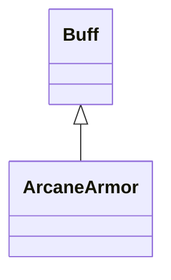

# ArcaneArmor 类文档

## 1. 基本信息

| 属性 | 值 |
|------|-----|
| **文件路径** | core/src/main/java/com/shatteredpixel/shatteredpixeldungeon/actors/buffs/ArcaneArmor.java |
| **包名** | com.shatteredpixel.shatteredpixeldungeon.actors.buffs |
| **类类型** | public class |
| **继承关系** | extends Buff |
| **代码行数** | 120 行 |
| **官方中文名** | 奥术护甲 |

## 2. 文件职责说明

ArcaneArmor 类表示“奥术护甲”Buff。它以 `level` 和 `interval` 为核心参数，按固定间隔衰减护甲值，并在数值耗尽时自动移除。

**核心职责**：
- 维护当前护甲等级 `level`
- 维护衰减间隔 `interval`
- 周期性递减护甲等级
- 提供图标、图标文本、描述和存档恢复

## 3. 结构总览

```
ArcaneArmor (extends Buff)
├── 字段
│   ├── level: int
│   └── interval: int
├── 方法
│   ├── act(): boolean
│   ├── level(): int
│   ├── set(int,int): void
│   ├── delay(float): void
│   ├── icon(): int
│   ├── tintIcon(Image): void
│   ├── iconFadePercent(): float
│   ├── iconTextDisplay(): String
│   ├── desc(): String
│   ├── storeInBundle(Bundle): void
│   └── restoreFromBundle(Bundle): void
```

## 4. 继承与协作关系

### 继承关系图



### 协作关系

| 协作类 | 协作方式 |
|--------|----------|
| **Buff** | 父类，提供计时与附着能力 |
| **Hero** | 用于图标淡出百分比计算 |
| **BuffIndicator** | 图标编号 |
| **Image** | 图标染色 |
| **Messages** | 描述文本国际化 |
| **Bundle** | 存档读写 |

## 5. 字段与常量详解

### 实例字段

| 字段 | 类型 | 说明 |
|------|------|------|
| `level` | int | 当前奥术护甲强度 |
| `interval` | int | 每次衰减发生的间隔 |

### Bundle 键

| 常量 | 值 | 用途 |
|------|-----|------|
| `LEVEL` | `level` | 保存护甲等级 |
| `INTERVAL` | `interval` | 保存衰减间隔 |

## 6. 构造与初始化机制

初始化块：

```java
{
    type = buffType.POSITIVE;
}
```

常见初始化：

```java
ArcaneArmor armor = Buff.affect(hero, ArcaneArmor.class);
armor.set(5, 3);
```

## 7. 方法详解

### act()

若目标存活：
- `spend(interval)`
- `--level`
- 当 `level <= 0` 时 `detach()`

若目标死亡：直接 `detach()`。

### level()

返回当前 `level`。

### set(int value, int time)

```java
if (Math.sqrt(interval)*level < Math.sqrt(time)*value) {
    level = value;
    interval = time;
    spend(time - cooldown() - 1);
}
```

它不是简单比较数值，而是比较 `sqrt(interval) * level` 与 `sqrt(time) * value`，偏向更高强度且更短间隔的组合。

### delay(float value)

调用 `spend(value)` 直接延后下一次衰减。

### icon() / tintIcon()

- 图标：`BuffIndicator.ARMOR`
- 染色：`icon.hardlight(1f, 0.5f, 2f)`

### iconFadePercent()

若目标是 `Hero`：

```java
float max = ((Hero) target).lvl/2 + 5;
return (max-level)/max;
```

非英雄目标返回 0。

### iconTextDisplay()

返回当前 `level` 的字符串。

### desc()

```java
Messages.get(this, "desc", level, dispTurns(visualcooldown()))
```

### storeInBundle() / restoreFromBundle()

保存并恢复 `interval` 与 `level`。

## 8. 对外暴露能力

| 方法 | 用途 |
|------|------|
| `level()` | 查询当前护甲等级 |
| `set(int,int)` | 设置或刷新护甲 |
| `delay(float)` | 推迟衰减 |

## 9. 运行机制与调用链

```
Buff.affect(target, ArcaneArmor.class)
└── set(value, time)
    └── 依据 sqrt(interval)*level 比较是否覆盖

Buff 调度系统
└── ArcaneArmor.act()
    ├── spend(interval)
    ├── --level
    └── [level <= 0] detach()
```

## 10. 资源、配置与国际化关联

文件：`core/src/main/assets/messages/actors/actors_zh.properties`

```properties
actors.buffs.arcanearmor.name=奥术护甲
actors.buffs.arcanearmor.desc=一层淡薄的护盾环绕着你，可为你抵挡一定的魔法伤害。
```

## 11. 使用示例

```java
ArcaneArmor armor = Buff.affect(hero, ArcaneArmor.class);
armor.set(4, 3);
armor.delay(1f);
```

## 12. 开发注意事项

- `set()` 的覆盖规则不是简单“大值覆盖小值”。
- 图标淡出逻辑对英雄和非英雄目标不同。
- 本类负责数值维护，不直接处理实际魔法减伤计算。

## 13. 修改建议与扩展点

- 若要让比较逻辑更易懂，可把覆盖公式提取成独立方法。
- 若要统一 Barkskin 和 ArcaneArmor，可考虑抽取共同父类。

## 14. 事实核查清单

- [x] 已覆盖全部字段与方法
- [x] 已验证继承关系 `extends Buff`
- [x] 已验证 `POSITIVE` 初始化
- [x] 已验证 `set()` 的平方根比较规则
- [x] 已验证图标、染色与文本显示
- [x] 已验证 `Bundle` 存档字段
- [x] 已核对中文名来自官方翻译
- [x] 无臆测性机制说明
