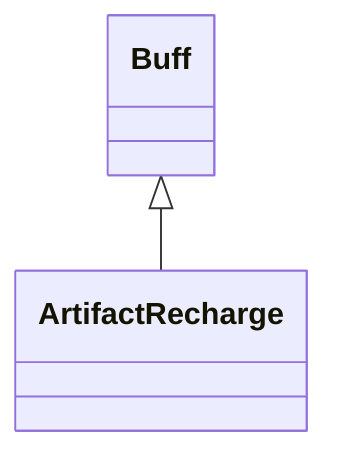

# ArtifactRecharge 类文档

## 1. 基本信息

| 属性 | 值 |
|------|-----|
| **文件路径** | core/src/main/java/com/shatteredpixel/shatteredpixeldungeon/actors/buffs/ArtifactRecharge.java |
| **包名** | com.shatteredpixel.shatteredpixeldungeon.actors.buffs |
| **类类型** | public class |
| **继承关系** | extends Buff |
| **代码行数** | 135 行 |
| **官方中文名** | 神器充能 |

## 2. 文件职责说明

ArtifactRecharge 类表示“神器充能”Buff。它在若干回合内持续为英雄身上的神器 Buff 充能，并支持排除 `HornOfPlenty` 的特殊开关。

**核心职责**：
- 维护剩余充能时间 `left`
- 每回合给非诅咒神器充能
- 可选择忽略丰饶之角
- 提供描述、图标与存档逻辑

## 3. 结构总览

```
ArtifactRecharge (extends Buff)
├── 常量
│   └── DURATION: float = 30f
├── 字段
│   ├── left: float
│   └── ignoreHornOfPlenty: boolean
├── 方法
│   ├── act(): boolean
│   ├── set(float): ArtifactRecharge
│   ├── extend(float): ArtifactRecharge
│   ├── left(): float
│   ├── icon(): int
│   ├── tintIcon(Image): void
│   ├── iconFadePercent(): float
│   ├── iconTextDisplay(): String
│   ├── desc(): String
│   ├── storeInBundle(Bundle): void
│   ├── restoreFromBundle(Bundle): void
│   └── chargeArtifacts(Hero,float): void$
```

## 4. 继承与协作关系

### 继承关系图



### 协作关系

| 协作类 | 协作方式 |
|--------|----------|
| **Buff** | 父类，提供计时能力 |
| **Hero** | Buff 主要作用目标 |
| **Artifact.ArtifactBuff** | 每回合被充能的目标 Buff 类型 |
| **HornOfPlenty.hornRecharge** | 可被 `ignoreHornOfPlenty` 排除 |
| **BuffIndicator** | 图标编号 |
| **Image** | 图标染色 |
| **Messages** | 描述文本国际化 |
| **Bundle** | 存档读写 |

## 5. 字段与常量详解

### 常量

| 常量 | 类型 | 值 | 说明 |
|------|------|----|------|
| `DURATION` | float | `30f` | 图标淡出基准时长 |

### 实例字段

| 字段 | 类型 | 说明 |
|------|------|------|
| `left` | float | 剩余充能时间 |
| `ignoreHornOfPlenty` | boolean | 是否跳过 `HornOfPlenty.hornRecharge` |

## 6. 构造与初始化机制

初始化块：

```java
{
    type = buffType.POSITIVE;
}
```

常见创建：

```java
ArtifactRecharge recharge = Buff.affect(hero, ArtifactRecharge.class);
recharge.set(ArtifactRecharge.DURATION);
```

## 7. 方法详解

### act()

**职责**：每回合为符合条件的神器 Buff 充能，并递减剩余时间。\n
**执行逻辑**：
1. 若 `target instanceof Hero`：
   - `chargeAmount = Math.min(1, left)`
   - 遍历 `target.buffs()`
   - 找到 `Artifact.ArtifactBuff`
   - 若该 Buff 是 `HornOfPlenty.hornRecharge` 且 `ignoreHornOfPlenty` 为真，则跳过
   - 若神器 Buff 未被诅咒，则调用 `charge((Hero) target, chargeAmount)`
2. `left--`
3. 若 `left < 0`，`detach()`；否则 `spend(TICK)`

### set(float amount)

当 `left < amount` 时更新 `left`，不会缩短已有剩余时间。

### extend(float amount)

直接 `left += amount`，用于叠加额外时长。

### left()

返回当前剩余时长。

### icon() / tintIcon()

- 图标：`BuffIndicator.RECHARGING`
- 染色：`icon.hardlight(0, 1f, 0)`

### iconFadePercent()

公式：

```java
Math.max(0, (DURATION - left) / DURATION)
```

### iconTextDisplay()

返回 `Integer.toString((int)left + 1)`。

### desc()

调用：

```java
Messages.get(this, "desc", dispTurns(left+1))
```

### storeInBundle() / restoreFromBundle()

保存并恢复：
- `left`
- `ignoreHornOfPlenty`

### chargeArtifacts(Hero hero, float turns)

静态工具方法，直接遍历英雄身上的 `Artifact.ArtifactBuff`，对未诅咒神器执行 `charge(hero, turns)`。

## 8. 对外暴露能力

| 方法 | 用途 |
|------|------|
| `set(float)` | 设置至少保留多少剩余时长 |
| `extend(float)` | 直接追加时长 |
| `left()` | 查询剩余时长 |
| `chargeArtifacts(Hero,float)` | 静态直接充能所有神器 |

## 9. 运行机制与调用链

```
Buff.affect(hero, ArtifactRecharge.class)
└── set(amount)

Buff 调度系统
└── ArtifactRecharge.act()
    ├── 遍历 hero.buffs()
    ├── 充能未诅咒的 ArtifactBuff
    ├── left--
    └── [left < 0] detach()
```

## 10. 资源、配置与国际化关联

文件：`core/src/main/assets/messages/actors/actors_zh.properties`

```properties
actors.buffs.artifactrecharge.name=神器充能
actors.buffs.artifactrecharge.desc=魔力在你体内奔腾而过，提高你手中神器的充能速率。
```

## 11. 使用示例

```java
ArtifactRecharge recharge = Buff.affect(hero, ArtifactRecharge.class);
recharge.set(ArtifactRecharge.DURATION);
recharge.ignoreHornOfPlenty = true;

ArtifactRecharge.chargeArtifacts(hero, 5f);
```

## 12. 开发注意事项

- `left < 0` 才分离，而不是 `left <= 0`，源码注释说明这是为了与法杖充能的视觉显示保持一致。
- `chargeAmount = Math.min(1, left)` 允许最后一个回合只按不足 1 的剩余时长充能。
- `chargeArtifacts()` 与实例 `act()` 的过滤条件略有不同：静态方法不会特别排除丰饶之角。

## 13. 修改建议与扩展点

- 若未来需要更细粒度控制不同神器的充能倍率，可把 `chargeAmount` 逻辑抽成策略方法。
- 若想统一实例与静态工具方法的行为，可复用同一套内部遍历逻辑。

## 14. 事实核查清单

- [x] 已覆盖全部字段、常量与方法
- [x] 已验证继承关系 `extends Buff`
- [x] 已验证 `ignoreHornOfPlenty` 的过滤逻辑
- [x] 已验证 `left < 0` 时才分离
- [x] 已验证图标、淡出与文本显示
- [x] 已验证 `Bundle` 存档字段
- [x] 已核对中文名来自官方翻译
- [x] 无臆测性机制说明
