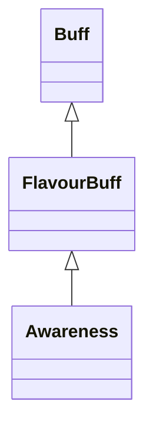

# Awareness 类文档

## 1. 基本信息

| 属性 | 值 |
|------|-----|
| **文件路径** | core/src/main/java/com/shatteredpixel/shatteredpixeldungeon/actors/buffs/Awareness.java |
| **包名** | com.shatteredpixel.shatteredpixeldungeon.actors.buffs |
| **类类型** | public class |
| **继承关系** | extends FlavourBuff |
| **代码行数** | 41 行 |
| **官方中文名** | 危险预知 |

## 2. 文件职责说明

Awareness 类表示“危险预知”Buff。它是一个短时正面 FlavourBuff，本类唯一的自定义行为是在 Buff 结束时刷新观察结果和战争迷雾。

**核心职责**：
- 定义短时正面状态
- 在移除时重新执行视野观察
- 刷新场景迷雾显示

## 3. 结构总览

```
Awareness (extends FlavourBuff)
├── 常量
│   └── DURATION: float = 2f
├── 初始化块
│   └── type = POSITIVE
└── 方法
    └── detach(): void
```

## 4. 继承与协作关系

### 继承关系图



### 协作关系

| 协作类 | 协作方式 |
|--------|----------|
| **FlavourBuff** | 父类，提供带时限 Buff 行为 |
| **Dungeon** | 调用 `observe()` 重新计算观察结果 |
| **GameScene** | 调用 `updateFog()` 刷新迷雾显示 |

## 5. 字段与常量详解

### 常量

| 常量 | 类型 | 值 | 说明 |
|------|------|----|------|
| `DURATION` | float | `2f` | 默认持续时间 |

### 初始化块

```java
{
    type = buffType.POSITIVE;
}
```

## 6. 构造与初始化机制

Awareness 没有显式构造函数。通常通过：

```java
Buff.affect(hero, Awareness.class, Awareness.DURATION);
```

施加到目标。

## 7. 方法详解

### detach()

```java
@Override
public void detach()
```

**职责**：在 Buff 结束时刷新视野与迷雾。\n
**执行流程**：
1. 调用 `super.detach()` 移除 Buff。
2. 调用 `Dungeon.observe()` 重新计算可观察区域。
3. 调用 `GameScene.updateFog()` 刷新迷雾渲染。

## 8. 对外暴露能力

| 方法/成员 | 用途 |
|-----------|------|
| `DURATION` | 标准持续时间 |
| `detach()` | 结束时刷新视野显示 |

## 9. 运行机制与调用链

```
Buff.affect(hero, Awareness.class, DURATION)
└── Buff 到期或被移除
    └── Awareness.detach()
        ├── super.detach()
        ├── Dungeon.observe()
        └── GameScene.updateFog()
```

## 10. 资源、配置与国际化关联

文件：`core/src/main/assets/messages/actors/actors_zh.properties`

```properties
actors.buffs.foresight.name=危险预知
actors.buffs.foresight.desc=不知为何，你的脑海中映射出了周遭的地形。
```

注意：源码类名为 `Awareness`，官方中文翻译键使用的是 `foresight`。

## 11. 使用示例

```java
Buff.affect(hero, Awareness.class, Awareness.DURATION);
```

## 12. 开发注意事项

- 本类没有覆写 `icon()`、`desc()`，相关展示行为来自继承链默认实现。
- 关键行为是 `detach()` 末尾的观察与迷雾刷新；若漏掉这两步，Buff 结束后的视野显示会不同步。

## 13. 修改建议与扩展点

- 若未来希望在 Buff 生效时也立即强制刷新一次视野，可考虑覆写 `attachTo()`。
- 若要和其他侦测类 Buff 统一，可把刷新逻辑抽成公共工具方法。

## 14. 事实核查清单

- [x] 已覆盖全部自有方法与常量
- [x] 已验证继承关系 `extends FlavourBuff`
- [x] 已验证 `type = POSITIVE`
- [x] 已验证 `detach()` 中的 `Dungeon.observe()`
- [x] 已验证 `GameScene.updateFog()` 调用
- [x] 已核对官方中文名来自翻译文件
- [x] 已注明类名与翻译键不一致这一事实
- [x] 无臆测性机制说明
