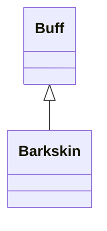

# Barkskin 类文档

## 1. 基本信息

| 属性 | 值 |
|------|-----|
| **文件路径** | core/src/main/java/com/shatteredpixel/shatteredpixeldungeon/actors/buffs/Barkskin.java |
| **包名** | com.shatteredpixel.shatteredpixeldungeon.actors.buffs |
| **类类型** | public class |
| **继承关系** | extends Buff |
| **代码行数** | 137 行 |
| **官方中文名** | 树肤 |

## 2. 文件职责说明

Barkskin 类表示“树肤”Buff。它以 `level` 与 `interval` 维护物理护甲增益，支持多个实例并存：持续时间可以通过多个实例叠加，但实际生效护甲取当前最高等级。

**核心职责**：
- 维护当前树肤等级与衰减间隔
- 周期性衰减等级
- 提供静态工具方法读取最高树肤等级
- 支持同间隔 Buff 的条件性刷新

## 3. 结构总览

```
Barkskin (extends Buff)
├── 字段
│   ├── level: int
│   └── interval: int
├── 方法
│   ├── act(): boolean
│   ├── level(): int
│   ├── set(int,int): void
│   ├── delay(float): void
│   ├── icon(): int
│   ├── iconFadePercent(): float
│   ├── iconTextDisplay(): String
│   ├── desc(): String
│   ├── storeInBundle(Bundle): void
│   ├── restoreFromBundle(Bundle): void
│   ├── currentLevel(Char): int$
│   └── conditionallyAppend(Char,int,int): void$
```

## 4. 继承与协作关系

### 继承关系图



### 协作关系

| 协作类 | 协作方式 |
|--------|----------|
| **Buff** | 父类，提供附着与计时 |
| **Char** | 树肤目标与静态工具方法参数 |
| **Hero** | 图标淡出计算依赖英雄等级 |
| **Talent** | 图标淡出计算读取 `BARKSKIN` 天赋点数 |
| **BuffIndicator** | 图标编号 |
| **Messages** | 描述文本国际化 |
| **Bundle** | 存档读写 |

## 5. 字段与常量详解

### 实例字段

| 字段 | 类型 | 说明 |
|------|------|------|
| `level` | int | 当前树肤强度 |
| `interval` | int | 每次衰减发生的间隔 |

### Bundle 键

| 常量 | 值 | 用途 |
|------|-----|------|
| `LEVEL` | `level` | 保存当前等级 |
| `INTERVAL` | `interval` | 保存衰减间隔 |

## 6. 构造与初始化机制

初始化块：

```java
{
    type = buffType.POSITIVE;
}
```

常见创建方式：

```java
Buff.append(hero, Barkskin.class).set(3, 2);
```

## 7. 方法详解

### act()

逻辑与 `ArcaneArmor` 类似：
- 目标存活：`spend(interval)`，然后 `--level`
- `level <= 0` 时移除
- 目标死亡则直接移除

### level()

返回当前 `level`。

### set(int value, int time)

```java
if (level <= value) {
    level = value;
    interval = time;
    spend(time - cooldown() - 1);
}
```

规则比 `ArcaneArmor` 更简单：只要新值不低于当前值就覆盖。

### delay(float value)

调用 `spend(value)` 延后衰减。

### icon()

返回 `BuffIndicator.BARKSKIN`。

### iconFadePercent()

若目标是 `Hero`：

```java
float max = hero.lvl * hero.pointsInTalent(Talent.BARKSKIN) / 2;
max = Math.max(max, 2 + hero.lvl/3);
return Math.max(0, (max-level)/max);
```

### iconTextDisplay()

返回 `level` 字符串。

### desc()

通过：

```java
Messages.get(this, "desc", level, dispTurns(visualcooldown()))
```

生成说明文本。

### currentLevel(Char ch)

遍历目标身上的所有 `Barkskin` Buff，返回最高 `level`。

### conditionallyAppend(Char ch, int level, int interval)

先遍历目标已有的 `Barkskin`：
- 若发现 `interval` 相同的实例，则对该实例执行 `set(level, interval)` 并返回
- 否则 `Buff.append(ch, Barkskin.class).set(level, interval)` 新建一个实例

### storeInBundle() / restoreFromBundle()

保存并恢复 `interval` 与 `level`。

## 8. 对外暴露能力

| 方法 | 用途 |
|------|------|
| `level()` | 查询当前实例等级 |
| `set(int,int)` | 设置/刷新当前实例 |
| `currentLevel(Char)` | 查询目标所有树肤中的最高等级 |
| `conditionallyAppend(Char,int,int)` | 条件性刷新或追加树肤 |

## 9. 运行机制与调用链

```
Buff.append(target, Barkskin.class).set(level, interval)
└── Barkskin 实例建立

Buff 调度系统
└── Barkskin.act()
    ├── spend(interval)
    ├── --level
    └── [level <= 0] detach()

其他系统
└── Barkskin.currentLevel(ch)
    └── 遍历 ch.buffs(Barkskin.class) 取最大值
```

## 10. 资源、配置与国际化关联

文件：`core/src/main/assets/messages/actors/actors_zh.properties`

```properties
actors.buffs.barkskin.name=树肤
actors.buffs.barkskin.desc=你的皮肤硬化了，摸起来如同树皮般粗糙而坚固。
```

## 11. 使用示例

```java
Barkskin.conditionallyAppend(hero, 4, 2);

int strongest = Barkskin.currentLevel(hero);
```

## 12. 开发注意事项

- 树肤允许多个实例并存，但实际护甲只取最高等级，这也是 `currentLevel()` 存在的原因。
- `conditionallyAppend()` 以 `interval` 为分组条件，而不是按来源或等级分组。
- 图标淡出计算依赖英雄天赋点数 `Talent.BARKSKIN`。

## 13. 修改建议与扩展点

- 若未来需要更明确的堆叠规则，可把“同 interval 归并”逻辑抽成独立策略。
- 若要和 `ArcaneArmor` 共享更多代码，可抽象出通用“递减护甲 Buff”父类。

## 14. 事实核查清单

- [x] 已覆盖全部字段、方法与静态工具方法
- [x] 已验证继承关系 `extends Buff`
- [x] 已验证 `POSITIVE` 初始化
- [x] 已验证 `set()` 的覆盖规则
- [x] 已验证 `currentLevel()` 与 `conditionallyAppend()` 的行为
- [x] 已验证图标、文本与淡出计算
- [x] 已验证 `Bundle` 存档字段
- [x] 已核对中文名来自官方翻译
- [x] 无臆测性机制说明
