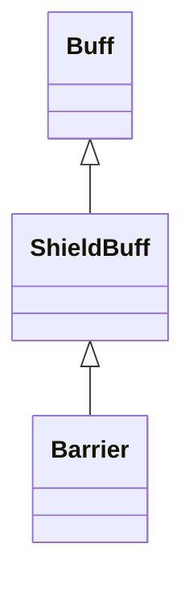

# Barrier 类文档

## 1. 基本信息

| 属性 | 值 |
|------|-----|
| **文件路径** | core/src/main/java/com/shatteredpixel/shatteredpixeldungeon/actors/buffs/Barrier.java |
| **包名** | com.shatteredpixel.shatteredpixeldungeon.actors.buffs |
| **类类型** | public class |
| **继承关系** | extends ShieldBuff |
| **代码行数** | 112 行 |
| **官方中文名** | 奥术屏障 |

## 2. 文件职责说明

Barrier 类表示“奥术屏障”Buff。它基于 `ShieldBuff` 提供护盾值，并让护盾按时间逐步自然衰减；衰减速度会受到 `HoldFast` 的减速系数影响。

**核心职责**：
- 继承 `ShieldBuff` 的护盾吸收能力
- 维护护盾自然衰减的浮点累计值 `partialLostShield`
- 在护盾启用/关闭时同步角色精灵的 `SHIELDED` 状态
- 保存并恢复衰减累计值

## 3. 结构总览

```
Barrier (extends ShieldBuff)
├── 字段
│   └── partialLostShield: float
├── 方法
│   ├── incShield(int): void
│   ├── setShield(int): void
│   ├── act(): boolean
│   ├── fx(boolean): void
│   ├── icon(): int
│   ├── tintIcon(Image): void
│   ├── iconTextDisplay(): String
│   ├── desc(): String
│   ├── storeInBundle(Bundle): void
│   └── restoreFromBundle(Bundle): void
```

## 4. 继承与协作关系

### 继承关系图



### 协作关系

| 协作类 | 协作方式 |
|--------|----------|
| **ShieldBuff** | 父类，提供护盾存储与伤害吸收 |
| **HoldFast** | 提供护盾衰减倍率 `buffDecayFactor(target)` |
| **Blocking.BlockBuff** | 关闭视觉效果时决定是否保留 `SHIELDED` 状态 |
| **CharSprite.State.SHIELDED** | 护盾视觉状态 |
| **BuffIndicator** | 图标编号 |
| **Image** | 图标染色 |
| **Messages** | 描述文本国际化 |
| **Bundle** | 存档读写 |

## 5. 字段与常量详解

### 实例字段

| 字段 | 类型 | 说明 |
|------|------|------|
| `partialLostShield` | float | 护盾自然衰减的浮点累计量；累计到 `>= 1f` 时才真正损失 1 点护盾 |

### 继承字段

Barrier 主要依赖 `ShieldBuff` 的：

| 继承字段 | 用途 |
|----------|------|
| `shielding` | 当前护盾值（通过 `shielding()` 访问） |
| `detachesAtZero` | 护盾归零时是否自动移除 |

### Bundle 键

| 常量 | 值 | 用途 |
|------|-----|------|
| `PARTIAL_LOST_SHIELD` | `partial_lost_shield` | 保存衰减累计值 |

## 6. 构造与初始化机制

初始化块：

```java
{
    type = buffType.POSITIVE;
}
```

Barrier 常见创建方式：

```java
Barrier barrier = Buff.affect(hero, Barrier.class);
barrier.setShield(10);
```

## 7. 方法详解

### incShield(int amt)

先调用 `super.incShield(amt)` 增加护盾值，再把 `partialLostShield` 归零。\n
含义：新增护盾会重置自然衰减累计进度。

### setShield(int shield)

先调用 `super.setShield(shield)`。若设置成功后当前护盾值恰好等于传入值，说明这次设置实际生效，于是把 `partialLostShield` 归零。

### act()

```java
partialLostShield += Math.min(1f, shielding()/20f) * HoldFast.buffDecayFactor(target);
```

这是 Barrier 的核心衰减公式。\n
**执行流程**：
1. 依据当前护盾值和 `HoldFast` 系数累加衰减量。\n
2. 当 `partialLostShield >= 1f`：
   - 调用 `absorbDamage(1)` 实际消耗 1 点护盾
   - `partialLostShield = 0`
3. 若 `shielding() <= 0`，移除 Buff
4. `spend(TICK)`

### fx(boolean on)

- `on == true`：给目标精灵添加 `CharSprite.State.SHIELDED`
- `on == false`：若目标没有 `Blocking.BlockBuff`，则移除 `SHIELDED`

### icon() / tintIcon()

- 图标：`BuffIndicator.ARMOR`
- 染色：`icon.hardlight(0.5f, 1f, 2f)`

### iconTextDisplay()

返回当前护盾值：

```java
Integer.toString(shielding())
```

### desc()

```java
Messages.get(this, "desc", shielding())
```

### storeInBundle() / restoreFromBundle()

除了父类保存的护盾值，还额外保存 `partialLostShield`。

## 8. 对外暴露能力

| 方法 | 用途 |
|------|------|
| `incShield(int)` | 增加护盾并重置衰减累计 |
| `setShield(int)` | 设置护盾并在成功时重置衰减累计 |
| `shielding()` | 继承自父类，查询当前护盾值 |

## 9. 运行机制与调用链

```
Barrier.act()
├── 计算 partialLostShield 累计值
├── [>= 1f] absorbDamage(1)
├── [shielding <= 0] detach()
└── spend(TICK)

角色受伤
└── ShieldBuff.processDamage(target, damage, src)
    └── Barrier.absorbDamage(...)
```

## 10. 资源、配置与国际化关联

文件：`core/src/main/assets/messages/actors/actors_zh.properties`

```properties
actors.buffs.barrier.name=奥术屏障
actors.buffs.barrier.desc=一团可以抵挡全部伤害的能量屏障。
```

## 11. 使用示例

```java
Barrier barrier = Buff.affect(hero, Barrier.class);
barrier.setShield(12);
barrier.incShield(3);
```

## 12. 开发注意事项

- `Barrier` 的自然衰减不是每回合固定减 1，而是依赖 `partialLostShield` 浮点累计。
- `HoldFast.buffDecayFactor(target)` 会改变衰减速度，甚至可能返回 0。
- `fx(false)` 不会在目标仍有 `Blocking.BlockBuff` 时移除 `SHIELDED`，避免视觉状态被错误清掉。

## 13. 修改建议与扩展点

- 若要调整 Barrier 手感，可优先修改自然衰减公式而不是直接改 `ShieldBuff`。
- 如果后续出现更多共享 `SHIELDED` 外观的护盾 Buff，可把 `fx()` 的保留逻辑抽象到父类。

## 14. 事实核查清单

- [x] 已覆盖全部字段与方法
- [x] 已验证继承关系 `extends ShieldBuff`
- [x] 已验证自然衰减公式
- [x] 已验证与 `HoldFast.buffDecayFactor()` 的协作
- [x] 已验证 `SHIELDED` 视觉状态处理
- [x] 已验证 `Bundle` 存档字段
- [x] 已核对中文名来自官方翻译
- [x] 无臆测性机制说明
