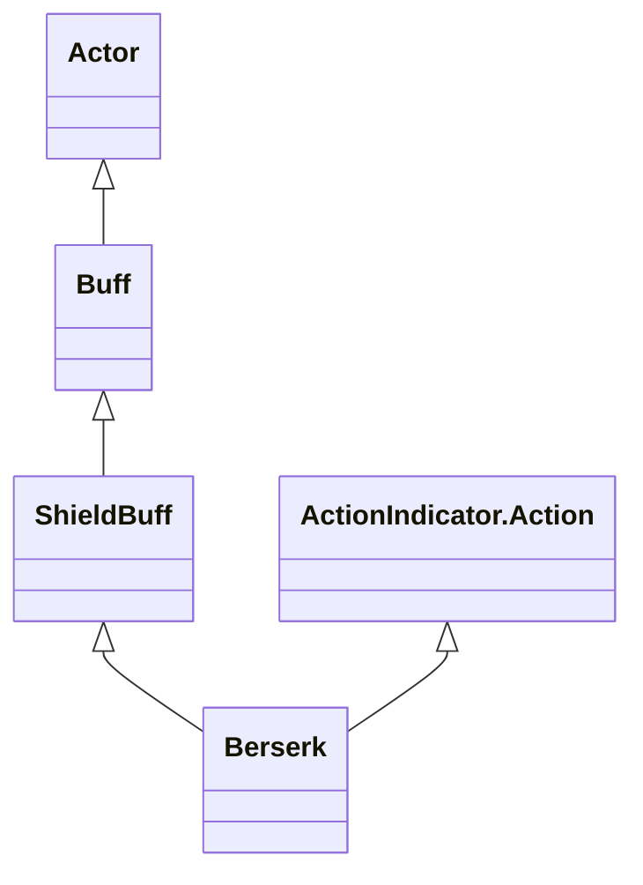

# Berserk 类文档

## 1. 基本信息
| 属性 | 值 |
|------|-----|
| 文件路径 | core/src/main/java/com/shatteredpixel/shatteredpixeldungeon/actors/buffs/Berserk.java |
| 包名 | com.shatteredpixel.shatteredpixeldungeon.actors.buffs |
| 类类型 | class |
| 继承关系 | extends ShieldBuff implements ActionIndicator.Action |
| 代码行数 | 376 |

## 2. 类职责说明
Berserk（狂暴）是一个复杂的正面护盾类状态效果，具有三种状态：普通（NORMAL）、狂暴（BERSERK）和恢复（RECOVERING）。它通过累积伤害来增加狂暴能量，在能量满时可以激活狂暴状态获得强大护盾，并在结束后进入恢复期。

## 4. 继承与协作关系


## 7. 方法详解
### act
**签名**: `public boolean act()`
**功能**: 状态的主逻辑循环，处理不同状态下的行为
**实现逻辑**: 在狂暴状态下每回合消耗护盾；在普通状态下逐渐减少能量；在恢复状态下处理冷却时间

### enchantFactor
**签名**: `public float enchantFactor(float chance)`
**功能**: 增强附魔触发几率
**实现逻辑**: 根据当前能量值增加附魔几率，受天赋影响

### damageFactor
**签名**: `public float damageFactor(float dmg)`
**功能**: 增加造成的伤害
**实现逻辑**: 根据当前能量值增加伤害，最多1.5倍

### berserking
**签名**: `public boolean berserking()`
**功能**: 检查是否处于狂暴状态
**实现逻辑**: 如果英雄生命为0且有死亡无怒天赋，自动激活狂暴状态

### startBerserking
**签名**: `private void startBerserking()`
**功能**: 启动狂暴状态
**实现逻辑**: 设置状态为BERSERK，显示视觉效果，计算并设置护盾值

### currentShieldBoost/maxShieldBoost
**签名**: `public int currentShieldBoost()` / `public int maxShieldBoost()`
**功能**: 计算当前和最大护盾值
**实现逻辑**: 基于英雄生命百分比、护甲等级和天赋计算护盾值

### damage
**签名**: `public void damage(int damage)`
**功能**: 处理受到的伤害，增加狂暴能量
**实现逻辑**: 根据伤害比例增加能量，上限受天赋影响

### recover
**签名**: `public void recover(float percent)`
**功能**: 处理恢复过程
**实现逻辑**: 在恢复状态下减少恢复计时器

### ActionIndicator相关方法
**签名**: `actionName()`, `actionIcon()`, `secondaryVisual()`, `indicatorColor()`, `doAction()`
**功能**: 实现ActionIndicator.Action接口，提供UI交互
**实现逻辑**: 显示狂暴激活按钮，点击时消耗战士护盾来启动狂暴状态

### icon/tintIcon/iconFadePercent/iconTextDisplay
**签名**: 各种图标相关方法
**功能**: 控制状态图标的显示
**实现逻辑**: 根据不同状态显示不同颜色和文本（能量百分比、护盾值、恢复时间）

### name/desc
**签名**: `name()` / `desc()`
**功能**: 获取状态名称和描述
**实现逻辑**: 根据当前状态返回不同的本地化文本

## 11. 使用示例
```java
// 为英雄添加狂暴状态
Hero hero = Dungeon.hero;
Berserk berserk = Buff.append(hero, Berserk.class);

// 累积伤害来增加能量
berserk.damage(10); // 受到10点伤害

// 手动激活狂暴（如果能量满）
if (berserk.power >= 1f) {
    WarriorShield shield = hero.buff(WarriorShield.class);
    if (shield != null && shield.maxShield() > 0) {
        berserk.startBerserking();
    }
}

// 检查当前状态
if (berserk.berserking()) {
    // 正在狂暴状态中
}
```