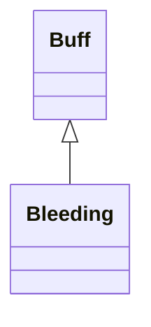

# Bleeding 类文档

## 1. 基本信息

| 属性 | 值 |
|------|-----|
| **文件路径** | core/src/main/java/com/shatteredpixel/shatteredpixeldungeon/actors/buffs/Bleeding.java |
| **包名** | com.shatteredpixel.shatteredpixeldungeon.actors.buffs |
| **类类型** | public class |
| **继承关系** | extends Buff |
| **代码行数** | 143 行 |
| **官方中文名** | 流血 |

## 2. 文件职责说明

Bleeding 类表示“流血”Buff。它会在每个回合按随机衰减后的 `level` 造成伤害，并依据 `source` 处理特定死亡逻辑和个别武器能力击杀回调。

**核心职责**：
- 维护当前流血强度 `level`
- 记录可选伤害来源 `source`
- 每回合造成流血伤害并播放血液特效
- 在英雄死亡或特殊击杀来源下执行附加逻辑

## 3. 结构总览

```
Bleeding (extends Buff)
├── 字段
│   ├── level: float
│   └── source: Class
├── 方法
│   ├── level(): float
│   ├── set(float): void
│   ├── set(float,Class): void
│   ├── extend(float): void
│   ├── icon(): int
│   ├── iconTextDisplay(): String
│   ├── act(): boolean
│   ├── desc(): String
│   ├── storeInBundle(Bundle): void
│   └── restoreFromBundle(Bundle): void
```

## 4. 继承与协作关系

### 继承关系图



### 协作关系

| 协作类 | 协作方式 |
|--------|----------|
| **Buff** | 父类，提供附着与计时 |
| **Splash** | 角色受伤时播放血液飞溅效果 |
| **Dungeon** | 英雄死亡时记录失败 |
| **Badges** | 根据来源验证死亡徽章 |
| **Chasm** | 作为坠落流血来源 |
| **Sacrificial** | 作为友方魔法死亡来源 |
| **Sickle.HarvestBleedTracker** | 特殊来源，用于触发武器击杀回调 |
| **MeleeWeapon** | 调用 `onAbilityKill()` |
| **Messages** | 描述与死亡文本国际化 |
| **Bundle** | 存档读写 |

## 5. 字段与常量详解

### 实例字段

| 字段 | 类型 | 说明 |
|------|------|------|
| `level` | float | 当前流血强度 |
| `source` | Class | 特定伤害来源，用于死亡判定和特殊能力结算 |

### Bundle 键

| 常量 | 值 | 用途 |
|------|-----|------|
| `LEVEL` | `level` | 保存流血强度 |
| `SOURCE` | `source` | 保存来源类 |

## 6. 构造与初始化机制

初始化块：

```java
{
    type = buffType.NEGATIVE;
    announced = true;
}
```

常见施加：

```java
Bleeding bleeding = Buff.affect(target, Bleeding.class);
bleeding.set(5f);
```

## 7. 方法详解

### level()

返回当前 `level`。

### set(float level) / set(float level, Class source)

仅当新值大于当前值时才更新：

```java
if (this.level < level) {
    this.level = Math.max(this.level, level);
    this.source = source;
}
```

### extend(float amount)

直接执行：

```java
level += amount;
```

### icon() / iconTextDisplay()

- 图标：`BuffIndicator.BLEEDING`
- 文本：`Integer.toString(Math.round(level))`

### act()

这是 Bleeding 的核心逻辑。\n
**执行流程**：
1. 若目标存活：
   - `level = Random.NormalFloat(level / 2f, level)`
   - `dmg = Math.round(level)`
2. 若 `dmg > 0`：
   - `target.damage(dmg, this)`
   - 若目标精灵可见，调用 `Splash.at(...)` 显示血液飞溅
   - 若目标是英雄且因此死亡：
     - `source == Chasm.class` -> `Badges.validateDeathFromFalling()`
     - `source == Sacrificial.class` -> `Badges.validateDeathFromFriendlyMagic()`
     - `Dungeon.fail(this)`
     - `GLog.n(Messages.get(this, "ondeath"))`
   - 若 `source == Sickle.HarvestBleedTracker.class` 且目标死亡：
     - `MeleeWeapon.onAbilityKill(Dungeon.hero, target)`
   - `spend(TICK)`
3. 若 `dmg <= 0`：`detach()`
4. 若目标一开始就不存活：`detach()`

### desc()

```java
Messages.get(this, "desc", Math.round(level))
```

### storeInBundle() / restoreFromBundle()

保存并恢复 `level` 与 `source`。

## 8. 对外暴露能力

| 方法 | 用途 |
|------|------|
| `level()` | 查询当前流血强度 |
| `set(...)` | 设置更强的流血与来源 |
| `extend(float)` | 直接叠加流血 |

## 9. 运行机制与调用链

```
Bleeding.act()
├── level = Random.NormalFloat(level/2, level)
├── dmg = round(level)
├── target.damage(dmg, this)
├── [英雄死亡] 处理徽章与失败
├── [镰刀特殊来源击杀] MeleeWeapon.onAbilityKill(...)
└── spend(TICK) / detach()
```

## 10. 资源、配置与国际化关联

文件：`core/src/main/assets/messages/actors/actors_zh.properties`

```properties
actors.buffs.bleeding.name=流血
actors.buffs.bleeding.ondeath=你因失血过多而死...
actors.buffs.bleeding.desc=伤口正在令人不安地涌出大量血液。
```

## 11. 使用示例

```java
Bleeding bleeding = Buff.affect(enemy, Bleeding.class);
bleeding.set(6f, Chasm.class);
bleeding.extend(2f);
```

## 12. 开发注意事项

- `act()` 会先对 `level` 进行随机衰减，再取整成伤害，不是固定每回合同值掉血。
- `source` 只在特定逻辑里用到，尤其是英雄死亡徽章和镰刀击杀回调。
- `set(float, Class)` 只接受更高的流血值，较低值不会覆盖来源。

## 13. 修改建议与扩展点

- 若要让不同来源的流血共存，可把单一 `source` 改为更细的来源结构。
- 若需要更稳定的数值表现，可把 `Random.NormalFloat` 逻辑抽成可配置策略。

## 14. 事实核查清单

- [x] 已覆盖全部字段与方法
- [x] 已验证继承关系 `extends Buff`
- [x] 已验证 `NEGATIVE` 与 `announced = true`
- [x] 已验证随机衰减与伤害计算逻辑
- [x] 已验证 `source` 对英雄死亡与镰刀回调的影响
- [x] 已验证 `Bundle` 存档字段
- [x] 已核对中文名与描述来自官方翻译
- [x] 无臆测性机制说明
