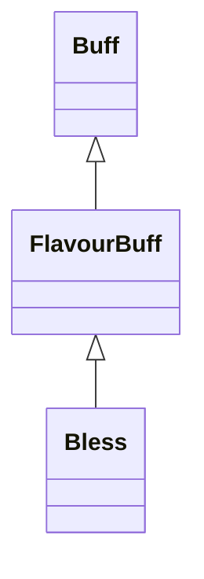

# Bless 类文档

## 1. 基本信息

| 属性 | 值 |
|------|-----|
| **文件路径** | core/src/main/java/com/shatteredpixel/shatteredpixeldungeon/actors/buffs/Bless.java |
| **包名** | com.shatteredpixel.shatteredpixeldungeon.actors.buffs |
| **类类型** | public class |
| **继承关系** | extends FlavourBuff |
| **代码行数** | 45 行 |
| **官方中文名** | 赐福 |

## 2. 文件职责说明

Bless 类表示“赐福”Buff。它是一个时限型正面 FlavourBuff，本类只定义持续时间、Buff 类型、公告行为和图标淡出显示。

**核心职责**：
- 定义标准持续时间 `DURATION = 30f`
- 把状态标记为正面且可公告
- 提供 Bless 图标
- 根据剩余时间计算图标淡出比例

## 3. 结构总览

```
Bless (extends FlavourBuff)
├── 常量
│   └── DURATION: float = 30f
├── 初始化块
│   ├── type = POSITIVE
│   └── announced = true
└── 方法
    ├── icon(): int
    └── iconFadePercent(): float
```

## 4. 继承与协作关系

### 继承关系图



### 协作关系

| 协作类 | 协作方式 |
|--------|----------|
| **FlavourBuff** | 父类，提供时限 Buff 行为 |
| **BuffIndicator** | 提供 Bless 图标编号 |

## 5. 字段与常量详解

### 常量

| 常量 | 类型 | 值 | 说明 |
|------|------|----|------|
| `DURATION` | float | `30f` | 标准持续时间与图标淡出基准 |

### 初始化块

```java
{
    type = buffType.POSITIVE;
    announced = true;
}
```

## 6. 构造与初始化机制

Bless 没有显式构造函数。常见施加方式：

```java
Buff.affect(target, Bless.class, Bless.DURATION);
```

## 7. 方法详解

### icon()

返回 `BuffIndicator.BLESS`。

### iconFadePercent()

公式：

```java
Math.max(0, (DURATION - visualcooldown()) / DURATION)
```

用于根据剩余时间显示图标淡出。

## 8. 对外暴露能力

| 方法/成员 | 用途 |
|-----------|------|
| `DURATION` | 标准持续时间 |
| `icon()` | UI 图标显示 |

## 9. 运行机制与调用链

```
Buff.affect(target, Bless.class, DURATION)
└── FlavourBuff 生命周期运行
    └── UI 读取 icon() / iconFadePercent()
```

## 10. 资源、配置与国际化关联

文件：`core/src/main/assets/messages/actors/actors_zh.properties`

```properties
actors.buffs.bless.name=赐福
actors.buffs.bless.desc=你的集中力正在喷薄而出，有人说这是神赐的礼物。
```

## 11. 使用示例

```java
Buff.affect(hero, Bless.class, Bless.DURATION);
```

## 12. 开发注意事项

- 本类没有自定义 `desc()`、`detach()` 或数值逻辑，主要承担状态定义与展示职责。
- 若外部以不同持续时间施加，图标淡出仍按固定 30f 基准计算。

## 13. 修改建议与扩展点

- 若需要更准确的 UI 表现，可把淡出基准改成实际初始持续时间。
- 若要给赐福增加额外视觉表现，可新增图标染色或特效方法。

## 14. 事实核查清单

- [x] 已覆盖全部自有方法与常量
- [x] 已验证继承关系 `extends FlavourBuff`
- [x] 已验证 `POSITIVE` 与 `announced = true`
- [x] 已验证图标为 `BuffIndicator.BLESS`
- [x] 已验证淡出公式
- [x] 已核对中文名来自官方翻译
- [x] 无臆测性机制说明
