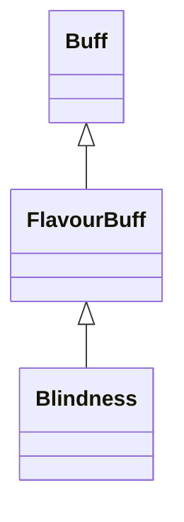

# Blindness 类文档

## 1. 基本信息

| 属性 | 值 |
|------|-----|
| **文件路径** | core/src/main/java/com/shatteredpixel/shatteredpixeldungeon/actors/buffs/Blindness.java |
| **包名** | com.shatteredpixel.shatteredpixeldungeon.actors.buffs |
| **类类型** | public class |
| **继承关系** | extends FlavourBuff |
| **代码行数** | 52 行 |
| **官方中文名** | 失明 |

## 2. 文件职责说明

Blindness 类表示“失明”Buff。它是一个负面 FlavourBuff，本类主要负责定义持续时间、显示图标，并在状态结束时刷新观察结果。

**核心职责**：
- 定义失明标准持续时间
- 标记为负面且会公告的 Buff
- 在结束时调用 `Dungeon.observe()`
- 提供失明图标与图标淡出比例

## 3. 结构总览

```
Blindness (extends FlavourBuff)
├── 常量
│   └── DURATION: float = 10f
├── 初始化块
│   ├── type = NEGATIVE
│   └── announced = true
└── 方法
    ├── detach(): void
    ├── icon(): int
    └── iconFadePercent(): float
```

## 4. 继承与协作关系

### 继承关系图



### 协作关系

| 协作类 | 协作方式 |
|--------|----------|
| **FlavourBuff** | 父类，提供时限 Buff 行为 |
| **Dungeon** | 结束时调用 `observe()` 刷新观察结果 |
| **BuffIndicator** | 提供失明图标编号 |

## 5. 字段与常量详解

### 常量

| 常量 | 类型 | 值 | 说明 |
|------|------|----|------|
| `DURATION` | float | `10f` | 默认持续时间 |

### 初始化块

```java
{
    type = buffType.NEGATIVE;
    announced = true;
}
```

## 6. 构造与初始化机制

Blindness 没有显式构造函数。常见施加方式：

```java
Buff.affect(target, Blindness.class, Blindness.DURATION);
```

## 7. 方法详解

### detach()

```java
@Override
public void detach()
```

先调用 `super.detach()`，再调用 `Dungeon.observe()`。\n
这意味着失明结束后会重新计算观察结果。

### icon()

返回 `BuffIndicator.BLINDNESS`。

### iconFadePercent()

公式：

```java
Math.max(0, (DURATION - visualcooldown()) / DURATION)
```

## 8. 对外暴露能力

| 方法/成员 | 用途 |
|-----------|------|
| `DURATION` | 标准持续时间 |
| `detach()` | 结束时刷新观察结果 |
| `icon()` | UI 图标显示 |

## 9. 运行机制与调用链

```
Buff.affect(target, Blindness.class, DURATION)
└── FlavourBuff 生命周期
    └── Blindness.detach()
        ├── super.detach()
        └── Dungeon.observe()
```

## 10. 资源、配置与国际化关联

文件：`core/src/main/assets/messages/actors/actors_zh.properties`

```properties
actors.buffs.blindness.name=失明
actors.buffs.blindness.desc=失明使周遭的一切陷入黑暗。
```

## 11. 使用示例

```java
Buff.affect(hero, Blindness.class, Blindness.DURATION);
```

## 12. 开发注意事项

- 本类不直接实现“视野变成 1 格”等数值逻辑，主要负责 Buff 壳与结束时刷新观察。
- 若移除 `Dungeon.observe()`，失明结束后的视野状态可能不会立即同步更新。

## 13. 修改建议与扩展点

- 若未来需要失明结束时同步刷新更多 UI，可在 `detach()` 中追加场景更新调用。
- 若要支持不同来源的失明时长表现，可改造淡出基准逻辑。

## 14. 事实核查清单

- [x] 已覆盖全部自有方法与常量
- [x] 已验证继承关系 `extends FlavourBuff`
- [x] 已验证 `NEGATIVE` 与 `announced = true`
- [x] 已验证 `detach()` 中的 `Dungeon.observe()`
- [x] 已验证图标与淡出公式
- [x] 已核对中文名来自官方翻译
- [x] 无臆测性机制说明
