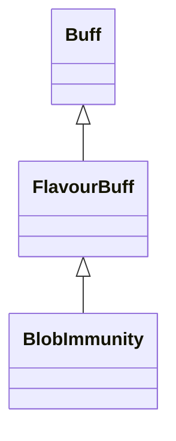

# BlobImmunity 类文档

## 1. 基本信息

| 属性 | 值 |
|------|-----|
| **文件路径** | core/src/main/java/com/shatteredpixel/shatteredpixeldungeon/actors/buffs/BlobImmunity.java |
| **包名** | com.shatteredpixel.shatteredpixeldungeon.actors.buffs |
| **类类型** | public class |
| **继承关系** | extends FlavourBuff |
| **代码行数** | 81 行 |
| **官方中文名** | 净化屏障 |

## 2. 文件职责说明

BlobImmunity 类表示“净化屏障”Buff。它是一个时限型正面 FlavourBuff，核心作用是把一组有害 Blob 类型加入自身免疫列表，使目标在 Buff 持续期间对这些环境效果免疫。

**核心职责**：
- 标记为正面 Buff
- 提供固定持续时间 `DURATION = 20f`
- 暴露免疫图标与淡出比例
- 在初始化时注册所有有害 Blob 免疫项

## 3. 结构总览

```
BlobImmunity (extends FlavourBuff)
├── 常量
│   └── DURATION: float = 20f
├── 初始化块
│   ├── type = POSITIVE
│   └── immunities.add(...) 注册有害 Blob
└── 方法
    ├── icon(): int
    └── iconFadePercent(): float
```

## 4. 继承与协作关系

### 继承关系图



### 协作关系

| 协作类 | 协作方式 |
|--------|----------|
| **FlavourBuff** | 父类，提供时限 Buff 逻辑 |
| **Buff** | 持有 `immunities` 集合并在 `attachTo()` 前使用 `target.isImmune()` 检查 |
| **BuffIndicator** | 提供免疫图标 |
| **Blizzard / Fire / ToxicGas 等** | 被加入免疫集合的 Blob 类型 |
| **MagicalFireRoom.EternalFire** | 特殊房间火焰 Blob，也被加入免疫 |
| **Tengu.FireAbility.FireBlob** | 天狗火焰能力对应 Blob，也被加入免疫 |

## 5. 字段与常量详解

### 常量

| 常量 | 类型 | 值 | 说明 |
|------|------|----|------|
| `DURATION` | float | `20f` | 标准持续时间 |

### 初始化块

第一段初始化块：

```java
{
    type = buffType.POSITIVE;
}
```

第二段初始化块把以下类加入 `immunities`：

- `Blizzard`
- `ConfusionGas`
- `CorrosiveGas`
- `Electricity`
- `Fire`
- `MagicalFireRoom.EternalFire`
- `Freezing`
- `Inferno`
- `ParalyticGas`
- `Regrowth`
- `SmokeScreen`
- `StenchGas`
- `StormCloud`
- `ToxicGas`
- `Web`
- `Tengu.FireAbility.FireBlob`

## 6. 构造与初始化机制

BlobImmunity 没有显式构造函数。通常通过：

```java
Buff.affect(target, BlobImmunity.class, BlobImmunity.DURATION);
```

附着到目标。

## 7. 方法详解

### icon()

返回 `BuffIndicator.IMMUNITY`。

### iconFadePercent()

公式：

```java
Math.max(0, (DURATION - visualcooldown()) / DURATION)
```

## 8. 对外暴露能力

| 方法/成员 | 用途 |
|-----------|------|
| `DURATION` | 标准持续时间 |
| `icon()` | UI 图标显示 |
| `immunities()` | 继承自 `Buff`，可获取当前免疫集合副本 |

## 9. 运行机制与调用链

```
Buff.affect(target, BlobImmunity.class, DURATION)
└── BlobImmunity 初始化块已注册免疫类型
    └── 目标在相关环境逻辑中通过 isImmune(...) 免受 Blob 影响
```

## 10. 资源、配置与国际化关联

文件：`core/src/main/assets/messages/actors/actors_zh.properties`

```properties
actors.buffs.blobimmunity.name=净化屏障
actors.buffs.blobimmunity.desc=一种奇怪的能量环绕在你的周围，为你阻挡有害的环境效果。
```

## 11. 使用示例

```java
Buff.affect(hero, BlobImmunity.class, BlobImmunity.DURATION);

boolean immuneToFire = hero.isImmune(Fire.class);
```

## 12. 开发注意事项

- 免疫列表是在实例初始化块中直接写死的，新增有害 Blob 时若希望受净化屏障保护，必须显式补到这里。
- `Regrowth`、`SmokeScreen` 也被视为需要免疫的环境类，文档必须按源码列出，不可自行删减。

## 13. 修改建议与扩展点

- 若有更多环境免疫需求，可把免疫列表提取成共享注册逻辑。
- 若需要区分“完全免疫”和“只免疫伤害不免疫地形效果”，需要拆分当前单一集合设计。

## 14. 事实核查清单

- [x] 已覆盖全部自有方法与常量
- [x] 已验证继承关系 `extends FlavourBuff`
- [x] 已验证 `POSITIVE` 初始化
- [x] 已逐项核对免疫列表
- [x] 已验证图标与淡出公式
- [x] 已核对官方中文名来自翻译文件
- [x] 无臆测性机制说明
