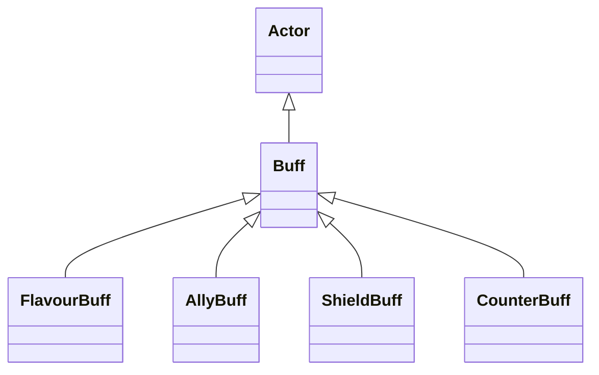

# Buff 类文档

## 1. 基本信息

| 属性 | 值 |
|------|-----|
| **文件路径** | core/src/main/java/com/shatteredpixel/shatteredpixeldungeon/actors/buffs/Buff.java |
| **包名** | com.shatteredpixel.shatteredpixeldungeon.actors.buffs |
| **类类型** | public class |
| **继承关系** | extends Actor |
| **代码行数** | 208 行 |
| **直接子类** | FlavourBuff, AllyBuff, ShieldBuff, CounterBuff 及大量具体 Buff |

## 2. 文件职责说明

Buff 是整个状态系统的基础类。它定义了 Buff 与目标角色的绑定、基础图标接口、描述文本接口、免疫/抗性集合、存档行为，以及一整套 `append` / `affect` / `prolong` / `count` / `detach` 静态工具方法。

**核心职责**：
- 保存 Buff 目标 `target`
- 维护 Buff 类型、公告、复活保留等元信息
- 提供附着/分离逻辑
- 提供 UI 与描述接口的默认实现
- 提供常用静态工厂与操作方法

## 3. 结构总览

```
Buff (extends Actor)
├── 字段
│   ├── target: Char
│   ├── mnemonicExtended: boolean
│   ├── type: buffType
│   ├── announced: boolean
│   ├── revivePersists: boolean
│   ├── resistances: HashSet<Class>
│   └── immunities: HashSet<Class>
├── 枚举
│   └── buffType { POSITIVE, NEGATIVE, NEUTRAL }
├── 方法
│   ├── attachTo(Char): boolean
│   ├── detach(): void
│   ├── act(): boolean
│   ├── icon(): int
│   ├── tintIcon(Image): void
│   ├── iconFadePercent(): float
│   ├── iconTextDisplay(): String
│   ├── fx(boolean): void
│   ├── heroMessage(): String
│   ├── name(): String
│   ├── desc(): String
│   ├── dispTurns(float): String
│   ├── visualcooldown(): float
│   ├── storeInBundle(Bundle): void
│   ├── restoreFromBundle(Bundle): void
│   ├── append(...): T$
│   ├── affect(...): T$
│   ├── prolong(...): T$
│   ├── count(...): T$
│   └── detach(Char, Class): void$
```

## 4. 继承与协作关系

### 继承关系图



### 协作关系

| 协作类 | 协作方式 |
|--------|----------|
| **Actor** | 父类，提供回合与冷却基础机制 |
| **Char** | Buff 的附着目标 |
| **Messages** | `name()`、`desc()`、`heroMessage()` 文本来源 |
| **BuffIndicator** | 默认图标编号来源 |
| **Image** | 图标染色接口 |
| **Bundle** | 存档读写 |
| **Reflection** | 静态工厂方法中反射创建 Buff 实例 |
| **FlavourBuff / CounterBuff** | 静态泛型方法中的特化类型 |

## 5. 字段与常量详解

### 枚举 `buffType`

| 枚举值 | 含义 |
|--------|------|
| `POSITIVE` | 正面 Buff |
| `NEGATIVE` | 负面 Buff |
| `NEUTRAL` | 中性 Buff |

### 实例字段

| 字段 | 类型 | 说明 |
|------|------|------|
| `target` | Char | 当前附着目标 |
| `mnemonicExtended` | boolean | 是否已被“助记祷文”延长过 |
| `type` | buffType | Buff 分类，默认 `NEUTRAL` |
| `announced` | boolean | 是否在显示时公告名称 |
| `revivePersists` | boolean | 是否在复活/类似效果后保留 |
| `resistances` | HashSet<Class> | 抗性集合 |
| `immunities` | HashSet<Class> | 免疫集合 |

### 初始化块

```java
{
    actPriority = BUFF_PRIO;
}
```

表示 Buff 默认在回合较后位置执行。

## 6. 构造与初始化机制

Buff 没有显式构造函数。通常不会直接 new，而是通过静态工具方法：

```java
Buff.append(target, SomeBuff.class);
Buff.affect(target, SomeBuff.class);
Buff.prolong(target, SomeFlavourBuff.class, duration);
```

完成创建与附着。

## 7. 方法详解

### resistances() / immunities()

返回内部集合的副本，不直接暴露原始集合。

### attachTo(Char target)

**执行流程**：
1. 若 `target.isImmune(getClass())`，返回 `false`
2. 设置 `this.target = target`
3. 调用 `target.add(this)`
4. 若成功且 `target.sprite != null`，执行 `fx(true)`
5. 若失败则把 `target` 清回 `null`

### detach()

若 `target.remove(this)` 成功且目标有精灵，则 `fx(false)`。

### act()

默认行为：

```java
diactivate();
return true;
```

即默认 Buff 在自己行动时进入失效状态。多数具体 Buff 会覆写该方法。

### icon() / tintIcon() / iconFadePercent() / iconTextDisplay() / fx(boolean)

这些都是默认 UI/视觉接口：
- `icon()` 默认返回 `BuffIndicator.NONE`
- 其余默认不做事或返回空值/0

### heroMessage()

读取 `Messages.get(this, "heromsg")`；若为空字符串则返回 `null`。

### name() / desc()

分别读取：
- `Messages.get(this, "name")`
- `Messages.get(this, "desc")`

### dispTurns(float input)

通过 `Messages.decimalFormat("#.##", input)` 统一格式化回合文本。

### visualcooldown()

返回：

```java
cooldown() + 1f
```

源码注释说明：因为 Buff 常在英雄之后行动，所以展示剩余时间时通常加 1 更符合视觉预期。

### storeInBundle() / restoreFromBundle()

只处理 `mnemonicExtended` 字段；其余字段由子类补充。

### append(Char, Class<T>)

用 `Reflection.newInstance(buffClass)` 新建实例并调用 `attachTo(target)`。允许重复附着。

### append(Char, Class<T extends FlavourBuff>, float duration)

调用无时长版 `append` 后，再：

```java
buff.spend(duration * target.resist(buffClass));
```

### affect(Char, Class<T>)

若目标已有该类 Buff，则返回已有实例；否则创建新实例。阻止重复。

### affect(Char, Class<T extends FlavourBuff>, float duration)

先 `affect()`，再按抗性修正持续时间执行 `spend(...)`。

### prolong(Char, Class<T extends FlavourBuff>, float duration)

先 `affect()`，再调用：

```java
buff.postpone(duration * target.resist(buffClass));
```

### count(Char, Class<T extends CounterBuff>, float count)

确保目标拥有该 `CounterBuff`，然后 `countUp(count)`。

### detach(Char, Class<? extends Buff>)

遍历目标身上所有匹配类型 Buff 并逐个 `detach()`。

## 8. 对外暴露能力

| 方法 | 用途 |
|------|------|
| `append(...)` | 创建并附着新 Buff，可重复 |
| `affect(...)` | 获取或创建同类 Buff，避免重复 |
| `prolong(...)` | 延长 FlavourBuff |
| `count(...)` | 操作 CounterBuff 计数 |
| `detach(target, cls)` | 批量移除指定类型 Buff |

## 9. 运行机制与调用链

```
Buff.affect(target, BuffClass)
├── 查找 target.buff(BuffClass)
└── [不存在] Buff.append(target, BuffClass)
    ├── Reflection.newInstance(BuffClass)
    └── attachTo(target)

Buff 生命周期
├── attachTo()
├── act() [多数子类覆写]
└── detach()
```

## 10. 资源、配置与国际化关联

Buff 自身通用依赖国际化键：
- `name`
- `desc`
- `heromsg`

这些键的实际内容由各具体 Buff 在 `actors_zh.properties` 中提供。

## 11. 使用示例

```java
Bless bless = Buff.affect(hero, Bless.class, Bless.DURATION);

Adrenaline adrenaline = Buff.append(hero, Adrenaline.class);
adrenaline.spend(Adrenaline.DURATION);

Buff.detach(hero, Bleeding.class);
```

## 12. 开发注意事项

- `append` 与 `affect` 的语义差异非常重要：前者允许重复，后者避免重复。
- `FlavourBuff` 时长相关的静态方法都会乘上 `target.resist(buffClass)`。
- `heroMessage()` 对空字符串返回 `null`，不是返回空串。

## 13. 修改建议与扩展点

- 若状态系统继续扩展，可把一部分静态工厂逻辑拆成专门的 BuffManager。
- 若未来免疫与抗性系统更复杂，可把 `HashSet<Class>` 升级成更结构化的规则对象。

## 14. 事实核查清单

- [x] 已覆盖核心字段、枚举与静态工具方法
- [x] 已验证继承关系 `extends Actor`
- [x] 已验证 `attachTo` 的免疫检查与 `fx(true)` 逻辑
- [x] 已验证 `detach` 的 `fx(false)` 逻辑
- [x] 已验证 `append` / `affect` / `prolong` / `count` / `detach` 语义
- [x] 已验证 `visualcooldown()` 的 `+1f` 规则
- [x] 无臆测性机制说明
