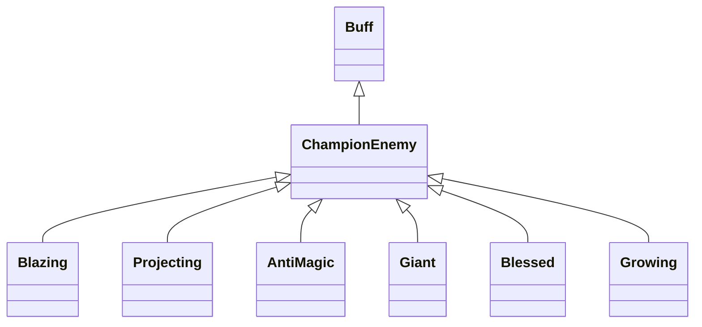

# ChampionEnemy 类文档

## 1. 基本信息

| 属性 | 值 |
|------|-----|
| **文件路径** | core/src/main/java/com/shatteredpixel/shatteredpixeldungeon/actors/buffs/ChampionEnemy.java |
| **包名** | com.shatteredpixel.shatteredpixeldungeon.actors.buffs |
| **类类型** | public abstract class |
| **继承关系** | extends Buff |
| **代码行数** | 306 行 |
| **内部子类** | Blazing, Projecting, AntiMagic, Giant, Blessed, Growing |
| **官方中文名** | 无独立统一翻译键（各冠军类型由挑战与视觉表现区分） |

## 2. 文件职责说明

ChampionEnemy 是冠军敌人 Buff 的抽象基类。它定义了统一的冠军视觉、图标、基础倍率接口、生成抽奖逻辑，以及 6 种具体冠军类型的特殊行为。

**核心职责**：
- 为冠军敌人提供统一光环和图标表现
- 定义攻击/伤害/闪避等可覆写倍率接口
- 统一实现“冠军敌人挑战”下的冠军生成逻辑
- 内置 6 种冠军类型的特殊能力

## 3. 结构总览

```
ChampionEnemy (extends Buff) [abstract]
├── 字段
│   ├── color: int
│   └── rays: int
├── 方法
│   ├── icon()/tintIcon()/fx(boolean)
│   ├── onAttackProc(Char)
│   ├── canAttackWithExtraReach(Char)
│   ├── meleeDamageFactor()
│   ├── damageTakenFactor()
│   ├── evasionAndAccuracyFactor()
│   └── rollForChampion(Mob): void$
└── 内部子类
    ├── Blazing
    ├── Projecting
    ├── AntiMagic
    ├── Giant
    ├── Blessed
    └── Growing
```

## 4. 继承与协作关系

### 继承关系图



### 协作关系

| 协作类 | 协作方式 |
|--------|----------|
| **Buff** | 父类，提供附着与生命周期 |
| **Challenges.CHAMPION_ENEMIES** | 控制是否允许生成冠军敌人 |
| **Dungeon.mobsToChampion** | 记录距离下一次冠军生成还差多少只怪 |
| **Mob** | 生成冠军的目标 |
| **Actor.chars() / PathFinder / BArray** | 计算超距离攻击可达性 |
| **Fire / Blob.seed()** | `Blazing` 死亡时生成火焰 |
| **Burning** | `Blazing` 攻击附加燃烧 |
| **AntiMagic.RESISTS** | `AntiMagic` 的免疫来源 |
| **AllyBuff** | 所有冠军默认免疫该类 Buff |

## 5. 字段与常量详解

### 实例字段

| 字段 | 类型 | 说明 |
|------|------|------|
| `color` | int | 冠军光环与图标染色颜色 |
| `rays` | int | 光环射线数量 |

### 初始化块

```java
{
    type = buffType.POSITIVE;
    revivePersists = true;
}
```

另一个初始化块：

```java
{
    immunities.add(AllyBuff.class);
}
```

### 六种冠军类型摘要

| 类型 | 颜色 | 射线 | 核心效果 |
|------|------|------|----------|
| `Blazing` | `0xFF8800` | 4 | 攻击附加燃烧，死亡时周围产火，免疫燃烧 |
| `Projecting` | `0x8800FF` | 4 | 可在 4 格内进行额外射程近战 |
| `AntiMagic` | `0x00FF00` | 5 | 受伤倍率 0.5，继承反魔法抗性集合 |
| `Giant` | `0x0088FF` | 5 | 受伤倍率 0.2，可在 2 格内进行额外射程近战 |
| `Blessed` | `0xFFFF00` | 6 | 闪避和命中倍率 4 |
| `Growing` | `0xFF2222` | 6 | 每 4T 增长倍率，提升攻防和闪避命中 |

## 6. 构造与初始化机制

ChampionEnemy 为抽象类，通常不会直接实例化。生成流程通过静态 `rollForChampion(Mob m)` 完成：
- 每刷出怪物时减少 `Dungeon.mobsToChampion`
- 固定进行一次冠军类型抽签，以保持 RNG 调用次数稳定
- 在满足条件时把抽中的冠军 Buff 附着到目标怪物身上

## 7. 方法详解

### 通用外观与倍率接口

- `icon()` -> `BuffIndicator.CORRUPT`
- `tintIcon()` -> 用 `color` 染色
- `fx(boolean on)` -> 开启/关闭光环
- `onAttackProc(Char enemy)` 默认空实现
- `canAttackWithExtraReach(Char enemy)` 默认 `false`
- `meleeDamageFactor()` / `damageTakenFactor()` / `evasionAndAccuracyFactor()` 默认 `1f`

### rollForChampion(Mob m)

逻辑：
1. `Dungeon.mobsToChampion--`
2. 无论是否真的生成冠军，都固定 `Random.Int(6)` 抽一次类型，保证关卡生成 RNG 稳定
3. 若 `mobsToChampion <= 0` 且开启冠军敌人挑战：
   - 在特定深度前排除 `Crab`、`Thief`、`Guard`、`Bat`
   - 为怪物附着抽中的冠军 Buff
   - 按深度把 `mobsToChampion` 重新加成到约 6~8 之间的值
   - 若怪物不是 `PASSIVE`，改为 `WANDERING`

### Blazing

- 近战伤害倍率：`1.25f`
- 攻击命中时：若目标不在水中，则 `Burning.reignite(enemy)`
- 死亡移除时：若不是坠坑死亡，在周围 9 格非实心且非水格生成 `Fire`
- 免疫 `Burning`

### Projecting

- 近战伤害倍率：`1.25f`
- `canAttackWithExtraReach()`：在 4 格内对可达目标允许超距离近战

### AntiMagic

- 受伤倍率：`0.5f`
- 免疫集合继承自 `items.armor.glyphs.AntiMagic.RESISTS`

### Giant

- 受伤倍率：`0.2f`
- `canAttackWithExtraReach()`：在 2 格内允许超距离近战

### Blessed

- 闪避与命中倍率：`4f`

### Growing

- `multiplier` 初始 `1.19f`
- 每次 `act()`：`multiplier += 0.01f`，并 `spend(4*TICK)`
- 近战、受伤、闪避命中都随 `multiplier` 变化
- `desc()` 会输出当前增伤百分比和减伤百分比
- 有独立的 `multiplier` 存档逻辑

## 8. 对外暴露能力

| 方法 | 用途 |
|------|------|
| `rollForChampion(Mob)` | 按规则尝试生成冠军敌人 |
| `meleeDamageFactor()` | 返回近战倍率 |
| `damageTakenFactor()` | 返回受伤倍率 |
| `evasionAndAccuracyFactor()` | 返回闪避与命中倍率 |
| `canAttackWithExtraReach()` | 判断是否可超距离近战 |

## 9. 运行机制与调用链

```
怪物生成
└── ChampionEnemy.rollForChampion(mob)
    ├── 抽冠军类型
    ├── 检查挑战与深度限制
    ├── Buff.affect(mob, subtype)
    └── 重置 mobsToChampion

冠军敌人战斗中
├── 外部战斗系统读取 damage/melee/evasion 倍率
└── 子类在攻击或移除时触发特殊效果
```

## 10. 资源、配置与国际化关联

ChampionEnemy 基类本身没有统一翻译键；至少 `Growing.desc()` 会通过 `Messages.get(this, "desc", ...)` 读取自己对应的描述模板。其他冠军类型主要依赖光环、数值和挑战逻辑来体现。

## 11. 使用示例

```java
ChampionEnemy.rollForChampion(mob);

ChampionEnemy champ = mob.buff(ChampionEnemy.class);
if (champ != null) {
    float dmgMul = champ.meleeDamageFactor();
}
```

## 12. 开发注意事项

- `rollForChampion()` 有“即使不生成也要抽一次类型”的 RNG 稳定性要求，不能删。
- 冠军基类默认免疫 `AllyBuff`，这会影响魅惑、招募等体系。
- `Growing` 是唯一一个主动 `act()` 的冠军子类，并且带独立存档字段。

## 13. 修改建议与扩展点

- 若冠军类型继续增加，建议把 `switch(Random.Int(6))` 和限制表抽成注册表。
- 若想让每种冠军拥有更完整文案，可为每个子类补齐专门的国际化键和文档。

## 14. 事实核查清单

- [x] 已覆盖抽象基类与 6 个内部子类的关键行为
- [x] 已验证继承关系 `extends Buff` 且为抽象类
- [x] 已验证 `revivePersists = true` 与 `AllyBuff` 免疫
- [x] 已验证 `rollForChampion()` 的 RNG 与生成限制逻辑
- [x] 已验证各冠军子类的倍率和特殊效果
- [x] 已验证 `Growing` 的独立成长与存档逻辑
- [x] 已说明基类无统一翻译键这一事实
- [x] 无臆测性机制说明
