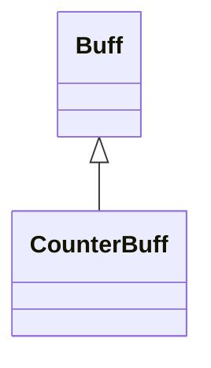

# CounterBuff 类文档

## 1. 基本信息

| 属性 | 值 |
|------|-----|
| **文件路径** | core/src/main/java/com/shatteredpixel/shatteredpixeldungeon/actors/buffs/CounterBuff.java |
| **包名** | com.shatteredpixel.shatteredpixeldungeon.actors.buffs |
| **类类型** | public class |
| **继承关系** | extends Buff |
| **代码行数** | 56 行 |
| **官方中文名** | 无单独翻译键 |

## 2. 文件职责说明

CounterBuff 是一个通用计数型 Buff 基类。它不提供额外游戏效果，只负责保存一个浮点计数值，并提供增减、读取和存档恢复能力。

**核心职责**：
- 保存一个 `float count`
- 提供 `countUp` / `countDown` / `count` 接口
- 为 `Buff.count(...)` 静态工具方法提供目标类型

## 3. 结构总览

```
CounterBuff (extends Buff)
├── 字段
│   └── count: float
├── 方法
│   ├── countUp(float): void
│   ├── countDown(float): void
│   ├── count(): float
│   ├── storeInBundle(Bundle): void
│   └── restoreFromBundle(Bundle): void
```

## 4. 继承与协作关系

### 继承关系图



### 协作关系

| 协作类 | 协作方式 |
|--------|----------|
| **Buff** | 父类，提供附着、生命周期与静态 `count(...)` 调用入口 |
| **Bundle** | 保存和恢复计数值 |

## 5. 字段与常量详解

### 实例字段

| 字段 | 类型 | 说明 |
|------|------|------|
| `count` | float | 当前计数值，默认 `0` |

### Bundle 键

| 常量 | 值 | 用途 |
|------|-----|------|
| `COUNT` | `count` | 保存计数值 |

## 6. 构造与初始化机制

CounterBuff 没有显式构造函数。通常通过：

```java
Buff.count(target, SomeCounterBuffSubclass.class, amount);
```

或普通 `Buff.affect(...)` 创建。

## 7. 方法详解

### countUp(float inc)

```java
count += inc;
```

### countDown(float inc)

```java
count -= inc;
```

### count()

返回当前计数值。

### storeInBundle() / restoreFromBundle()

保存并恢复 `count` 字段。

## 8. 对外暴露能力

| 方法 | 用途 |
|------|------|
| `countUp(float)` | 增加计数 |
| `countDown(float)` | 减少计数 |
| `count()` | 读取计数 |

## 9. 运行机制与调用链

```
Buff.count(target, CounterBuffSubclass.class, amount)
└── Buff.affect(target, CounterBuffSubclass.class)
    └── countUp(amount)
```

## 10. 资源、配置与国际化关联

CounterBuff 本类没有单独的翻译键、图标或描述资源；这些通常由具体子类提供，或根本不对玩家直接显示。

## 11. 使用示例

```java
CounterBuff buff = Buff.affect(target, CounterBuff.class);
buff.countUp(2.5f);
buff.countDown(1f);
float current = buff.count();
```

## 12. 开发注意事项

- 该类只是“带一个浮点计数的 Buff 外壳”，不包含自动衰减或行为逻辑。
- 若某个子类需要更复杂规则，应在此基础上自行扩展，而不是修改通用 `count` 语义。

## 13. 修改建议与扩展点

- 若后续出现大量整数型计数 Buff，可考虑增加专用整型版本以减少四舍五入问题。
- 若计数变化需要触发事件，可在子类里覆写并包装 `countUp/countDown`。

## 14. 事实核查清单

- [x] 已覆盖全部字段与方法
- [x] 已验证继承关系 `extends Buff`
- [x] 已验证 `countUp` / `countDown` / `count` 行为
- [x] 已验证 `Bundle` 存档字段
- [x] 已说明无单独翻译键这一事实
- [x] 无臆测性机制说明
