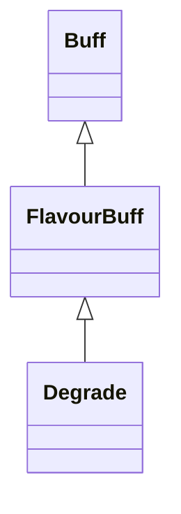

# Degrade 类文档

## 1. 基本信息

| 属性 | 值 |
|------|-----|
| **文件路径** | core/src/main/java/com/shatteredpixel/shatteredpixeldungeon/actors/buffs/Degrade.java |
| **包名** | com.shatteredpixel.shatteredpixeldungeon.actors.buffs |
| **类类型** | public class |
| **继承关系** | extends FlavourBuff |
| **代码行数** | 80 行 |
| **官方中文名** | 降级 |

## 2. 文件职责说明

Degrade 类表示“降级”Buff。它通过静态方法 `reduceLevel()` 影响物品有效等级，并在附着/移除时刷新快捷栏与英雄最大生命值显示。

**核心职责**：
- 定义降级状态的持续时间与图标
- 在附着/移除时刷新相关 UI 和英雄属性显示
- 提供统一的等级压缩公式 `reduceLevel()`

## 3. 结构总览

```
Degrade (extends FlavourBuff)
├── 常量
│   └── DURATION: float = 30f
├── 初始化块
│   ├── type = NEGATIVE
│   └── announced = true
└── 方法
    ├── attachTo(Char): boolean
    ├── detach(): void
    ├── reduceLevel(int): int$
    ├── icon(): int
    └── iconFadePercent(): float
```

## 4. 继承与协作关系

### 继承关系图



### 协作关系

| 协作类 | 协作方式 |
|--------|----------|
| **FlavourBuff** | 父类，提供时限 Buff 逻辑 |
| **Item** | 附着/移除时调用 `updateQuickslot()` |
| **Hero** | 若目标是英雄，附着/移除时调用 `updateHT(false)` |
| **Dungeon.hero** | 用于判断是否需要刷新英雄最大生命值 |
| **BuffIndicator** | 图标编号 |

## 5. 字段与常量详解

### 常量

| 常量 | 类型 | 值 | 说明 |
|------|------|----|------|
| `DURATION` | float | `30f` | 默认持续时间 |

### 初始化块

```java
{
    type = buffType.NEGATIVE;
    announced = true;
}
```

## 6. 构造与初始化机制

Degrade 没有显式构造函数。通常通过：

```java
Buff.affect(target, Degrade.class, Degrade.DURATION);
```

施加到目标。

## 7. 方法详解

### attachTo(Char target)

先调用 `super.attachTo(target)`。若成功：
- `Item.updateQuickslot()`
- 若 `target == Dungeon.hero`，调用 `((Hero) target).updateHT(false)`

### detach()

移除顺序：
1. `super.detach()`
2. 若目标是英雄，`updateHT(false)`
3. `Item.updateQuickslot()`

### reduceLevel(int level)

这是本类最关键的静态逻辑。\n
规则：
- 若 `level <= 0`，直接返回原值
- 否则返回：

```java
(int)Math.round(Math.sqrt(2*(level-1)) + 1)
```

源码注释给出的对应关系：

| 原等级 | 降级后 |
|--------|--------|
| 1 | 1 |
| 2 | 2 |
| 3 | 3 |
| 4 | 3 |
| 5 | 4 |
| 6 | 4 |
| 7 | 4 |
| 8 | 5 |
| 9 | 5 |
| 10 | 5 |
| 11 | 5 |
| 12 | 6 |

### icon()

返回 `BuffIndicator.DEGRADE`。

### iconFadePercent()

公式：

```java
(DURATION - visualcooldown())/DURATION
```

源码未额外调用 `Math.max`。

## 8. 对外暴露能力

| 方法/成员 | 用途 |
|-----------|------|
| `DURATION` | 标准持续时间 |
| `reduceLevel(int)` | 供 `Item.buffedLevel()` 调用的等级压缩逻辑 |
| `attachTo/detach` | 负责附着/移除时刷新显示 |

## 9. 运行机制与调用链

```
Buff.affect(target, Degrade.class, DURATION)
└── Degrade.attachTo(target)
    ├── super.attachTo(target)
    ├── Item.updateQuickslot()
    └── [hero] updateHT(false)

Item.buffedLevel()
└── Degrade.reduceLevel(level)
```

## 10. 资源、配置与国际化关联

文件：`core/src/main/assets/messages/actors/actors_zh.properties`

```properties
actors.buffs.degrade.name=降级
actors.buffs.degrade.desc=强大的黑暗魔法正在吞噬升级卷轴注入你装备的魔力！
```

## 11. 使用示例

```java
Buff.affect(hero, Degrade.class, Degrade.DURATION);

int effective = Degrade.reduceLevel(8); // 返回 5
```

## 12. 开发注意事项

- `reduceLevel()` 只影响正等级，0 或负等级完全不变。
- 本类没有自有字段，核心影响都通过附着/移除时刷新 UI 和静态等级压缩完成。
- 文档中所有等级映射必须以源码注释与公式为准，不能手写近似规则。

## 13. 修改建议与扩展点

- 若后续需要多种“等级压缩”Debuff，可把 `reduceLevel()` 抽成策略接口。
- 若 `updateHT(false)` 的副作用继续增多，可考虑把附着/移除刷新统一封装。

## 14. 事实核查清单

- [x] 已覆盖全部自有方法与常量
- [x] 已验证继承关系 `extends FlavourBuff`
- [x] 已验证 `NEGATIVE` 与 `announced = true`
- [x] 已验证附着/移除时的快捷栏和英雄属性刷新
- [x] 已验证 `reduceLevel()` 公式与映射关系
- [x] 已验证图标与淡出公式
- [x] 已核对官方中文名来自翻译文件
- [x] 无臆测性机制说明
