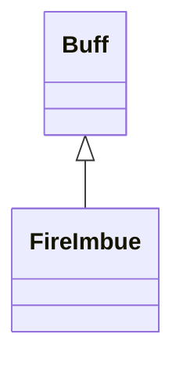

# FireImbue 类文档

## 1. 基本信息

| 属性 | 值 |
|------|-----|
| **文件路径** | core/src/main/java/com/shatteredpixel/shatteredpixeldungeon/actors/buffs/FireImbue.java |
| **包名** | com.shatteredpixel.shatteredpixeldungeon.actors.buffs |
| **类类型** | public class |
| **继承关系** | extends Buff |
| **代码行数** | 130 行 |
| **官方中文名** | 烈焰之力 |

## 2. 文件职责说明

FireImbue 类表示“烈焰之力”Buff。它在持续期间让目标对 `Burning` 免疫、每回合把脚下草地烧成余烬，并在攻击命中时有概率让敌人燃烧。

**核心职责**：
- 维护剩余持续时间 `left`
- 给予 `Burning` 免疫并在附着时移除现有燃烧
- 每回合把脚下 `GRASS` 烧成 `EMBERS`
- 在命中时以 50% 概率给敌人附加 `Burning`

## 3. 结构总览

```
FireImbue (extends Buff)
├── 常量
│   └── DURATION: float = 50f
├── 字段
│   └── left: float
├── 初始化块
│   ├── type = POSITIVE
│   ├── announced = true
│   └── immunities.add(Burning.class)
└── 方法
    ├── set(float): void
    ├── extend(float): void
    ├── act(): boolean
    ├── proc(Char): void
    ├── icon(): int
    ├── tintIcon(Image): void
    ├── iconFadePercent(): float
    ├── iconTextDisplay(): String
    ├── desc(): String
    ├── attachTo(Char): boolean
    ├── storeInBundle(Bundle): void
    └── restoreFromBundle(Bundle): void
```

## 4. 继承与协作关系

### 继承关系图



### 协作关系

| 协作类 | 协作方式 |
|--------|----------|
| **Buff** | 父类，提供附着与计时 |
| **Burning** | 附着时移除，命中时可能施加 |
| **Terrain** | 每回合把 `GRASS` 改成 `EMBERS` |
| **GameScene** | 地形变化后刷新地图 |
| **FlameParticle** | 命中时火焰粒子爆发 |
| **BuffIndicator** | IMBUE 图标 |
| **Image** | 图标染色 |
| **Messages** | 描述文本国际化 |
| **Bundle** | 存档读写 |

## 5. 字段与常量详解

### 常量

| 常量 | 类型 | 值 | 说明 |
|------|------|----|------|
| `DURATION` | float | `50f` | 默认持续时间与图标淡出基准 |

### 实例字段

| 字段 | 类型 | 说明 |
|------|------|------|
| `left` | float | 剩余持续时间 |

### 初始化块

第一段初始化：

```java
{
    type = buffType.POSITIVE;
    announced = true;
}
```

第二段初始化：

```java
{
    immunities.add(Burning.class);
}
```

## 6. 构造与初始化机制

FireImbue 没有显式构造函数。常见创建方式：

```java
FireImbue imbue = Buff.affect(hero, FireImbue.class);
imbue.set(FireImbue.DURATION);
```

## 7. 方法详解

### storeInBundle() / restoreFromBundle()

保存并恢复 `left`。

### set(float duration)

把 `left` 直接设置为传入持续时间。

### extend(float duration)

执行 `left += duration`。

### act()

每回合：
1. 若当前位置地形是 `Terrain.GRASS`：
   - `Dungeon.level.set(target.pos, Terrain.EMBERS)`
   - `GameScene.updateMap(target.pos)`
2. `spend(TICK)`
3. `left -= TICK`
4. 若 `left <= 0` 则移除 Buff

### proc(Char enemy)

命中时：

```java
if (Random.Int(2) == 0)
    Buff.affect(enemy, Burning.class).reignite(enemy);

enemy.sprite.emitter().burst(FlameParticle.FACTORY, 2);
```

即 50% 概率施加 `Burning`，并总是播放火焰粒子。

### icon() / tintIcon()

- 图标：`BuffIndicator.IMBUE`
- 染色：`icon.hardlight(2f, 0.75f, 0f)`

### iconFadePercent()

公式：

```java
Math.max(0, (DURATION - left) / DURATION)
```

### iconTextDisplay()

返回 `(int)left` 字符串。

### desc()

```java
Messages.get(this, "desc", dispTurns(left))
```

### attachTo(Char target)

调用 `super.attachTo(target)` 成功后，执行：

```java
Buff.detach(target, Burning.class);
```

确保目标在获得烈焰之力时不再处于燃烧状态。

## 8. 对外暴露能力

| 方法 | 用途 |
|------|------|
| `set(float)` | 设置剩余时间 |
| `extend(float)` | 延长持续时间 |
| `proc(Char)` | 处理命中附火效果 |

## 9. 运行机制与调用链

```
Buff.affect(target, FireImbue.class)
└── FireImbue.attachTo(target)
    └── 移除 Burning

每回合
└── FireImbue.act()
    ├── [脚下是草地] 改成 EMBERS
    ├── left -= TICK
    └── [left <= 0] detach()

命中敌人
└── FireImbue.proc(enemy)
    ├── 50% 概率施加 Burning
    └── 爆发 FlameParticle
```

## 10. 资源、配置与国际化关联

文件：`core/src/main/assets/messages/actors/actors_zh.properties`

```properties
actors.buffs.fireimbue.name=烈焰之力
actors.buffs.fireimbue.desc=你被灌注了烈焰的力量！
```

## 11. 使用示例

```java
FireImbue imbue = Buff.affect(hero, FireImbue.class);
imbue.set(FireImbue.DURATION);
imbue.extend(10f);
```

## 12. 开发注意事项

- 本类不是 `FlavourBuff`，因为它每回合要处理地形与剩余时间。
- `iconFadePercent()` 使用固定 `DURATION` 做基准，若外部设置了不同初始时长，UI 淡出比例仍按 50f 参考。
- `proc()` 只在调用者主动触发时才生效，本类不会自行监听攻击事件。

## 13. 修改建议与扩展点

- 若后续需要不同火焰附魔来源，可考虑把点燃概率抽成字段。
- 若想避免固定 UI 基准带来的偏差，可把初始时长也存成字段。

## 14. 事实核查清单

- [x] 已覆盖全部字段、方法、常量与初始化块
- [x] 已验证继承关系 `extends Buff`
- [x] 已验证 `Burning` 免疫与附着时移除逻辑
- [x] 已验证草地变余烬逻辑
- [x] 已验证 `proc()` 的 50% 点燃概率与粒子效果
- [x] 已验证 `Bundle` 存档字段
- [x] 已核对官方中文名来自翻译文件
- [x] 无臆测性机制说明
