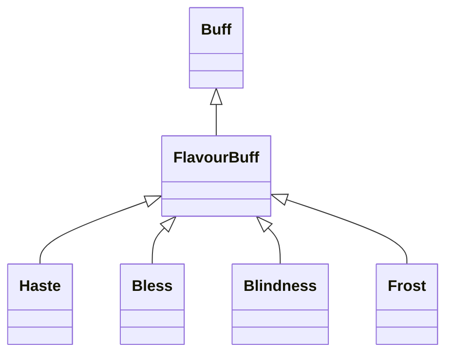

# FlavourBuff 类文档

## 1. 基本信息

| 属性 | 值 |
|------|-----|
| **文件路径** | core/src/main/java/com/shatteredpixel/shatteredpixeldungeon/actors/buffs/FlavourBuff.java |
| **包名** | com.shatteredpixel.shatteredpixeldungeon.actors.buffs |
| **类类型** | public class |
| **继承关系** | extends Buff |
| **代码行数** | 49 行 |
| **直接子类** | Haste, Bless, Blindness, Frost, Hex 等大量时限型简单 Buff |

## 2. 文件职责说明

FlavourBuff 是简单时限 Buff 的通用父类。它的内部逻辑只有“等待到时间点后自动移除”，并提供统一的描述文本和图标文字显示规则。

**核心职责**：
- 用作简单时限 Buff 的轻量父类
- 在行动时直接移除自身
- 统一描述文本中的剩余时间格式
- 统一大图标上的剩余时间文本

## 3. 结构总览

```
FlavourBuff (extends Buff)
├── 方法
│   ├── act(): boolean
│   ├── desc(): String
│   ├── dispTurns(): String
│   └── iconTextDisplay(): String
└── 无自有字段
```

## 4. 继承与协作关系

### 继承关系图



### 协作关系

| 协作类 | 协作方式 |
|--------|----------|
| **Buff** | 父类，提供附着、冷却、`visualcooldown()` 等基础能力 |
| **Messages** | `desc()` 读取国际化文本 |

## 5. 字段与常量详解

FlavourBuff 没有自有字段，完全依赖 `Buff` 的：

| 继承字段/能力 | 用途 |
|---------------|------|
| `cooldown()` | 控制何时执行 `act()` |
| `visualcooldown()` | 用于显示剩余时间 |
| `detach()` | 到时移除自身 |

## 6. 构造与初始化机制

FlavourBuff 没有显式构造函数。通常通过：

```java
Buff.affect(target, SomeFlavourBuff.class, duration);
```

或：

```java
Buff.append(target, SomeFlavourBuff.class, duration);
```

进行创建与附着。

## 7. 方法详解

### act()

```java
@Override
public boolean act()
```

执行逻辑非常简单：

```java
detach();
return true;
```

也就是说，FlavourBuff 本身不做复杂逻辑，时间到后直接移除。

### desc()

```java
@Override
public String desc() {
    return Messages.get(this, "desc", dispTurns());
}
```

会把剩余时间字符串作为参数传给国际化描述文本。

### dispTurns()

```java
protected String dispTurns() {
    return dispTurns(visualcooldown());
}
```

这是 `Buff.dispTurns(float)` 的无参包装版本，统一使用 `visualcooldown()`。

### iconTextDisplay()

```java
@Override
public String iconTextDisplay() {
    return Integer.toString((int)visualcooldown());
}
```

用于桌面端大图标显示剩余回合数。

## 8. 对外暴露能力

| 方法 | 用途 |
|------|------|
| `desc()` | 自动带剩余回合参数的描述文本 |
| `iconTextDisplay()` | 大图标显示剩余回合 |

## 9. 运行机制与调用链

```
Buff.affect(target, SomeFlavourBuff.class, duration)
└── Buff.spend(duration * resist)

时间到达
└── FlavourBuff.act()
    └── detach()
```

## 10. 资源、配置与国际化关联

FlavourBuff 本类没有自己的专属翻译键；其 `desc()` 会要求子类在国际化文件中提供一个可接受“剩余时间”参数的 `desc` 模板。

## 11. 使用示例

```java
Buff.affect(hero, Haste.class, Haste.DURATION);
Buff.affect(enemy, Blindness.class, Blindness.DURATION);
```

## 12. 开发注意事项

- 只适用于“时间到了就移除”的简单 Buff。
- 如果某个 Buff 需要每回合执行额外逻辑，就不应只继承 `FlavourBuff` 并依赖默认 `act()`。
- `desc()` 默认传一个参数，因此子类翻译文本要与此参数形式兼容。

## 13. 修改建议与扩展点

- 若未来存在更多“带时限但同时还需要轻量每回合行为”的 Buff，可以新建介于 `Buff` 和 `FlavourBuff` 之间的中间父类。
- 若需要统一显示小数回合或更精确文本，可在 `dispTurns()` 层调整。

## 14. 事实核查清单

- [x] 已覆盖全部自有方法
- [x] 已验证继承关系 `extends Buff`
- [x] 已验证 `act()` 仅执行 `detach()`
- [x] 已验证 `desc()` 使用 `Messages.get(..., dispTurns())`
- [x] 已验证 `iconTextDisplay()` 使用 `visualcooldown()`
- [x] 无臆测性机制说明
