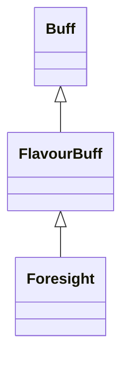

# Foresight 类文档

## 1. 基本信息

| 属性 | 值 |
|------|-----|
| **文件路径** | core/src/main/java/com/shatteredpixel/shatteredpixeldungeon/actors/buffs/Foresight.java |
| **包名** | com.shatteredpixel.shatteredpixeldungeon.actors.buffs |
| **类类型** | public class |
| **继承关系** | extends FlavourBuff |
| **代码行数** | 62 行 |
| **官方中文名** | 危险预知 |

## 2. 文件职责说明

Foresight 类表示“危险预知”Buff。它是一个长时正面 FlavourBuff，除图标和持续时间外，唯一的特殊逻辑是在附着到英雄时触发一次重新搜索，用于配合初次激活时的可视化揭示效果。

**核心职责**：
- 定义较长持续时间 `DURATION = 400f`
- 提供固定探测距离常量 `DISTANCE = 8`
- 在附着到英雄时重置当前位置已映射状态并触发搜索
- 提供图标与淡出比例

## 3. 结构总览

```
Foresight (extends FlavourBuff)
├── 常量
│   ├── DURATION: float = 400f
│   └── DISTANCE: int = 8
├── 初始化块
│   └── type = POSITIVE
└── 方法
    ├── icon(): int
    ├── attachTo(Char): boolean
    └── iconFadePercent(): float
```

## 4. 继承与协作关系

### 继承关系图



### 协作关系

| 协作类 | 协作方式 |
|--------|----------|
| **FlavourBuff** | 父类，提供时限型 Buff 行为 |
| **Dungeon.hero** | 附着到英雄时触发搜索逻辑 |
| **Level.mapped** | 当前位置映射状态会被重置为 `false` |
| **BuffIndicator** | 提供危险预知图标 |

## 5. 字段与常量详解

### 常量

| 常量 | 类型 | 值 | 说明 |
|------|------|----|------|
| `DURATION` | float | `400f` | 默认持续时间 |
| `DISTANCE` | int | `8` | 预知相关距离常量 |

### 初始化块

```java
{
    type = buffType.POSITIVE;
}
```

## 6. 构造与初始化机制

Foresight 没有显式构造函数。通常通过：

```java
Buff.affect(hero, Foresight.class, Foresight.DURATION);
```

施加到目标。

## 7. 方法详解

### icon()

返回 `BuffIndicator.FORESIGHT`。

### attachTo(Char target)

先调用 `super.attachTo(target)`。若成功且目标是英雄：

```java
Dungeon.level.mapped[target.pos] = false;
Dungeon.hero.search(false);
```

源码注释说明这样做是为了让首次激活时出现一次“漂亮的视觉扫掠效果”。

### iconFadePercent()

公式：

```java
Math.max(0, (DURATION - visualcooldown()) / DURATION)
```

## 8. 对外暴露能力

| 方法/成员 | 用途 |
|-----------|------|
| `DURATION` | 标准持续时间 |
| `DISTANCE` | 相关功能的固定距离常量 |
| `attachTo(Char)` | 初次附着时执行英雄搜索刷新 |

## 9. 运行机制与调用链

```
Buff.affect(hero, Foresight.class, DURATION)
└── Foresight.attachTo(hero)
    ├── super.attachTo(hero)
    ├── mapped[hero.pos] = false
    └── hero.search(false)
```

## 10. 资源、配置与国际化关联

文件：`core/src/main/assets/messages/actors/actors_zh.properties`

```properties
actors.buffs.foresight.name=危险预知
actors.buffs.foresight.desc=不知为何，你的脑海中映射出了周遭的地形。
```

## 11. 使用示例

```java
Buff.affect(hero, Foresight.class, Foresight.DURATION);

if (hero.buff(Foresight.class) != null) {
    // 英雄当前拥有危险预知
}
```

## 12. 开发注意事项

- `DISTANCE = 8` 是本类对外公开的常量，修改时要同时检查依赖它的视野/侦测逻辑。
- `attachTo()` 的特殊行为只对英雄生效，文档不能扩展成“所有角色附着时都会触发搜索”。

## 13. 修改建议与扩展点

- 若后续有更多来源需要不同范围的预知，可以把 `DISTANCE` 改成实例参数而不是静态常量。
- 若首次激活视觉效果需要更清晰的封装，可把 `mapped+search` 逻辑抽成单独方法。

## 14. 事实核查清单

- [x] 已覆盖全部自有方法与常量
- [x] 已验证继承关系 `extends FlavourBuff`
- [x] 已验证 `POSITIVE` 初始化
- [x] 已验证英雄附着时的 `mapped` 重置与 `search(false)` 调用
- [x] 已验证图标与淡出公式
- [x] 已核对官方中文名来自翻译文件
- [x] 无臆测性机制说明
