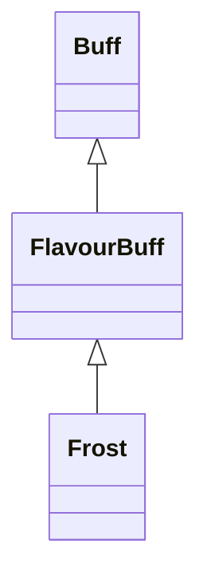

# Frost 类文档

## 1. 基本信息

| 属性 | 值 |
|------|-----|
| **文件路径** | core/src/main/java/com/shatteredpixel/shatteredpixeldungeon/actors/buffs/Frost.java |
| **包名** | com.shatteredpixel.shatteredpixeldungeon.actors.buffs |
| **类类型** | public class |
| **继承关系** | extends FlavourBuff |
| **代码行数** | 144 行 |
| **官方中文名** | 冻结 |

## 2. 文件职责说明

Frost 类表示“冻结”Buff。它会让目标进入冻结/麻痹状态，清除燃烧与冻伤，并在附着或移除时联动处理英雄或盗贼携带的可冻结物品。

**核心职责**：
- 施加冻结带来的麻痹效果
- 移除 `Burning` 与 `Chill`
- 对英雄背包或盗贼偷走的物品执行冻结转换逻辑
- 在结束时于水中补施半时长 `Chill`
- 提供冻结视觉状态与免疫关系

## 3. 结构总览

```
Frost (extends FlavourBuff)
├── 常量
│   └── DURATION: float = 10f
├── 初始化块
│   ├── type = NEGATIVE
│   ├── announced = true
│   └── immunities.add(Chill.class)
└── 方法
    ├── attachTo(Char): boolean
    ├── detach(): void
    ├── icon(): int
    ├── tintIcon(Image): void
    ├── iconFadePercent(): float
    └── fx(boolean): void
```

## 4. 继承与协作关系

### 继承关系图



### 协作关系

| 协作类 | 协作方式 |
|--------|----------|
| **FlavourBuff** | 父类，提供时限型 Buff 行为 |
| **Burning** | 附着前先移除 |
| **Chill** | 附着时移除，结束时在水中补施 |
| **Hero** | 处理背包中的可冻结物品 |
| **Thief** | 处理其持有物品的冻结转换 |
| **Potion** | 可被打碎 |
| **MysteryMeat** | 可转成 `FrozenCarpaccio` |
| **FrozenCarpaccio** | 冻结肉的结果物品 |
| **GLog / Messages** | 输出冻结提示 |
| **CharSprite** | 角色冻结与麻痹外观 |
| **BuffIndicator** | 冻结图标 |

## 5. 字段与常量详解

### 常量

| 常量 | 类型 | 值 | 说明 |
|------|------|----|------|
| `DURATION` | float | `10f` | 默认持续时间 |

### 初始化块

第一段初始化：

```java
{
    type = buffType.NEGATIVE;
    announced = true;
}
```

第二段初始化：

```java
{
    immunities.add(Chill.class);
}
```

表示被冻结目标不会再获得 `Chill`。

## 6. 构造与初始化机制

Frost 没有显式构造函数。常见施加方式：

```java
Buff.affect(target, Frost.class, Frost.DURATION);
```

## 7. 方法详解

### attachTo(Char target)

**执行流程**：
1. `Buff.detach(target, Burning.class)`，先移除燃烧。\n
2. 调用 `super.attachTo(target)`。\n
3. 成功后：
   - `target.paralysed++`
   - `Buff.detach(target, Chill.class)`
4. 若目标是 `Hero`：
   - 从背包中筛选 `!unique` 且属于 `Potion` 或 `MysteryMeat` 的物品
   - 随机取一件处理
   - `Potion`：`shatter(hero.pos)`
   - `MysteryMeat`：转为 `FrozenCarpaccio`
5. 若目标是 `Thief`：
   - 若偷的物品是普通 `Potion`，直接在目标位置打碎并清空其持有物
   - 若是 `MysteryMeat`，替换成 `FrozenCarpaccio`

### detach()

先 `super.detach()`，然后：
- 若 `target.paralysed > 0`，执行 `target.paralysed--`
- 若目标当前位置在水中，`Buff.prolong(target, Chill.class, Chill.DURATION/2f)`

### icon() / tintIcon()

- 图标：`BuffIndicator.FROST`
- 染色：`icon.hardlight(0f, 0.75f, 1f)`

### iconFadePercent()

公式：

```java
Math.max(0, (DURATION - visualcooldown()) / DURATION)
```

### fx(boolean on)

- 开启时：添加 `FROZEN` 与 `PARALYSED`
- 关闭时：移除 `FROZEN`，并仅当 `target.paralysed <= 1` 时移除 `PARALYSED`

## 8. 对外暴露能力

| 方法/成员 | 用途 |
|-----------|------|
| `DURATION` | 标准持续时间 |
| `attachTo(Char)` | 执行冻结附着与物品处理 |
| `fx(boolean)` | 控制冻结外观 |

## 9. 运行机制与调用链

```
Buff.affect(target, Frost.class, DURATION)
└── Frost.attachTo(target)
    ├── 移除 Burning / Chill
    ├── target.paralysed++
    ├── [Hero] 随机冻结背包中的药水或神秘肉
    └── [Thief] 处理其偷取物品

Buff 结束
└── Frost.detach()
    ├── target.paralysed--
    └── [在水中] prolong Chill
```

## 10. 资源、配置与国际化关联

文件：`core/src/main/assets/messages/actors/actors_zh.properties`

```properties
actors.buffs.frost.name=冻结
actors.buffs.frost.freezes=%s冻住了！
actors.buffs.frost.desc=不要与冻成冰雕混淆，这种温和的冰冻只是把目标包裹在冰里。
```

## 11. 使用示例

```java
Buff.affect(enemy, Frost.class, Frost.DURATION);

if (enemy.buff(Frost.class) != null) {
    // 目标当前被冻结
}
```

## 12. 开发注意事项

- `attachTo()` 会实际处理物品，尤其是英雄背包中的药水和神秘肉，因此不是纯控制 Buff。
- `paralysed` 计数是显式加减的，修改时要注意与其他麻痹来源的并发关系。
- 结束时在水中补施半时长 `Chill` 是冻结解冻后的后续效果，不应漏写。

## 13. 修改建议与扩展点

- 若要让冻结影响更多可冻结物品，可把物品筛选逻辑抽成专门方法。
- 若未来需要区分“英雄冻结”和“敌人冻结”，可拆分当前单类中的不同分支。

## 14. 事实核查清单

- [x] 已覆盖全部自有方法、常量和初始化块
- [x] 已验证继承关系 `extends FlavourBuff`
- [x] 已验证 `NEGATIVE` 与 `announced = true`
- [x] 已验证附着时移除 `Burning` 与 `Chill`
- [x] 已验证英雄/盗贼的物品冻结逻辑
- [x] 已验证 `paralysed` 加减与水中补施 `Chill`
- [x] 已验证图标、染色与视觉状态逻辑
- [x] 已核对官方中文名来自翻译文件
- [x] 无臆测性机制说明
