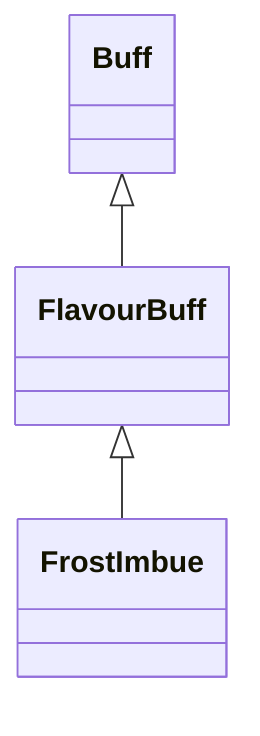

# FrostImbue 类文档

## 1. 基本信息

| 属性 | 值 |
|------|-----|
| **文件路径** | core/src/main/java/com/shatteredpixel/shatteredpixeldungeon/actors/buffs/FrostImbue.java |
| **包名** | com.shatteredpixel.shatteredpixeldungeon.actors.buffs |
| **类类型** | public class |
| **继承关系** | extends FlavourBuff |
| **代码行数** | 73 行 |
| **官方中文名** | 寒霜之力 |

## 2. 文件职责说明

FrostImbue 类表示“寒霜之力”Buff。它是一个正面 FlavourBuff，在持续期间让目标对 `Frost` 和 `Chill` 免疫，并提供命中后附加 `Chill` 的攻击处理方法。

**核心职责**：
- 定义固定持续时间 `DURATION = 50f`
- 给予 `Frost` 与 `Chill` 免疫
- 在附着时清除目标身上的冻结和冻伤
- 在命中时给敌人附加 3 回合 `Chill`

## 3. 结构总览

```
FrostImbue (extends FlavourBuff)
├── 常量
│   └── DURATION: float = 50f
├── 初始化块
│   ├── type = POSITIVE
│   ├── announced = true
│   └── immunities.add(Frost/Chill)
└── 方法
    ├── proc(Char): void
    ├── icon(): int
    ├── tintIcon(Image): void
    ├── iconFadePercent(): float
    └── attachTo(Char): boolean
```

## 4. 继承与协作关系

### 继承关系图



### 协作关系

| 协作类 | 协作方式 |
|--------|----------|
| **FlavourBuff** | 父类，提供时限型 Buff 行为 |
| **Frost** | 被加入免疫，并在附着时移除 |
| **Chill** | 被加入免疫，并在命中时施加给敌人 |
| **SnowParticle** | 命中时雪花粒子效果 |
| **BuffIndicator** | IMBUE 图标 |
| **Image** | 图标染色 |

## 5. 字段与常量详解

### 常量

| 常量 | 类型 | 值 | 说明 |
|------|------|----|------|
| `DURATION` | float | `50f` | 默认持续时间 |

### 初始化块

第一段：

```java
{
    type = buffType.POSITIVE;
    announced = true;
}
```

第二段：

```java
{
    immunities.add(Frost.class);
    immunities.add(Chill.class);
}
```

## 6. 构造与初始化机制

FrostImbue 没有显式构造函数。常见施加方式：

```java
Buff.affect(hero, FrostImbue.class, FrostImbue.DURATION);
```

## 7. 方法详解

### proc(Char enemy)

命中时执行：

```java
Buff.affect(enemy, Chill.class, 3f);
enemy.sprite.emitter().burst(SnowParticle.FACTORY, 3);
```

即给敌人附加 3 回合 `Chill`，并播放雪花粒子。

### icon() / tintIcon()

- 图标：`BuffIndicator.IMBUE`
- 染色：`icon.hardlight(0, 2f, 3f)`

### iconFadePercent()

公式：

```java
Math.max(0, (DURATION - visualcooldown()) / DURATION)
```

### attachTo(Char target)

若 `super.attachTo(target)` 成功：

```java
Buff.detach(target, Frost.class);
Buff.detach(target, Chill.class);
```

即先清掉目标原有的冻结与冻伤，再让寒霜之力生效。

## 8. 对外暴露能力

| 方法/成员 | 用途 |
|-----------|------|
| `DURATION` | 标准持续时间 |
| `proc(Char)` | 处理命中时的冻伤附加 |
| `attachTo(Char)` | 附着时清除 Frost / Chill |

## 9. 运行机制与调用链

```
Buff.affect(target, FrostImbue.class, DURATION)
└── FrostImbue.attachTo(target)
    ├── super.attachTo(target)
    ├── Buff.detach(target, Frost.class)
    └── Buff.detach(target, Chill.class)

命中敌人
└── FrostImbue.proc(enemy)
    ├── Buff.affect(enemy, Chill.class, 3f)
    └── 雪花粒子爆发
```

## 10. 资源、配置与国际化关联

文件：`core/src/main/assets/messages/actors/actors_zh.properties`

```properties
actors.buffs.frostimbue.name=寒霜之力
actors.buffs.frostimbue.desc=你被灌注了寒霜的力量！
```

## 11. 使用示例

```java
Buff.affect(hero, FrostImbue.class, FrostImbue.DURATION);
```

## 12. 开发注意事项

- 本类虽然有 `proc()`，但主体仍继承 `FlavourBuff`，因为持续期间不需要每回合自定义逻辑。
- 免疫和附着清理是成套的：不仅声明免疫，还会在附着时主动移除旧状态。

## 13. 修改建议与扩展点

- 若未来想让寒霜之力叠加更长冻伤时间，可把 `3f` 抽成常量或实例参数。
- 若希望和 `FireImbue` 保持更统一的结构，可考虑抽取附魔型 Buff 公共父类。

## 14. 事实核查清单

- [x] 已覆盖全部自有方法、常量与初始化块
- [x] 已验证继承关系 `extends FlavourBuff`
- [x] 已验证 `POSITIVE` 与 `announced = true`
- [x] 已验证 `Frost` / `Chill` 免疫与附着时清理逻辑
- [x] 已验证 `proc()` 的 3 回合 `Chill` 与粒子效果
- [x] 已验证图标、染色与淡出公式
- [x] 已核对官方中文名来自翻译文件
- [x] 无臆测性机制说明
