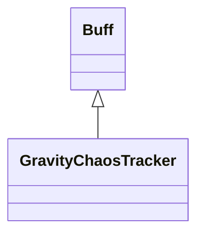

# GravityChaosTracker 类文档

## 1. 基本信息

| 属性 | 值 |
|------|-----|
| **文件路径** | core/src/main/java/com/shatteredpixel/shatteredpixeldungeon/actors/buffs/GravityChaosTracker.java |
| **包名** | com.shatteredpixel.shatteredpixeldungeon.actors.buffs |
| **类类型** | public class |
| **继承关系** | extends Buff |
| **代码行数** | 176 行 |
| **官方中文名** | 重力混乱 |

## 2. 文件职责说明

GravityChaosTracker 类实现“重力混乱”Buff。它会周期性地把当前楼层中的单位向随机方向抛掷，并在单位被其他单位阻挡时记录到 `blocked` 列表，随后重试推进。

**核心职责**：
- 维护剩余持续次数 `left`
- 随机选择一个八方向索引 `idx`
- 让符合条件的单位被 `WandOfBlastWave.throwChar` 抛掷
- 处理被其他单位阻挡的角色重试逻辑
- 在结束时播放提示与音效

## 3. 结构总览

```
GravityChaosTracker (extends Buff)
├── 字段
│   ├── left: int
│   ├── positiveOnly: boolean
│   ├── idx: int
│   └── blocked: ArrayList<Char>
├── 初始化块
│   └── actPriority = BUFF_PRIO - 10
└── 方法
    ├── icon(): int
    ├── tintIcon(Image): void
    ├── act(): boolean
    ├── desc(): String
    ├── storeInBundle(Bundle): void
    └── restoreFromBundle(Bundle): void
```

## 4. 继承与协作关系

### 继承关系图



### 协作关系

| 协作类 | 协作方式 |
|--------|----------|
| **Buff** | 父类，提供附着与回合调度 |
| **Actor.chars()** | 遍历当前楼层全部角色 |
| **Ballistica** | 计算抛掷路径 |
| **PathFinder.NEIGHBOURS8** | 提供 8 个随机方向 |
| **WandOfBlastWave** | 实际执行角色抛掷 |
| **Hero / Mob** | 根据角色类型处理打断或唤醒 |
| **Char.Property.IMMOVABLE** | 判定是否免疫重力混乱 |
| **CursedWand** | 结束提示文本来源 |
| **Sample / Assets.Sounds.DEGRADE** | 结束时音效 |
| **BuffIndicator** | 使用 `VERTIGO` 图标 |
| **Bundle** | 存档读写 |

## 5. 字段与常量详解

### 实例字段

| 字段 | 类型 | 说明 |
|------|------|------|
| `left` | int | 剩余持续次数，初始为 `Random.NormalIntRange(30, 70)` |
| `positiveOnly` | boolean | 若为真，则盟友不受影响 |
| `idx` | int | 当前随机方向索引 |
| `blocked` | ArrayList<Char> | 记录因角色阻挡而尚未成功抛出的单位 |

### 初始化块

```java
{
    actPriority = BUFF_PRIO-10;
}
```

注释说明其“acts after other buffs”。

### Bundle 键

| 常量 | 值 | 用途 |
|------|-----|------|
| `LEFT` | `left` | 保存剩余次数 |
| `POSITIVE_ONLY` | `positive_only` | 保存盟友豁免标志 |

## 6. 构造与初始化机制

GravityChaosTracker 没有显式构造函数。创建后：
- `left` 会立刻按正态范围初始化
- `positiveOnly` 默认为 `false`
- `blocked` 初始为空列表

## 7. 方法详解

### icon() / tintIcon()

- 图标：`BuffIndicator.VERTIGO`
- 染色：
  - `positiveOnly == true` -> 绿色 `hardlight(0,1,0)`
  - 否则 -> 红色 `hardlight(1,0,0)`

### act()

这是本类的核心逻辑。\n
**执行流程**：
1. 先遍历所有角色，等待其精灵移动动画完成：
   - 对每个 `ch.sprite` 加锁
   - 若 `isMoving`，调用 `wait()`
2. 若 `blocked` 不为空：
   - 对每个被阻挡角色，重新计算朝 `idx` 方向的一格 `Ballistica`
   - 若前方不再被角色挡住：
     - 若是英雄，先 `interrupt()`
     - `WandOfBlastWave.throwChar(...)`
     - 从 `blocked` 移除
   - 若本轮没有新的解除阻挡，或者列表已清空：
     - 清空 `blocked`
     - `left--`
     - 若 `left <= 0`，输出 `gravity_end` 并播放 `DEGRADE` 音效后移除
     - 否则 `spend(Random.IntRange(1, 3))`
     - 返回 `true`
3. 若 `blocked` 原本为空：
   - 随机选一个八方向索引 `idx`
   - 遍历所有角色
   - 跳过：
     - `IMMOVABLE` 单位
     - `positiveOnly == true` 且阵营是 `ALLY` 的单位
   - 若是睡眠中的 `Mob`，先切换到 `WANDERING`
   - 计算朝随机方向一格的 `Ballistica`
   - 若前方被其他角色占据，加入 `blocked`
   - 否则直接抛出；英雄会先 `interrupt()`
4. 若最终 `blocked` 为空，才在这一轮末尾消耗 `left` 并决定是否结束。

### desc()

描述文本先读取 `desc_intro`，若 `positiveOnly` 为真再拼接 `desc_positive`，最后拼上 `desc_duration`。

### storeInBundle() / restoreFromBundle()

保存并恢复 `left` 与 `positiveOnly`。

## 8. 对外暴露能力

| 方法/成员 | 用途 |
|-----------|------|
| `left` | 表示剩余持续次数 |
| `positiveOnly` | 控制是否豁免盟友 |
| `desc()` | 根据 `positiveOnly` 拼接不同说明 |

## 9. 运行机制与调用链

```
GravityChaosTracker.act()
├── 等待所有 sprite 停止移动
├── [blocked 非空] 重试推动被阻挡角色
└── [blocked 为空] 随机选方向并推动所有符合条件的角色
    ├── 记录新的 blocked
    └── [无 blocked] left-- 并决定是否结束
```

## 10. 资源、配置与国际化关联

文件：`core/src/main/assets/messages/actors/actors_zh.properties`

```properties
actors.buffs.gravitychaostracker.name=重力混乱
actors.buffs.gravitychaostracker.desc_intro=每经几回合，当前楼层的所有单位都会被抛向某个随机方向。
actors.buffs.gravitychaostracker.desc_positive=然而你和你的盟友似乎对此免疫。
actors.buffs.gravitychaostracker.desc_duration=重力混乱会持续多久不得而知，但其不会一直持续下去。
```

## 11. 使用示例

```java
GravityChaosTracker tracker = Buff.affect(hero, GravityChaosTracker.class);
tracker.positiveOnly = true;
```

## 12. 开发注意事项

- 该 Buff 会直接遍历并操作当前楼层所有角色，改动前必须留意全局副作用。
- `blocked` 机制意味着一次重力事件可能分两轮或更多轮完成，不能把它误写成“每轮只推一次”。
- `positiveOnly` 的逻辑是“盟友免疫”，不是“只影响正面目标”。

## 13. 修改建议与扩展点

- 若未来要降低复杂度，可把“处理 blocked 重试”抽成独立私有方法。
- 若要支持不同方向模式，可把 `idx` 选择逻辑抽象成策略。

## 14. 事实核查清单

- [x] 已覆盖全部字段、方法与初始化块
- [x] 已验证继承关系 `extends Buff`
- [x] 已验证 `left` 的随机初值与 `positiveOnly` 作用
- [x] 已验证等待精灵移动完成的同步逻辑
- [x] 已验证 `blocked` 重试流程
- [x] 已验证结束提示与音效逻辑
- [x] 已验证 `Bundle` 存档字段
- [x] 已核对官方中文名来自翻译文件
- [x] 无臆测性机制说明
