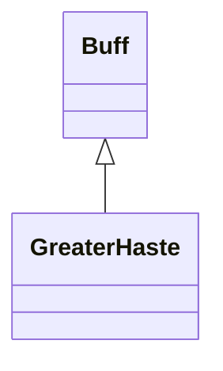

# GreaterHaste 类文档

## 1. 基本信息

| 属性 | 值 |
|------|-----|
| **文件路径** | core/src/main/java/com/shatteredpixel/shatteredpixeldungeon/actors/buffs/GreaterHaste.java |
| **包名** | com.shatteredpixel.shatteredpixeldungeon.actors.buffs |
| **类类型** | public class |
| **继承关系** | extends Buff |
| **代码行数** | 105 行 |
| **官方中文名** | 飞影 |

## 2. 文件职责说明

GreaterHaste 类表示“飞影”Buff。它不是按普通持续时间衰减，而是维护一个整数 `left`，每次移动消耗 1 点；耗尽后移除。源码注释明确说明它当前只应用于英雄。

**核心职责**：
- 保存剩余移动次数 `left`
- 在移动时通过 `spendMove()` 消耗次数
- 提供图标、图标文本和描述文本
- 保存/恢复剩余次数

## 3. 结构总览

```
GreaterHaste (extends Buff)
├── 字段
│   └── left: int
├── 方法
│   ├── act(): boolean
│   ├── spendMove(): void
│   ├── set(int): void
│   ├── extend(float): void
│   ├── icon(): int
│   ├── tintIcon(Image): void
│   ├── iconFadePercent(): float
│   ├── iconTextDisplay(): String
│   ├── desc(): String
│   ├── storeInBundle(Bundle): void
│   └── restoreFromBundle(Bundle): void
```

## 4. 继承与协作关系

### 继承关系图



### 协作关系

| 协作类 | 协作方式 |
|--------|----------|
| **Buff** | 父类，提供基础计时与附着能力 |
| **Dungeon.hero** | 图标淡出计算读取英雄天赋 |
| **Talent.LETHAL_HASTE** | 决定图标淡出基准时长 |
| **BuffIndicator** | 图标编号 |
| **Image** | 图标染色 |
| **Messages** | 描述文本国际化 |
| **Bundle** | 存档读写 |

## 5. 字段与常量详解

### 实例字段

| 字段 | 类型 | 说明 |
|------|------|------|
| `left` | int | 剩余移动次数 |

### Bundle 键

| 常量 | 值 | 用途 |
|------|-----|------|
| `LEFT` | `left` | 保存剩余移动次数 |

## 6. 构造与初始化机制

初始化块：

```java
{
    type = buffType.POSITIVE;
}
```

常见使用：

```java
GreaterHaste buff = Buff.affect(hero, GreaterHaste.class);
buff.set(3);
```

## 7. 方法详解

### act()

执行：

```java
spendMove();
spend(TICK);
return true;
```

也就是说，GreaterHaste 的回合行为会消耗一次移动次数，然后继续推进一回合。

### spendMove()

```java
left--;
if (left <= 0) {
    detach();
}
```

### set(int time)

直接把 `left` 设为传入值。

### extend(float duration)

执行：

```java
left += duration;
```

这里 `duration` 是 `float`，但与 `int left` 相加时会发生复合赋值转换。

### icon() / tintIcon()

- 图标：`BuffIndicator.HASTE`
- 染色：`icon.hardlight(1f, 0.3f, 0f)`

### iconFadePercent()

公式：

```java
float duration = 1 + 2*Dungeon.hero.pointsInTalent(Talent.LETHAL_HASTE);
return Math.max(0, (duration - left) / duration);
```

源码注释说明：当前只有 `LETHAL_HASTE` 这个来源，因此直接用该天赋点数做显示基准。

### iconTextDisplay()

返回 `left` 的字符串。

### desc()

```java
Messages.get(this, "desc", left)
```

### storeInBundle() / restoreFromBundle()

保存并恢复 `left`。

## 8. 对外暴露能力

| 方法 | 用途 |
|------|------|
| `spendMove()` | 消耗一次移动次数 |
| `set(int)` | 设置剩余次数 |
| `extend(float)` | 追加剩余次数 |
| `iconTextDisplay()` | 显示剩余次数 |

## 9. 运行机制与调用链

```
GreaterHaste 生效
└── set(left)

角色移动/回合推进
└── GreaterHaste.act()
    ├── spendMove()
    │   ├── left--
    │   └── [left <= 0] detach()
    └── spend(TICK)
```

## 10. 资源、配置与国际化关联

文件：`core/src/main/assets/messages/actors/actors_zh.properties`

```properties
actors.buffs.greaterhaste.name=飞影
actors.buffs.greaterhaste.desc=惊人的速度加成效果使得一切都好像在此刻静止了。
```

## 11. 使用示例

```java
GreaterHaste buff = Buff.affect(hero, GreaterHaste.class);
buff.set(3);
buff.extend(2f);
```

## 12. 开发注意事项

- 该 Buff 的核心不是“剩余回合”而是“剩余移动次数”。
- `iconFadePercent()` 假设来源是 `Talent.LETHAL_HASTE`，如果未来有其他来源，需要重新审查显示逻辑。
- 源码注释明确写了“currently only applies to the hero”，文档不应扩展成通用全角色机制。

## 13. 修改建议与扩展点

- 若未来来源变多，可把显示基准从天赋读取改成实例字段。
- 若要避免 `extend(float)` 到 `int` 的隐式转换，可以把参数类型改成 `int` 或显式取整。

## 14. 事实核查清单

- [x] 已覆盖全部字段与方法
- [x] 已验证继承关系 `extends Buff`
- [x] 已验证 `spendMove()` 消耗逻辑
- [x] 已验证图标淡出依赖 `LETHAL_HASTE`
- [x] 已验证 `Bundle` 存档字段
- [x] 已核对官方中文名来自翻译文件
- [x] 已注明当前只应用于英雄这一源码事实
- [x] 无臆测性机制说明
