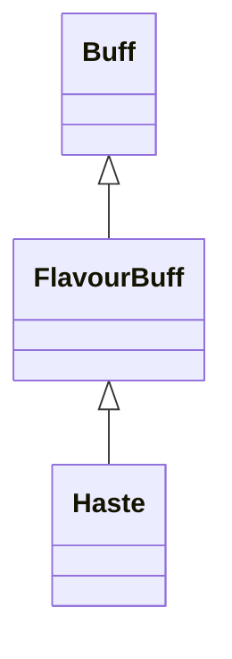

# Haste 类文档

## 1. 基本信息

| 属性 | 值 |
|------|-----|
| **文件路径** | core/src/main/java/com/shatteredpixel/shatteredpixeldungeon/actors/buffs/Haste.java |
| **包名** | com.shatteredpixel.shatteredpixeldungeon.actors.buffs |
| **类类型** | public class |
| **继承关系** | extends FlavourBuff |
| **代码行数** | 50 行 |
| **官方中文名** | 极速 |

## 2. 文件职责说明

Haste 类表示“极速”Buff。它是一个时限型正面 FlavourBuff，负责提供图标、图标染色和固定时长的淡出显示。

**核心职责**：
- 定义固定持续时间 `20f`
- 标记为正面 Buff
- 提供 HASTE 图标与橙黄色染色
- 按固定时长计算淡出比例

## 3. 结构总览

```
Haste (extends FlavourBuff)
├── 常量
│   └── DURATION: float = 20f
├── 初始化块
│   └── type = POSITIVE
└── 方法
    ├── icon(): int
    ├── tintIcon(Image): void
    └── iconFadePercent(): float
```

## 4. 继承与协作关系

### 继承关系图



### 协作关系

| 协作类 | 协作方式 |
|--------|----------|
| **FlavourBuff** | 父类，提供简单时限 Buff 行为 |
| **BuffIndicator** | 提供急速图标 |
| **Image** | 图标染色 |

## 5. 字段与常量详解

### 常量

| 常量 | 类型 | 值 | 说明 |
|------|------|----|------|
| `DURATION` | float | `20f` | 标准持续时间与图标淡出基准 |

### 初始化块

```java
{
    type = buffType.POSITIVE;
}
```

## 6. 构造与初始化机制

Haste 没有显式构造函数。常见施加方式：

```java
Buff.affect(target, Haste.class, Haste.DURATION);
```

## 7. 方法详解

### icon()

返回 `BuffIndicator.HASTE`。

### tintIcon(Image icon)

```java
icon.hardlight(1f, 0.8f, 0f);
```

把图标染成橙黄色。

### iconFadePercent()

公式：

```java
Math.max(0, (DURATION - visualcooldown()) / DURATION)
```

## 8. 对外暴露能力

| 方法/成员 | 用途 |
|-----------|------|
| `DURATION` | 标准持续时间 |
| `icon()` | UI 图标显示 |
| `tintIcon()` | UI 图标染色 |

## 9. 运行机制与调用链

```
Buff.affect(target, Haste.class, DURATION)
└── FlavourBuff 生命周期运行
    └── UI 读取 icon / tintIcon / iconFadePercent
```

## 10. 资源、配置与国际化关联

文件：`core/src/main/assets/messages/actors/actors_zh.properties`

```properties
actors.buffs.haste.name=极速
actors.buffs.haste.desc=强大的能量灌入到你的双腿肌肉上，允许你以不可思议的速度移动！
```

## 11. 使用示例

```java
Buff.affect(hero, Haste.class, Haste.DURATION);
```

## 12. 开发注意事项

- 本类不直接实现移动速度计算，只提供 Buff 定义与显示行为。
- 未设置 `announced = true`，因此不会像部分正面 Buff 那样主动公告名称。

## 13. 修改建议与扩展点

- 若要让不同来源的极速表现不同，可增加图标染色或单独描述文本。
- 若要让 UI 更精确，可把固定 `DURATION` 改成动态基准。

## 14. 事实核查清单

- [x] 已覆盖全部自有方法与常量
- [x] 已验证继承关系 `extends FlavourBuff`
- [x] 已验证 `POSITIVE` 初始化
- [x] 已验证图标、染色与淡出公式
- [x] 已核对中文名来自官方翻译
- [x] 无臆测性机制说明
