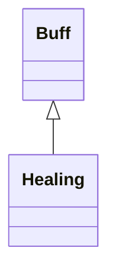

# Healing 类文档

## 1. 基本信息

| 属性 | 值 |
|------|-----|
| **文件路径** | core/src/main/java/com/shatteredpixel/shatteredpixeldungeon/actors/buffs/Healing.java |
| **包名** | com.shatteredpixel.shatteredpixeldungeon.actors.buffs |
| **类类型** | public class |
| **继承关系** | extends Buff |
| **代码行数** | 148 行 |
| **官方中文名** | 治疗 |

## 2. 文件职责说明

Healing 类实现持续治疗 Buff。它按每回合百分比/固定值计算本回合治疗量，逐步消耗总治疗池 `healingLeft`，并支持与 `VialOfBlood` 的延迟爆发治疗限制联动。

**核心职责**：
- 维护剩余治疗总量 `healingLeft`
- 维护每回合百分比治疗与固定治疗参数
- 在每回合按规则恢复生命并显示浮字
- 在治疗耗尽时自动移除自身
- 处理血之瓶的治疗上限与总量乘区

## 3. 结构总览

```
Healing (extends Buff)
├── 字段
│   ├── healingLeft: int
│   ├── percentHealPerTick: float
│   ├── flatHealPerTick: int
│   └── healingLimited: boolean
├── 初始化块
│   ├── actPriority = HERO_PRIO - 1
│   └── type = POSITIVE
└── 方法
    ├── act(): boolean
    ├── healingThisTick(): int
    ├── setHeal(int,float,int): void
    ├── applyVialEffect(): void
    ├── increaseHeal(int): void
    ├── fx(boolean): void
    ├── icon(): int
    ├── iconTextDisplay(): String
    ├── desc(): String
    ├── storeInBundle(Bundle): void
    └── restoreFromBundle(Bundle): void
```

## 4. 继承与协作关系

### 继承关系图



### 协作关系

| 协作类 | 协作方式 |
|--------|----------|
| **Buff** | 父类，提供计时、附着与视觉接口 |
| **Hero** | 目标为英雄时会停止休息状态 |
| **VialOfBlood** | 提供每回合治疗上限与总量乘数 |
| **GameMath** | `healingThisTick()` 使用 `gate()` 限制范围 |
| **FloatingText** | 显示治疗浮字 |
| **CharSprite** | 治疗状态与正面浮字 |
| **BuffIndicator** | 治疗图标 |
| **Messages** | 描述文本国际化 |
| **Bundle** | 存档读写 |

## 5. 字段与常量详解

### 实例字段

| 字段 | 类型 | 说明 |
|------|------|------|
| `healingLeft` | int | 剩余治疗总量 |
| `percentHealPerTick` | float | 每回合按剩余治疗量比例取值的系数 |
| `flatHealPerTick` | int | 每回合固定附加治疗量 |
| `healingLimited` | boolean | 是否受 `VialOfBlood.maxHealPerTurn()` 限制 |

### 初始化块

```java
{
    actPriority = HERO_PRIO - 1;
    type = buffType.POSITIVE;
}
```

这使得 Healing 在英雄行动后、其他多数效果之前执行。

### Bundle 键

| 常量 | 值 | 用途 |
|------|-----|------|
| `LEFT` | `left` | 保存剩余治疗量 |
| `PERCENT` | `percent` | 保存百分比治疗系数 |
| `FLAT` | `flat` | 保存固定治疗量 |
| `HEALING_LIMITED` | `healing_limited` | 保存是否受限 |

## 6. 构造与初始化机制

Healing 没有显式构造函数。常见使用：

```java
Healing healing = Buff.affect(hero, Healing.class);
healing.setHeal(amount, percent, flat);
```

## 7. 方法详解

### act()

每回合逻辑：
1. 若 `target.HP < target.HT`，则：
   - `target.HP = Math.min(target.HT, target.HP + healingThisTick())`
   - 若目标是英雄且已满血，`resting = false`
2. 无论是否缺血，都会显示：

```java
target.sprite.showStatusWithIcon(CharSprite.POSITIVE, Integer.toString(healingThisTick()), FloatingText.HEALING)
```

3. `healingLeft -= healingThisTick()`
4. 若 `healingLeft <= 0`：
   - 若目标是英雄，`resting = false`
   - `detach()`
5. `spend(TICK)`

### healingThisTick()

计算公式：

```java
int heal = (int)GameMath.gate(1,
        Math.round(healingLeft * percentHealPerTick) + flatHealPerTick,
        healingLeft);
```

然后若 `healingLimited` 且大于 `VialOfBlood.maxHealPerTurn()`，就截断到上限。

### setHeal(int amount, float percentPerTick, int flatPerTick)

多个治疗来源不会简单叠加，而是逐项取更优值：

```java
healingLeft = Math.max(healingLeft, amount);
percentHealPerTick = Math.max(percentHealPerTick, percentPerTick);
flatHealPerTick = Math.max(flatHealPerTick, flatPerTick);
```

### applyVialEffect()

```java
healingLimited = VialOfBlood.delayBurstHealing();
if (healingLimited){
    healingLeft = Math.round(healingLeft*VialOfBlood.totalHealMultiplier());
}
```

### increaseHeal(int amount)

直接增加 `healingLeft`。

### fx(boolean on)

- 开启：添加 `CharSprite.State.HEALING`
- 关闭：移除该状态

### icon() / iconTextDisplay()

- 图标：`BuffIndicator.HEALING`
- 图标文本：剩余治疗量 `healingLeft`

### desc()

```java
Messages.get(this, "desc", healingThisTick(), healingLeft)
```

### storeInBundle() / restoreFromBundle()

保存并恢复四个核心字段。

## 8. 对外暴露能力

| 方法 | 用途 |
|------|------|
| `setHeal(int,float,int)` | 设置治疗参数 |
| `applyVialEffect()` | 施加血之瓶限制与总量乘区 |
| `increaseHeal(int)` | 增加剩余治疗总量 |

## 9. 运行机制与调用链

```
Healing.act()
├── heal = healingThisTick()
├── 恢复 HP
├── 显示治疗浮字
├── healingLeft -= heal
└── [healingLeft <= 0] detach()
```

## 10. 资源、配置与国际化关联

文件：`core/src/main/assets/messages/actors/actors_zh.properties`

```properties
actors.buffs.healing.name=治疗
actors.buffs.healing.desc=一股治愈魔力让你的伤口开始愈合。
```

## 11. 使用示例

```java
Healing healing = Buff.affect(hero, Healing.class);
healing.setHeal(20, 0.1f, 2);
healing.applyVialEffect();
```

## 12. 开发注意事项

- 本类优先级高于普通 Buff，是为了让治疗尽量先于其他效果结算。
- `act()` 中 `healingThisTick()` 会被多次调用，文档与分析必须按源码如实记录，而不是自行优化成一次缓存。
- `setHeal()` 不是简单叠加，而是“保留最优参数组合”。

## 13. 修改建议与扩展点

- 若后续要避免重复调用 `healingThisTick()` 带来的不一致风险，可在 `act()` 内缓存一次结果。
- 若要支持更多治疗限制来源，可把 `healingLimited` 扩展成更通用的限流策略。

## 14. 事实核查清单

- [x] 已覆盖全部字段与方法
- [x] 已验证继承关系 `extends Buff`
- [x] 已验证高优先级 `HERO_PRIO - 1`
- [x] 已验证 `healingThisTick()` 公式与血之瓶限制
- [x] 已验证 `setHeal()` 的最优组合规则
- [x] 已验证 `Bundle` 存档字段
- [x] 已核对官方中文名来自翻译文件
- [x] 无臆测性机制说明
