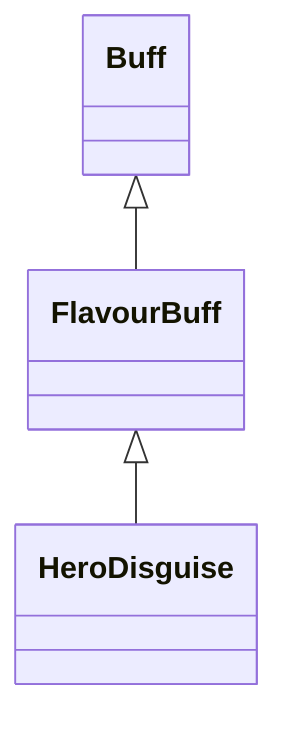

# HeroDisguise 类文档

## 1. 基本信息

| 属性 | 值 |
|------|-----|
| **文件路径** | core/src/main/java/com/shatteredpixel/shatteredpixeldungeon/actors/buffs/HeroDisguise.java |
| **包名** | com.shatteredpixel.shatteredpixeldungeon.actors.buffs |
| **类类型** | public class |
| **继承关系** | extends FlavourBuff |
| **代码行数** | 84 行 |
| **官方中文名** | 伪装 |

## 2. 文件职责说明

HeroDisguise 类表示“伪装”Buff。它是一个长时 FlavourBuff，会把英雄外观临时伪装成其他英雄职业，并在结束时恢复原职业外观，同时刷新头像显示。

**核心职责**：
- 保存当前伪装目标职业 `cls`
- 在首次启用时随机选择一个不等于当前职业的 `HeroClass`
- 对英雄精灵执行伪装/还原
- 存档恢复伪装职业

## 3. 结构总览

```
HeroDisguise (extends FlavourBuff)
├── 字段
│   └── cls: HeroClass
├── 常量
│   └── DURATION: float = 1000f
├── 初始化块
│   └── announced = true
└── 方法
    ├── getDisguise(): HeroClass
    ├── icon(): int
    ├── iconFadePercent(): float
    ├── fx(boolean): void
    ├── storeInBundle(Bundle): void
    └── restoreFromBundle(Bundle): void
```

## 4. 继承与协作关系

### 继承关系图



### 协作关系

| 协作类 | 协作方式 |
|--------|----------|
| **FlavourBuff** | 父类，提供长时 Buff 生命周期 |
| **Hero** | 仅对英雄伪装有效 |
| **HeroClass** | 伪装目标职业枚举 |
| **HeroSprite** | 执行 `disguise(...)` 外观切换 |
| **GameScene** | 调用 `updateAvatar()` 刷新头像 |
| **BuffIndicator** | 提供 DISGUISE 图标 |
| **Random** | 随机选择伪装职业 |
| **Bundle** | 存档读写 |

## 5. 字段与常量详解

### 实例字段

| 字段 | 类型 | 说明 |
|------|------|------|
| `cls` | HeroClass | 当前伪装的职业；初始为 `null`，首次启用时随机生成 |

### 常量

| 常量 | 类型 | 值 | 说明 |
|------|------|----|------|
| `DURATION` | float | `1000f` | 默认持续时间 |

### 初始化块

```java
{
    announced = true;
}
```

本类没有显式设置 `type`，因此保持 `Buff` 默认的 `NEUTRAL`。

## 6. 构造与初始化机制

HeroDisguise 没有显式构造函数。通常通过：

```java
Buff.affect(hero, HeroDisguise.class, HeroDisguise.DURATION);
```

施加。首次触发 `fx(true)` 时若 `cls == null`，会在所有 `HeroClass` 中随机抽一个非当前职业。

## 7. 方法详解

### getDisguise()

返回当前记录的伪装职业 `cls`。

### icon()

返回 `BuffIndicator.DISGUISE`。

### iconFadePercent()

公式：

```java
Math.max(0, (DURATION - visualcooldown()) / DURATION)
```

### fx(boolean on)

仅当：
- `target instanceof Hero`
- `target.sprite instanceof HeroSprite`

时生效。\n
执行逻辑：
1. 若 `cls == null`，随机选择一个 `HeroClass`，并确保不等于英雄当前职业。\n
2. 若 `on == true`：
   - `((HeroSprite)target.sprite).disguise(cls)`
3. 否则：
   - `((HeroSprite)target.sprite).disguise(((Hero) target).heroClass)`
4. `GameScene.updateAvatar()` 更新头像。

### storeInBundle() / restoreFromBundle()

使用键 `class` 保存和恢复 `cls`。

## 8. 对外暴露能力

| 方法/成员 | 用途 |
|-----------|------|
| `DURATION` | 标准持续时间 |
| `getDisguise()` | 查询当前伪装职业 |
| `fx(boolean)` | 执行外观切换或恢复 |

## 9. 运行机制与调用链

```
Buff.affect(hero, HeroDisguise.class, DURATION)
└── HeroDisguise.fx(true)
    ├── [cls == null] 随机选一个非当前 HeroClass
    ├── HeroSprite.disguise(cls)
    └── GameScene.updateAvatar()

Buff 结束
└── HeroDisguise.fx(false)
    ├── HeroSprite.disguise(hero.heroClass)
    └── GameScene.updateAvatar()
```

## 10. 资源、配置与国际化关联

文件：`core/src/main/assets/messages/actors/actors_zh.properties`

```properties
actors.buffs.herodisguise.name=伪装
actors.buffs.herodisguise.desc=幻术魔法改变了你的外貌！虽然此效果是完全装饰性的，但无论如何感觉起来还是很奇怪。
```

## 11. 使用示例

```java
HeroDisguise disguise = Buff.affect(hero, HeroDisguise.class, HeroDisguise.DURATION);
HeroClass currentMask = disguise.getDisguise();
```

## 12. 开发注意事项

- 该 Buff 是纯装饰性，源码中没有改动英雄属性、职业能力或战斗逻辑。
- 只有在目标是 `Hero` 且精灵是 `HeroSprite` 时，伪装才真正发生。
- `cls` 一旦生成会被存档保存，不会每次读档后重新随机。

## 13. 修改建议与扩展点

- 若未来需要指定伪装目标职业，可新增显式 setter，而不是总是首次随机。
- 若要让头像与立绘更新更统一，可把 `GameScene.updateAvatar()` 封装进精灵层接口。

## 14. 事实核查清单

- [x] 已覆盖全部字段、方法与常量
- [x] 已验证继承关系 `extends FlavourBuff`
- [x] 已验证仅设置 `announced = true`，未显式修改 `type`
- [x] 已验证随机职业选择会排除当前职业
- [x] 已验证 `fx(true/false)` 的伪装与还原逻辑
- [x] 已验证 `Bundle` 存档字段
- [x] 已核对官方中文名来自翻译文件
- [x] 无臆测性机制说明
