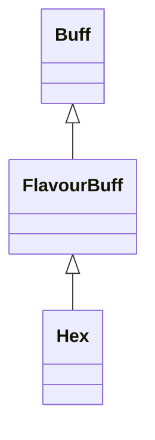

# Hex 类文档

## 1. 基本信息

| 属性 | 值 |
|------|-----|
| **文件路径** | core/src/main/java/com/shatteredpixel/shatteredpixeldungeon/actors/buffs/Hex.java |
| **包名** | com.shatteredpixel.shatteredpixeldungeon.actors.buffs |
| **类类型** | public class |
| **继承关系** | extends FlavourBuff |
| **代码行数** | 44 行 |
| **官方中文名** | 幻惑 |

## 2. 文件职责说明

Hex 类表示“幻惑”Buff。它是一个负面 FlavourBuff，本类只定义持续时间、Buff 类型、公告行为和图标显示，具体数值影响由战斗系统依据该 Buff 是否存在来处理。

**核心职责**：
- 定义默认持续时间 `30f`
- 标记为负面且可公告的 Buff
- 提供 HEX 图标与图标淡出比例

## 3. 结构总览

```
Hex (extends FlavourBuff)
├── 常量
│   └── DURATION: float = 30f
├── 初始化块
│   ├── type = NEGATIVE
│   └── announced = true
└── 方法
    ├── icon(): int
    └── iconFadePercent(): float
```

## 4. 继承与协作关系

### 继承关系图



### 协作关系

| 协作类 | 协作方式 |
|--------|----------|
| **FlavourBuff** | 父类，提供时限 Buff 行为 |
| **BuffIndicator** | 提供幻惑图标 |

## 5. 字段与常量详解

### 常量

| 常量 | 类型 | 值 | 说明 |
|------|------|----|------|
| `DURATION` | float | `30f` | 默认持续时间 |

### 初始化块

```java
{
    type = buffType.NEGATIVE;
    announced = true;
}
```

## 6. 构造与初始化机制

Hex 没有显式构造函数。常见施加方式：

```java
Buff.affect(target, Hex.class, Hex.DURATION);
```

## 7. 方法详解

### icon()

返回 `BuffIndicator.HEX`。

### iconFadePercent()

公式：

```java
Math.max(0, (DURATION - visualcooldown()) / DURATION)
```

## 8. 对外暴露能力

| 方法/成员 | 用途 |
|-----------|------|
| `DURATION` | 标准持续时间 |
| `icon()` | UI 图标显示 |

## 9. 运行机制与调用链

```
Buff.affect(target, Hex.class, DURATION)
└── FlavourBuff 生命周期运行
    └── UI 读取 icon() / iconFadePercent()
```

## 10. 资源、配置与国际化关联

文件：`core/src/main/assets/messages/actors/actors_zh.properties`

```properties
actors.buffs.hex.name=幻惑
actors.buffs.hex.heromsg=你的精神受到了魔法的干扰！
actors.buffs.hex.desc=干扰集中力的黑暗魔法，使目标无法准确地判断方位。
```

## 11. 使用示例

```java
Buff.affect(enemy, Hex.class, Hex.DURATION);
```

## 12. 开发注意事项

- 本类本身不包含命中/闪避减益计算，只定义 Buff 壳与显示接口。
- `announced = true` 表示施加时会公告；`heromsg` 则由通用 Buff 文本接口读取。

## 13. 修改建议与扩展点

- 若未来需要按来源区分不同强度的幻惑，可从 `FlavourBuff` 升级为带字段的 `Buff` 子类。
- 若希望图标展示更精细，可加入自定义染色逻辑。

## 14. 事实核查清单

- [x] 已覆盖全部自有方法与常量
- [x] 已验证继承关系 `extends FlavourBuff`
- [x] 已验证 `NEGATIVE` 与 `announced = true`
- [x] 已验证图标与淡出公式
- [x] 已核对官方中文名来自翻译文件
- [x] 无臆测性机制说明
