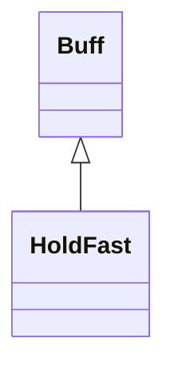

# HoldFast 类文档

## 1. 基本信息

| 属性 | 值 |
|------|-----|
| **文件路径** | core/src/main/java/com/shatteredpixel/shatteredpixeldungeon/actors/buffs/HoldFast.java |
| **包名** | com.shatteredpixel.shatteredpixeldungeon.actors.buffs |
| **类类型** | public class |
| **继承关系** | extends Buff |
| **代码行数** | 110 行 |
| **官方中文名** | 不动如山 |

## 2. 文件职责说明

HoldFast 类表示“不动如山”Buff。它记录一个固定据守位置 `pos`，只要目标还站在原地，就能为英雄提供额外护甲，并为其他系统提供护盾/连击衰减减速系数。

**核心职责**：
- 记录据守时的位置
- 目标离开原地时自动移除 Buff
- 根据 `Talent.HOLD_FAST` 提供随机护甲加成
- 通过 `buffDecayFactor()` 暴露衰减减速系数

## 3. 结构总览

```
HoldFast (extends Buff)
├── 字段
│   └── pos: int
├── 初始化块
│   └── type = POSITIVE
└── 方法
    ├── act(): boolean
    ├── armorBonus(): int
    ├── buffDecayFactor(Char): float$
    ├── icon(): int
    ├── tintIcon(Image): void
    ├── desc(): String
    ├── storeInBundle(Bundle): void
    └── restoreFromBundle(Bundle): void
```

## 4. 继承与协作关系

### 继承关系图



### 协作关系

| 协作类 | 协作方式 |
|--------|----------|
| **Buff** | 父类，提供附着与计时 |
| **Hero** | 护甲加成和衰减系数都只在英雄逻辑下计算 |
| **Talent.HOLD_FAST** | 决定护甲范围和减速比例 |
| **BuffIndicator** | 使用 ARMOR 图标 |
| **Image** | 图标染色 |
| **Messages** | 描述文本国际化 |
| **Bundle** | 存档读写 |

## 5. 字段与常量详解

### 实例字段

| 字段 | 类型 | 说明 |
|------|------|------|
| `pos` | int | Buff 生效时记录的位置；目标离开此格即失效 |

### 初始化块

```java
{
    type = buffType.POSITIVE;
}
```

### Bundle 键

| 常量 | 值 | 用途 |
|------|-----|------|
| `POS` | `pos` | 保存据守位置 |

## 6. 构造与初始化机制

HoldFast 没有显式构造函数。一般是在英雄触发相关天赋效果时创建，并把 `pos` 设为当前格。

## 7. 方法详解

### act()

每回合检查：
- 若 `pos != target.pos`，移除 Buff
- 否则 `spend(TICK)` 继续存在

### armorBonus()

仅当：
- `pos == target.pos`
- `target instanceof Hero`

时返回：

```java
Random.NormalIntRange(pointsInTalent(HOLD_FAST), 2*pointsInTalent(HOLD_FAST))
```

否则会先 `detach()`，再返回 `0`。

### buffDecayFactor(Char target)

这是 HoldFast 最重要的静态工具方法，供 `Barrier` 等系统读取。\n
逻辑：
- 若目标拥有 HoldFast、仍站在原位且是英雄：
  - 天赋 1 点 -> `0.5f`
  - 天赋 2 点 -> `0.25f`
  - 天赋 3 点 -> `0f`
- 若目标有 HoldFast 但已不在原位，则先移除该 Buff
- 其他情况返回 `1`

### icon() / tintIcon()

- 图标：`BuffIndicator.ARMOR`
- 染色：`icon.hardlight(1.9f, 2.4f, 3.25f)`

### desc()

通过：

```java
Messages.get(this, "desc",
    pointsInTalent,
    2*pointsInTalent,
    25 + 25*pointsInTalent)
```

把天赋点数对应的护甲范围和衰减减缓百分比填入描述。

### storeInBundle() / restoreFromBundle()

保存并恢复 `pos`。

## 8. 对外暴露能力

| 方法 | 用途 |
|------|------|
| `armorBonus()` | 获取当前额外护甲 |
| `buffDecayFactor(Char)` | 获取护盾/连击等衰减减速系数 |

## 9. 运行机制与调用链

```
HoldFast.act()
├── [离开原位] detach()
└── [仍在原位] spend(TICK)

其他系统
└── HoldFast.buffDecayFactor(target)
    └── 根据 HOLD_FAST 天赋返回 0.5 / 0.25 / 0 / 1
```

## 10. 资源、配置与国际化关联

文件：`core/src/main/assets/messages/actors/actors_zh.properties`

```properties
actors.buffs.holdfast.name=不动如山
actors.buffs.holdfast.desc=战士正在据守此处，提升其%1$d~%2$d点护甲并将连击与护盾的衰减速度减缓%3$d%%，直至他移动为止。
```

## 11. 使用示例

```java
HoldFast buff = Buff.affect(hero, HoldFast.class);
buff.pos = hero.pos;

int armor = buff.armorBonus();
float decayFactor = HoldFast.buffDecayFactor(hero);
```

## 12. 开发注意事项

- `armorBonus()` 每次调用都会重新随机，不是固定值缓存。
- `buffDecayFactor()` 在目标离开原位时会顺手移除 Buff，这个副作用必须按源码记载。
- 该 Buff 的数值依赖 `Talent.HOLD_FAST`，不应在文档里扩展成通用全角色机制。

## 13. 修改建议与扩展点

- 若后续想让护甲值更稳定，可把当前随机区间结果缓存到实例字段。
- 若更多系统依赖衰减减速，可考虑把 `buffDecayFactor()` 拆成独立接口型能力。

## 14. 事实核查清单

- [x] 已覆盖全部字段与方法
- [x] 已验证继承关系 `extends Buff`
- [x] 已验证 `POSITIVE` 初始化
- [x] 已验证位置绑定与离位移除逻辑
- [x] 已验证 `armorBonus()` 随机区间公式
- [x] 已验证 `buffDecayFactor()` 的三档系数与副作用
- [x] 已验证 `Bundle` 存档字段
- [x] 已核对官方中文名来自翻译文件
- [x] 无臆测性机制说明
