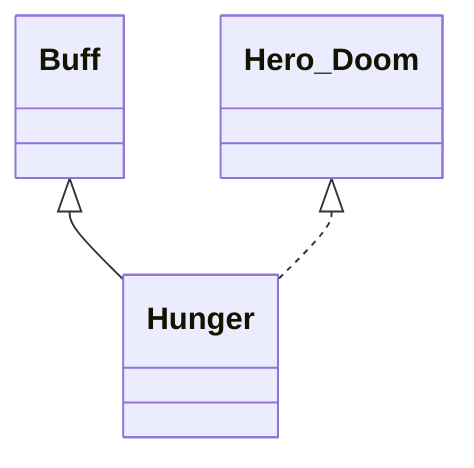

# Hunger 类文档

## 1. 基本信息

| 属性 | 值 |
|------|-----|
| **文件路径** | core/src/main/java/com/shatteredpixel/shatteredpixeldungeon/actors/buffs/Hunger.java |
| **包名** | com.shatteredpixel.shatteredpixeldungeon.actors.buffs |
| **类类型** | public class |
| **继承关系** | extends Buff implements Hero.Doom |
| **代码行数** | 220 行 |
| **官方中文名** | 饥饿 / 极度饥饿 |

## 2. 文件职责说明

Hunger 类实现英雄的饥饿系统。它按时间累积饥饿值 `level`，在达到 `HUNGRY` 和 `STARVING` 阈值后切换状态，并在极度饥饿时持续造成伤害，最终可触发饥饿死亡。

**核心职责**：
- 维护饥饿值与饥饿伤害累计值
- 在特定条件下暂停或累积饥饿
- 处理食物带来的饥饿恢复
- 根据阈值切换名称、图标和描述
- 处理饥饿致死逻辑

## 3. 结构总览

```
Hunger (extends Buff implements Hero.Doom)
├── 常量
│   ├── HUNGRY: float = 300f
│   └── STARVING: float = 450f
├── 字段
│   ├── level: float
│   └── partialDamage: float
├── 方法
│   ├── act(): boolean
│   ├── satisfy(float): void
│   ├── affectHunger(float): void
│   ├── affectHunger(float, boolean): void
│   ├── isStarving(): boolean
│   ├── hunger(): int
│   ├── icon(): int
│   ├── name(): String
│   ├── desc(): String
│   ├── onDeath(): void
│   ├── storeInBundle(Bundle): void
│   └── restoreFromBundle(Bundle): void
```

## 4. 继承与协作关系

### 继承关系图



### 协作关系

| 协作类 | 协作方式 |
|--------|----------|
| **Buff** | 父类，提供附着和行动调度 |
| **Hero.Doom** | 饥饿致死时的失败处理接口 |
| **Hero** | 饥饿系统的主要作用对象 |
| **WellFed** | 存在时暂停饥饿累积，负能量优先消耗其时长 |
| **Shadows** | 存在时降低饥饿累积速度 |
| **SaltCube** | 通过 `hungerGainMultiplier()` 调整饥饿增长速度 |
| **ScrollOfChallenge.ChallengeArena** | 在竞技场时暂停饥饿 |
| **VaultLevel** | 在金库层暂停饥饿 |
| **Document / GameScene** | 初次进入饥饿状态时触发指南提示 |
| **Badges / Dungeon / GLog** | 饥饿死亡的徽章、失败与日志处理 |
| **BuffIndicator** | 刷新英雄状态图标 |

## 5. 字段与常量详解

### 常量

| 常量 | 类型 | 值 | 说明 |
|------|------|----|------|
| `HUNGRY` | float | `300f` | 进入饥饿状态阈值 |
| `STARVING` | float | `450f` | 进入极度饥饿状态阈值 |

### 实例字段

| 字段 | 类型 | 说明 |
|------|------|------|
| `level` | float | 当前饥饿值 |
| `partialDamage` | float | 极度饥饿时累计的伤害小数部分 |

### Bundle 键

| 常量 | 值 | 用途 |
|------|-----|------|
| `LEVEL` | `level` | 保存当前饥饿值 |
| `PARTIALDAMAGE` | `partialDamage` | 保存累计伤害 |

## 6. 构造与初始化机制

Hunger 没有显式构造函数。它通常作为英雄长期存在的核心 Buff 之一被附着，并通过 `act()` 持续推进饥饿系统。

## 7. 方法详解

### act()

**首先检查暂停条件**：若满足以下任一条件，则只 `spend(TICK)` 并返回：
- `Dungeon.level.locked`
- 目标有 `WellFed`
- `SPDSettings.intro()` 为真
- 目标有 `ScrollOfChallenge.ChallengeArena`
- 当前楼层是 `VaultLevel`

**正常饥饿流程**：
1. 仅当目标存活且是 `Hero` 时继续。\n
2. 若 `isStarving()`：
   - `partialDamage += target.HT/1000f`
   - 当 `partialDamage > 1` 时，按整数部分造成伤害并扣除已消费部分
3. 否则进入普通累积：
   - `hungerDelay` 初始为 `1f`
   - 有 `Shadows` 时乘 `1.5f`
   - 再除以 `SaltCube.hungerGainMultiplier()`
   - `newLevel = level + (1f/hungerDelay)`
   - 若跨过 `STARVING`：输出 `onstarving`，立刻对英雄造成 1 点伤害并中断，且把 `newLevel` 钳制到 `STARVING`
   - 若从低于 `HUNGRY` 跨入 `HUNGRY`：输出 `onhungry`，并可能闪烁冒险者指南食物页
   - 最后 `level = newLevel`
4. `spend(TICK)`
5. 若目标已死亡或不是英雄，则 `diactivate()`

### satisfy(float energy)

调用 `affectHunger(energy, false)`，用于满足饥饿。

### affectHunger(float energy)

是 `affectHunger(energy, false)` 的简化重载。

### affectHunger(float energy, boolean overrideLimits)

这是外部修改饥饿值的核心方法。\n
逻辑：
1. 若 `energy < 0` 且目标有 `WellFed`：
   - 把负值直接加到 `WellFed.left`
   - 刷新英雄图标并返回
2. `oldLevel = level`
3. `level -= energy`
4. 若 `level < 0` 且不允许越界：钳制到 `0`
5. 若 `level > STARVING`：
   - 把超出部分换算进 `partialDamage`
   - 同样在 `partialDamage > 1f` 时立刻造成伤害
6. 根据是否跨过 `HUNGRY` / `STARVING` 阈值输出提示并在进入 `STARVING` 时立刻伤害 1 点
7. 刷新英雄 Buff 图标

### isStarving()

返回 `level >= STARVING`。

### hunger()

返回 `ceil(level)` 的整数结果。

### icon()

- `level < HUNGRY` -> `BuffIndicator.NONE`
- `level < STARVING` -> `BuffIndicator.HUNGER`
- 否则 -> `BuffIndicator.STARVATION`

### name()

- 未到 `STARVING`：返回 `hungry`
- 达到 `STARVING`：返回 `starving`

### desc()

先根据当前状态选择：
- `desc_intro_hungry`
- `desc_intro_starving`

再拼接通用 `desc`。

### onDeath()

饥饿致死时：
- `Badges.validateDeathFromHunger()`
- `Dungeon.fail(this)`
- 输出 `ondeath`

### storeInBundle() / restoreFromBundle()

保存并恢复 `level` 与 `partialDamage`。

## 8. 对外暴露能力

| 方法 | 用途 |
|------|------|
| `satisfy(float)` | 满足饥饿值 |
| `affectHunger(...)` | 通用修改饥饿值接口 |
| `isStarving()` | 判断是否处于极度饥饿 |
| `hunger()` | 获取当前整数化饥饿值 |

## 9. 运行机制与调用链

```
Hunger.act()
├── [暂停条件成立] 仅 spend(TICK)
├── [极度饥饿] 累计 partialDamage 并周期性掉血
└── [普通状态] level 逐步增长
    ├── 达到 HUNGRY -> 提示
    └── 达到 STARVING -> 提示 + 立刻掉 1 血

吃食物/获得饱食效果
└── Hunger.satisfy()/affectHunger()
    └── 直接减少 level 或优先作用于 WellFed
```

## 10. 资源、配置与国际化关联

文件：`core/src/main/assets/messages/actors/actors_zh.properties`

```properties
actors.buffs.hunger.hungry=饥饿
actors.buffs.hunger.starving=极度饥饿
actors.buffs.hunger.onhungry=你有点饿了。
actors.buffs.hunger.onstarving=你已经饥肠辘辘！
actors.buffs.hunger.ondeath=你活活饿死了...
actors.buffs.hunger.rankings_desc=饥饿致死
```

## 11. 使用示例

```java
Hunger hunger = hero.buff(Hunger.class);
hunger.satisfy(100f);

if (hunger.isStarving()) {
    // 英雄处于极度饥饿状态
}
```

## 12. 开发注意事项

- `energy` 的正负语义要特别注意：方法内部是 `level -= energy`。
- `WellFed` 的处理优先于直接改动 `level`。
- 饥饿系统和教程、竞技场、金库层、锁层状态等都有联动，改动前必须检查这些暂停条件。

## 13. 修改建议与扩展点

- 若未来需要更清晰的数值含义，可把 `energy` 重命名为更明确的“饱食增量/饥饿改变量”。
- 若饥饿暂停条件继续增加，可把前置判断抽成单独方法。

## 14. 事实核查清单

- [x] 已覆盖全部字段、常量与方法
- [x] 已验证继承关系 `extends Buff implements Hero.Doom`
- [x] 已验证 `HUNGRY` / `STARVING` 阈值逻辑
- [x] 已验证暂停条件集合
- [x] 已验证 `partialDamage` 累计伤害逻辑
- [x] 已验证 `affectHunger()` 与 `WellFed` 的交互
- [x] 已验证图标、名称与描述切换规则
- [x] 已验证饥饿致死处理
- [x] 已核对官方中文名与文案来自翻译文件
- [x] 无臆测性机制说明
