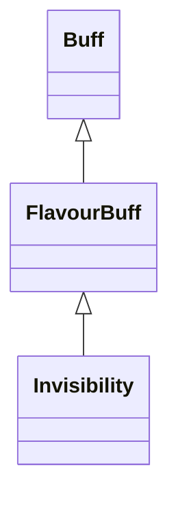

# Invisibility 类文档

## 1. 基本信息

| 属性 | 值 |
|------|-----|
| **文件路径** | core/src/main/java/com/shatteredpixel/shatteredpixeldungeon/actors/buffs/Invisibility.java |
| **包名** | com.shatteredpixel.shatteredpixeldungeon.actors.buffs |
| **类类型** | public class |
| **继承关系** | extends FlavourBuff |
| **代码行数** | 121 行 |
| **官方中文名** | 隐形 |

## 2. 文件职责说明

Invisibility 类表示“隐形”Buff。它在附着时增加目标的 `invisible` 计数，并在特定英雄职业/天赋下附带额外 Buff；同时还提供静态 `dispel()` 方法，统一解除隐形及若干与其同步结束的战术效果。

**核心职责**：
- 维护目标的 `invisible` 计数
- 在刺客或特定天赋下附加额外 Buff
- 控制角色精灵的隐形外观
- 提供统一的隐形驱散入口

## 3. 结构总览

```
Invisibility (extends FlavourBuff)
├── 常量
│   └── DURATION: float = 20f
├── 初始化块
│   ├── type = POSITIVE
│   └── announced = true
└── 方法
    ├── attachTo(Char): boolean
    ├── detach(): void
    ├── icon(): int
    ├── iconFadePercent(): float
    ├── fx(boolean): void
    ├── dispel(): void$
    └── dispel(Char): void$
```

## 4. 继承与协作关系

### 继承关系图



### 协作关系

| 协作类 | 协作方式 |
|--------|----------|
| **FlavourBuff** | 父类，提供时限型 Buff 行为 |
| **Hero / HeroSubClass.ASSASSIN** | 刺客获得额外 `Preparation` |
| **Talent.PROTECTIVE_SHADOWS** | 触发 `ProtectiveShadowsTracker` |
| **CharSprite.State.INVISIBLE** | 控制隐形外观 |
| **CloakOfShadows.cloakStealth** | `dispel()` 时同步驱散 |
| **TimekeepersHourglass.timeFreeze** | `dispel()` 时同步驱散 |
| **Preparation** | `dispel()` 时同步驱散 |
| **Swiftthistle.TimeBubble** | `dispel()` 时同步驱散 |
| **RoundShield.GuardTracker** | 满足条件时同步驱散 |
| **BuffIndicator** | 隐形图标 |

## 5. 字段与常量详解

### 常量

| 常量 | 类型 | 值 | 说明 |
|------|------|----|------|
| `DURATION` | float | `20f` | 默认持续时间 |

### 初始化块

```java
{
    type = buffType.POSITIVE;
    announced = true;
}
```

## 6. 构造与初始化机制

Invisibility 没有显式构造函数。常见施加方式：

```java
Buff.affect(target, Invisibility.class, Invisibility.DURATION);
```

## 7. 方法详解

### attachTo(Char target)

成功附着后：
- `target.invisible++`
- 若目标是刺客英雄，附加 `Preparation`
- 若目标英雄拥有 `PROTECTIVE_SHADOWS`，附加 `Talent.ProtectiveShadowsTracker`

### detach()

若 `target.invisible > 0`，先 `target.invisible--`，然后调用 `super.detach()`。

### icon() / iconFadePercent()

- 图标：`BuffIndicator.INVISIBLE`
- 淡出：`Math.max(0, (DURATION - visualcooldown()) / DURATION)`

### fx(boolean on)

- `on == true`：添加 `CharSprite.State.INVISIBLE`
- `on == false`：仅当 `target.invisible == 0` 时才移除该视觉状态

### dispel()

无参版本会对 `Dungeon.hero` 调用 `dispel(Dungeon.hero)`。

### dispel(Char ch)

统一移除：
- 所有 `Invisibility`
- `CloakOfShadows.cloakStealth`
- `TimekeepersHourglass.timeFreeze`
- `Preparation`
- `Swiftthistle.TimeBubble`
- 若 `RoundShield.GuardTracker.hasBlocked` 为真，则移除该 GuardTracker

## 8. 对外暴露能力

| 方法 | 用途 |
|------|------|
| `dispel()` | 驱散英雄当前所有隐形相关效果 |
| `dispel(Char)` | 驱散指定目标的隐形相关效果 |

## 9. 运行机制与调用链

```
Buff.affect(target, Invisibility.class, DURATION)
└── Invisibility.attachTo(target)
    ├── invisible++
    ├── [ASSASSIN] affect Preparation
    └── [PROTECTIVE_SHADOWS] affect tracker

Invisibility.dispel(ch)
├── detach all Invisibility
├── dispel cloakStealth
├── detach timeFreeze / Preparation / TimeBubble
└── [GuardTracker.hasBlocked] detach GuardTracker
```

## 10. 资源、配置与国际化关联

文件：`core/src/main/assets/messages/actors/actors_zh.properties`

```properties
actors.buffs.invisibility.name=隐形
actors.buffs.invisibility.desc=你和周围的地形完全融为一体，使你不可能被看到。
```

## 11. 使用示例

```java
Buff.affect(hero, Invisibility.class, Invisibility.DURATION);
Invisibility.dispel(hero);
```

## 12. 开发注意事项

- `invisible` 是计数器，不是单一布尔值；视觉状态只有在计数归零后才会真正移除。
- `dispel()` 同时会清掉一些“并非隐形但与隐形同步结束”的效果，文档必须明确写成源码事实。
- 刺客与 `PROTECTIVE_SHADOWS` 的联动发生在附着阶段，不在驱散阶段创建。

## 13. 修改建议与扩展点

- 若未来隐形同步驱散的效果继续增加，可把 `dispel(Char)` 拆成专门的隐形清理协调器。
- 若需要更细粒度控制不同隐形来源的移除方式，可为不同来源增加标签或接口。

## 14. 事实核查清单

- [x] 已覆盖全部自有方法与常量
- [x] 已验证继承关系 `extends FlavourBuff`
- [x] 已验证 `POSITIVE` 与 `announced = true`
- [x] 已验证 `invisible` 计数加减逻辑
- [x] 已验证刺客和 `PROTECTIVE_SHADOWS` 联动
- [x] 已验证 `dispel(Char)` 中的所有同步清理项
- [x] 已核对官方中文名来自翻译文件
- [x] 无臆测性机制说明
