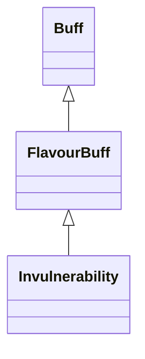

# Invulnerability 类文档

## 1. 基本信息

| 属性 | 值 |
|------|-----|
| **文件路径** | core/src/main/java/com/shatteredpixel/shatteredpixeldungeon/actors/buffs/Invulnerability.java |
| **包名** | com.shatteredpixel.shatteredpixeldungeon.actors.buffs |
| **类类型** | public class |
| **继承关系** | extends FlavourBuff |
| **代码行数** | 69 行 |
| **官方中文名** | 无敌 |

## 2. 文件职责说明

Invulnerability 类表示“无敌”Buff。它是一个短时正面 FlavourBuff，会为目标附带 `Paralysis` 和 `Frost` 免疫，并在附着时清除这两种负面状态；视觉上会给目标添加黄色光环，但若目标带有 `ChampionEnemy` 则不显示该光环。

**核心职责**：
- 定义短时无敌持续时间 `3f`
- 给予 `Paralysis` 与 `Frost` 免疫
- 在附着时清除已存在的麻痹与冻结
- 提供无敌光环视觉效果

## 3. 结构总览

```
Invulnerability (extends FlavourBuff)
├── 常量
│   └── DURATION: float = 3f
├── 初始化块
│   ├── type = POSITIVE
│   ├── announced = true
│   └── immunities.add(Paralysis/Frost)
└── 方法
    ├── fx(boolean): void
    ├── icon(): int
    ├── iconFadePercent(): float
    └── attachTo(Char): boolean
```

## 4. 继承与协作关系

### 继承关系图



### 协作关系

| 协作类 | 协作方式 |
|--------|----------|
| **FlavourBuff** | 父类，提供时限型 Buff 行为 |
| **Paralysis** | 被加入免疫，并在附着时清除 |
| **Frost** | 被加入免疫，并在附着时清除 |
| **ChampionEnemy** | 若存在则禁用本 Buff 的光环显示 |
| **BuffIndicator** | 使用 `ANKH` 图标 |

## 5. 字段与常量详解

### 常量

| 常量 | 类型 | 值 | 说明 |
|------|------|----|------|
| `DURATION` | float | `3f` | 默认持续时间 |

### 初始化块

第一段：

```java
{
    type = Buff.buffType.POSITIVE;
    announced = true;
}
```

第二段：

```java
{
    immunities.add(Paralysis.class);
    immunities.add(Frost.class);
}
```

## 6. 构造与初始化机制

Invulnerability 没有显式构造函数。常见施加方式：

```java
Buff.affect(target, Invulnerability.class, Invulnerability.DURATION);
```

## 7. 方法详解

### fx(boolean on)

若目标存在 `ChampionEnemy` Buff，则直接返回，不显示或清理光环。\n
否则：
- `on == true`：`target.sprite.aura(0xFFFF00, 5)`
- `on == false`：`target.sprite.clearAura()`

### icon()

返回 `BuffIndicator.ANKH`。

### iconFadePercent()

公式：

```java
Math.max(0, (DURATION - visualcooldown()) / DURATION)
```

### attachTo(Char target)

若 `super.attachTo(target)` 成功：
- `Buff.detach(target, Paralysis.class)`
- `Buff.detach(target, Frost.class)`
- 返回 `true`

否则返回 `false`。

## 8. 对外暴露能力

| 方法/成员 | 用途 |
|-----------|------|
| `DURATION` | 标准持续时间 |
| `attachTo(Char)` | 附着时清除麻痹与冻结 |
| `fx(boolean)` | 控制无敌光环显示 |

## 9. 运行机制与调用链

```
Buff.affect(target, Invulnerability.class, DURATION)
└── Invulnerability.attachTo(target)
    ├── super.attachTo(target)
    ├── detach Paralysis
    └── detach Frost

视觉刷新
└── Invulnerability.fx(on)
    ├── [有 ChampionEnemy] 直接返回
    └── [无 ChampionEnemy] 设置/清理黄色光环
```

## 10. 资源、配置与国际化关联

文件：`core/src/main/assets/messages/actors/actors_zh.properties`

```properties
actors.buffs.invulnerability.name=无敌
actors.buffs.invulnerability.desc=这个单位充满了金刚不坏之力，获得了短暂的无敌效果！
```

## 11. 使用示例

```java
Buff.affect(hero, Invulnerability.class, Invulnerability.DURATION);
```

## 12. 开发注意事项

- 视觉光环会被 `ChampionEnemy` 直接屏蔽，这是一条显式源码逻辑。
- 本类只声明了对 `Paralysis` 和 `Frost` 的免疫；文档不能擅自扩大成“免疫所有控制”。

## 13. 修改建议与扩展点

- 若未来需要支持更多控制免疫，可继续在初始化块扩展 `immunities`。
- 若光环显示逻辑需要与冠军敌人系统解耦，可以把外观优先级抽成单独策略。

## 14. 事实核查清单

- [x] 已覆盖全部自有方法、常量与初始化块
- [x] 已验证继承关系 `extends FlavourBuff`
- [x] 已验证 `POSITIVE` 与 `announced = true`
- [x] 已验证 `Paralysis` / `Frost` 免疫与附着时清理逻辑
- [x] 已验证 `ChampionEnemy` 对光环显示的屏蔽
- [x] 已验证图标与淡出公式
- [x] 已核对官方中文名来自翻译文件
- [x] 无臆测性机制说明
