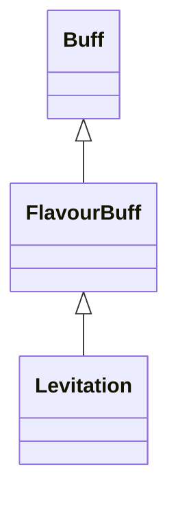

# Levitation 类文档

## 1. 基本信息

| 属性 | 值 |
|------|-----|
| **文件路径** | core/src/main/java/com/shatteredpixel/shatteredpixeldungeon/actors/buffs/Levitation.java |
| **包名** | com.shatteredpixel.shatteredpixeldungeon.actors.buffs |
| **类类型** | public class |
| **继承关系** | extends FlavourBuff |
| **代码行数** | 96 行 |
| **官方中文名** | 飘浮 |

## 2. 文件职责说明

Levitation 类表示“飘浮”Buff。它会让目标进入飞行状态、清除根系束缚，并在 Buff 结束时重新触发落地格交互；另外还提供一个用于判断“飘浮是否即将结束”的辅助方法。

**核心职责**：
- 让目标进入 `flying` 状态
- 附着时移除 `Roots`
- 结束时恢复非飞行状态并重新占据落地格
- 提供剩余时间是否短于给定延迟的判断接口

## 3. 结构总览

```
Levitation (extends FlavourBuff)
├── 常量
│   └── DURATION: float = 20f
├── 初始化块
│   └── type = POSITIVE
└── 方法
    ├── attachTo(Char): boolean
    ├── detach(): void
    ├── detachesWithinDelay(float): boolean
    ├── icon(): int
    ├── tintIcon(Image): void
    ├── iconFadePercent(): float
    └── fx(boolean): void
```

## 4. 继承与协作关系

### 继承关系图



### 协作关系

| 协作类 | 协作方式 |
|--------|----------|
| **FlavourBuff** | 父类，提供时限型 Buff 行为 |
| **Roots** | 附着时被移除 |
| **ShatteredPixelDungeon.scene()** | 结束时判断当前是否仍在 `GameScene` |
| **GameScene** | 在游戏场景中才触发落地格占据逻辑 |
| **Dungeon.level.occupyCell()** | Buff 结束后重新处理落地格效果 |
| **Swiftthistle.TimeBubble** | 存在时阻止“即将结束”判定 |
| **TimekeepersHourglass.timeFreeze** | 存在时阻止“即将结束”判定 |
| **CharSprite.State.LEVITATING** | 飘浮视觉状态 |
| **BuffIndicator** | 飘浮图标 |

## 5. 字段与常量详解

### 常量

| 常量 | 类型 | 值 | 说明 |
|------|------|----|------|
| `DURATION` | float | `20f` | 默认持续时间 |

### 初始化块

```java
{
    type = buffType.POSITIVE;
}
```

### 目标状态联动

本类不定义自有字段，但直接读写目标的：

| 目标字段 | 用途 |
|----------|------|
| `target.flying` | 表示目标是否处于飞行状态 |

## 6. 构造与初始化机制

Levitation 没有显式构造函数。常见施加方式：

```java
Buff.affect(target, Levitation.class, Levitation.DURATION);
```

## 7. 方法详解

### attachTo(Char target)

若 `super.attachTo(target)` 成功：
- `target.flying = true`
- `Roots.detach(target, Roots.class)`
- 返回 `true`

否则返回 `false`。

### detach()

结束时：
1. `target.flying = false`
2. `super.detach()`
3. 若当前场景仍是 `GameScene`：

```java
Dungeon.level.occupyCell(target);
```

源码注释说明：只有当前仍在游戏场景中才按落地格逻辑处理。

### detachesWithinDelay(float delay)

用于判断飘浮是否会在给定延迟内结束。\n
逻辑：
- 若目标有 `Swiftthistle.TimeBubble`，返回 `false`
- 若目标有 `TimekeepersHourglass.timeFreeze`，返回 `false`
- 否则返回 `cooldown() < delay`

### icon() / tintIcon()

- 图标：`BuffIndicator.LEVITATION`
- 染色：`icon.hardlight(1f, 2.1f, 2.5f)`

### iconFadePercent()

公式：

```java
Math.max(0, (DURATION - visualcooldown()) / DURATION)
```

### fx(boolean on)

- `on == true`：添加 `CharSprite.State.LEVITATING`
- `on == false`：移除该状态

## 8. 对外暴露能力

| 方法 | 用途 |
|------|------|
| `detachesWithinDelay(float)` | 判断飘浮是否会在给定延迟内结束 |
| `attachTo(Char)` | 开启飞行并解除根系束缚 |

## 9. 运行机制与调用链

```
Buff.affect(target, Levitation.class, DURATION)
└── Levitation.attachTo(target)
    ├── target.flying = true
    └── Roots.detach(...)

Buff 结束
└── Levitation.detach()
    ├── target.flying = false
    ├── super.detach()
    └── [GameScene] Dungeon.level.occupyCell(target)
```

## 10. 资源、配置与国际化关联

文件：`core/src/main/assets/messages/actors/actors_zh.properties`

```properties
actors.buffs.levitation.name=飘浮
actors.buffs.levitation.desc=一股魔力把你从地面托起，让你觉得自己身轻如燕。
```

## 11. 使用示例

```java
Buff.affect(hero, Levitation.class, Levitation.DURATION);

Levitation lev = hero.buff(Levitation.class);
boolean endingSoon = lev != null && lev.detachesWithinDelay(2f);
```

## 12. 开发注意事项

- 本类结束时会主动重新触发落地格占据逻辑，因此与陷阱、植物、地面效果强相关。
- `detachesWithinDelay()` 明确把 `TimeBubble` 和 `timeFreeze` 视为会阻止结束判定的特殊情况，不能省略。

## 13. 修改建议与扩展点

- 若未来有更多能冻结 Buff 计时的效果，可统一抽到 `detachesWithinDelay()` 的时间暂停判断中。
- 若飞行状态需要更复杂的进入/离开事件，可把 `flying` 切换封装到角色接口。

## 14. 事实核查清单

- [x] 已覆盖全部自有方法与常量
- [x] 已验证继承关系 `extends FlavourBuff`
- [x] 已验证 `POSITIVE` 初始化
- [x] 已验证附着时设置 `flying` 并移除 `Roots`
- [x] 已验证结束时调用 `occupyCell()` 的条件
- [x] 已验证 `detachesWithinDelay()` 的三段逻辑
- [x] 已核对官方中文名来自翻译文件
- [x] 无臆测性机制说明
