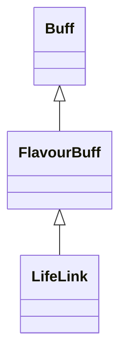

# LifeLink 类文档

## 1. 基本信息

| 属性 | 值 |
|------|-----|
| **文件路径** | core/src/main/java/com/shatteredpixel/shatteredpixeldungeon/actors/buffs/LifeLink.java |
| **包名** | com.shatteredpixel.shatteredpixeldungeon.actors.buffs |
| **类类型** | public class |
| **继承关系** | extends FlavourBuff |
| **代码行数** | 84 行 |
| **官方中文名** | 生命联结 |

## 2. 文件职责说明

LifeLink 类表示“生命联结”Buff。它记录与另一名单位的 Actor ID 关联，并在某一端失活时尝试同步移除另一端对应的 `LifeLink`。

**核心职责**：
- 保存联结对象 ID `object`
- 在 Buff 分离时查找对端单位
- 若当前目标已不活跃，则同步拆除对端的配对联结
- 提供图标、染色与淡出显示

## 3. 结构总览

```
LifeLink (extends FlavourBuff)
├── 字段
│   └── object: int
├── 初始化块
│   ├── type = POSITIVE
│   └── announced = true
└── 方法
    ├── detach(): void
    ├── storeInBundle(Bundle): void
    ├── restoreFromBundle(Bundle): void
    ├── icon(): int
    ├── tintIcon(Image): void
    └── iconFadePercent(): float
```

## 4. 继承与协作关系

### 继承关系图



### 协作关系

| 协作类 | 协作方式 |
|--------|----------|
| **FlavourBuff** | 父类，提供时限型 Buff 行为 |
| **Actor.findById(int)** | 用于查找联结另一端角色 |
| **Char** | 联结对象与当前目标 |
| **Talent.LIFE_LINK** | 图标淡出时间计算依赖英雄天赋 |
| **BuffIndicator** | 使用 `HERB_HEALING` 图标 |
| **Image** | 图标染色 |
| **Bundle** | 存档读写 |

## 5. 字段与常量详解

### 实例字段

| 字段 | 类型 | 说明 |
|------|------|------|
| `object` | int | 另一端联结目标的 Actor ID |

### 初始化块

```java
{
    type = buffType.POSITIVE;
    announced = true;
}
```

### Bundle 键

| 常量 | 值 | 用途 |
|------|-----|------|
| `OBJECT` | `object` | 保存联结目标 ID |

## 6. 构造与初始化机制

LifeLink 没有显式构造函数。通常在创建联结关系时，由外部逻辑给双方各自附加一个 `LifeLink`，并互相写入 `object`。

## 7. 方法详解

### detach()

先调用 `super.detach()`，然后：
1. `Actor.findById(object)` 查找另一端角色
2. 若当前 `target` 已不活跃且另一端存在：
   - 遍历另一端身上的全部 `LifeLink`
   - 若其中某个 `LifeLink.object == target.id()`，则把它也 `detach()`

这实现了联结关系在一端失活后的同步拆除。

### storeInBundle() / restoreFromBundle()

保存并恢复 `object`。

### icon() / tintIcon()

- 图标：`BuffIndicator.HERB_HEALING`
- 染色：`icon.hardlight(1, 0, 1)`

### iconFadePercent()

按英雄 `Talent.LIFE_LINK` 点数动态计算基准时长：

```java
int duration = Math.round(6.67f + 3.33f*Dungeon.hero.pointsInTalent(Talent.LIFE_LINK));
return Math.max(0, (duration - visualcooldown()) / duration);
```

## 8. 对外暴露能力

| 方法/成员 | 用途 |
|-----------|------|
| `object` | 保存联结另一端 Actor ID |
| `detach()` | 在一端失活后尝试同步拆除另一端联结 |

## 9. 运行机制与调用链

```
一对单位建立生命联结
├── A 身上 LifeLink.object = B.id
└── B 身上 LifeLink.object = A.id

A 的 LifeLink.detach()
├── super.detach()
├── findById(B.id)
└── [A 已不活跃] 在 B 身上查找 object == A.id 的 LifeLink 并 detach()
```

## 10. 资源、配置与国际化关联

文件：`core/src/main/assets/messages/actors/actors_zh.properties`

```properties
actors.buffs.lifelink.name=生命联结
actors.buffs.lifelink.ondeath=你因生命联结的共享伤害而亡...
actors.buffs.lifelink.desc=该单位的生命力与附近的另一个单位相连。双方会共同承担所有所受伤害。
```

## 11. 使用示例

```java
LifeLink a = Buff.affect(charA, LifeLink.class, duration);
LifeLink b = Buff.affect(charB, LifeLink.class, duration);
a.object = charB.id();
b.object = charA.id();
```

## 12. 开发注意事项

- 本类只管理联结标识和拆除同步，不直接在这里实现“伤害共享”结算。
- 图标淡出基准取自英雄天赋点数，而不是类内固定常量；若英雄不存在或该逻辑在非英雄场景使用，需要额外审查调用环境。

## 13. 修改建议与扩展点

- 若要提高健壮性，可把 `object` 从裸 ID 升级成更明确的联结对象结构。
- 若未来伤害共享逻辑也放入本类，可增加显式的双方有效性校验工具方法。

## 14. 事实核查清单

- [x] 已覆盖全部字段与方法
- [x] 已验证继承关系 `extends FlavourBuff`
- [x] 已验证 `POSITIVE` 与 `announced = true`
- [x] 已验证基于 Actor ID 的另一端查找逻辑
- [x] 已验证一端失活时的同步拆除逻辑
- [x] 已验证 `Bundle` 存档字段
- [x] 已核对官方中文名来自翻译文件
- [x] 无把伤害共享结算误写成本类直接行为
