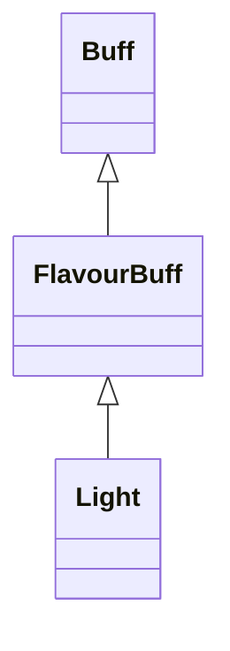

# Light 类文档

## 1. 基本信息

| 属性 | 值 |
|------|-----|
| **文件路径** | core/src/main/java/com/shatteredpixel/shatteredpixeldungeon/actors/buffs/Light.java |
| **包名** | com.shatteredpixel.shatteredpixeldungeon.actors.buffs |
| **类类型** | public class |
| **继承关系** | extends FlavourBuff |
| **代码行数** | 77 行 |
| **官方中文名** | 发光 |

## 2. 文件职责说明

Light 类表示“发光”Buff。它在附着时提高目标的 `viewDistance`，结束时恢复楼层默认视距，并提供一个可直接削弱剩余持续时间的 `weaken()` 方法。

**核心职责**：
- 定义较长持续时间与固定光照距离
- 附着时提升目标视距并刷新观察结果
- 结束时恢复默认视距并刷新观察结果
- 提供直接缩短剩余时长的接口

## 3. 结构总览

```
Light (extends FlavourBuff)
├── 常量
│   ├── DURATION: float = 250f
│   └── DISTANCE: int = 6
├── 初始化块
│   └── type = POSITIVE
└── 方法
    ├── attachTo(Char): boolean
    ├── detach(): void
    ├── weaken(int): void
    ├── icon(): int
    ├── iconFadePercent(): float
    └── fx(boolean): void
```

## 4. 继承与协作关系

### 继承关系图



### 协作关系

| 协作类 | 协作方式 |
|--------|----------|
| **FlavourBuff** | 父类，提供时限型 Buff 行为 |
| **Dungeon.level.viewDistance** | 用作视距恢复基准 |
| **Dungeon.observe()** | 附着/移除时刷新观察结果 |
| **CharSprite.State.ILLUMINATED** | 发光视觉状态 |
| **BuffIndicator** | 发光图标 |

## 5. 字段与常量详解

### 常量

| 常量 | 类型 | 值 | 说明 |
|------|------|----|------|
| `DURATION` | float | `250f` | 默认持续时间 |
| `DISTANCE` | int | `6` | 最低发光视距 |

### 初始化块

```java
{
    type = buffType.POSITIVE;
}
```

## 6. 构造与初始化机制

Light 没有显式构造函数。常见施加方式：

```java
Buff.affect(target, Light.class, Light.DURATION);
```

## 7. 方法详解

### attachTo(Char target)

若 `super.attachTo(target)` 成功：
- 若 `Dungeon.level != null`：

```java
target.viewDistance = Math.max(Dungeon.level.viewDistance, DISTANCE);
Dungeon.observe();
```

然后返回 `true`。

### detach()

结束时：
- `target.viewDistance = Dungeon.level.viewDistance`
- `Dungeon.observe()`
- `super.detach()`

### weaken(int amount)

调用：

```java
spend(-amount);
```

用于直接减少剩余持续时间。

### icon() / iconFadePercent()

- 图标：`BuffIndicator.LIGHT`
- 淡出：`Math.max(0, (DURATION - visualcooldown()) / DURATION)`

### fx(boolean on)

- `on == true`：添加 `CharSprite.State.ILLUMINATED`
- `on == false`：移除该状态

## 8. 对外暴露能力

| 方法 | 用途 |
|------|------|
| `weaken(int)` | 直接缩短 Buff 持续时间 |
| `DISTANCE` | 发光目标视距下限 |

## 9. 运行机制与调用链

```
Buff.affect(target, Light.class, DURATION)
└── Light.attachTo(target)
    ├── target.viewDistance = max(level.viewDistance, 6)
    └── Dungeon.observe()

Buff 结束
└── Light.detach()
    ├── target.viewDistance = level.viewDistance
    ├── Dungeon.observe()
    └── super.detach()
```

## 10. 资源、配置与国际化关联

文件：`core/src/main/assets/messages/actors/actors_zh.properties`

```properties
actors.buffs.light.name=发光
actors.buffs.light.desc=即使是在最黑暗的地牢中，身边有一个稳定的光源也总是令人欣慰。
```

## 11. 使用示例

```java
Light light = Buff.affect(hero, Light.class, Light.DURATION);
light.weaken(20);
```

## 12. 开发注意事项

- 本类直接修改 `target.viewDistance`，因此与其他改视距 Buff 共存时要注意覆盖顺序。
- `detach()` 恢复的是 `Dungeon.level.viewDistance`，不是附着前的旧值。
- `weaken()` 通过负数 `spend()` 缩短时间，这一点必须按源码如实记录。

## 13. 修改建议与扩展点

- 若未来有多个视距来源叠加，可把 `viewDistance` 的计算改为统一聚合而不是直接覆盖。
- 若要让 Light 支持更灵活的时长削弱规则，可把 `weaken()` 参数改成浮点数。

## 14. 事实核查清单

- [x] 已覆盖全部自有方法与常量
- [x] 已验证继承关系 `extends FlavourBuff`
- [x] 已验证 `POSITIVE` 初始化
- [x] 已验证附着/移除时对 `viewDistance` 与 `Dungeon.observe()` 的处理
- [x] 已验证 `weaken()` 的 `spend(-amount)` 逻辑
- [x] 已验证视觉状态控制
- [x] 已核对官方中文名来自翻译文件
- [x] 无臆测性机制说明
