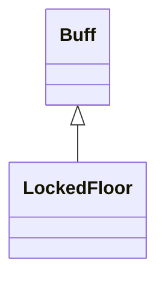

# LockedFloor 类文档

## 1. 基本信息

| 属性 | 值 |
|------|-----|
| **文件路径** | core/src/main/java/com/shatteredpixel/shatteredpixeldungeon/actors/buffs/LockedFloor.java |
| **包名** | com.shatteredpixel.shatteredpixeldungeon.actors.buffs |
| **类类型** | public class |
| **继承关系** | extends Buff |
| **代码行数** | 79 行 |
| **官方中文名** | 背水一战 |

## 2. 文件职责说明

LockedFloor 类表示“背水一战”Buff。它用于追踪楼层封锁期间剩余的“被动回复有效时间”，并在楼层不再封锁时自动移除。

**核心职责**：
- 维护剩余有效时间 `left`
- 在封锁楼层中每回合递减该时间
- 根据挑战模式决定初始时长
- 暴露 `regenOn()` 判断被动回复是否仍开启

## 3. 结构总览

```
LockedFloor (extends Buff)
├── 字段
│   └── left: float
├── 方法
│   ├── act(): boolean
│   ├── addTime(float): void
│   ├── removeTime(float): void
│   ├── regenOn(): boolean
│   ├── storeInBundle(Bundle): void
│   ├── restoreFromBundle(Bundle): void
│   └── icon(): int
```

## 4. 继承与协作关系

### 继承关系图



### 协作关系

| 协作类 | 协作方式 |
|--------|----------|
| **Buff** | 父类，提供附着与计时 |
| **Dungeon.level.locked** | 判断楼层是否仍处于封锁状态 |
| **Challenges.STRONGER_BOSSES** | 决定初始剩余时间是 20 还是 50 |
| **BuffIndicator** | 使用 `LOCKED_FLOOR` 图标 |
| **Bundle** | 存档读写 |

## 5. 字段与常量详解

### 实例字段

| 字段 | 类型 | 说明 |
|------|------|------|
| `left` | float | 被动回复仍可开启的剩余回合数；默认值依挑战而定 |

### 初始值逻辑

```java
private float left = Dungeon.isChallenged(Challenges.STRONGER_BOSSES) ? 20 : 50;
```

### Bundle 键

| 常量 | 值 | 用途 |
|------|-----|------|
| `LEFT` | `left` | 保存剩余时间 |

## 6. 构造与初始化机制

LockedFloor 没有显式构造函数。实例创建时就会立刻依据 `STRONGER_BOSSES` 挑战决定 `left` 初值。

## 7. 方法详解

### act()

每回合：
1. `spend(TICK)`
2. 若 `!Dungeon.level.locked`，移除 Buff
3. 若 `left >= 1`，则 `left--`
4. 返回 `true`

### addTime(float time)

执行：

```java
left += time;
left = Math.min(left, 50);
```

即最多累计到 50。

### removeTime(float time)

执行：

```java
left -= time;
```

源码注释明确指出：`can go negative!`

### regenOn()

返回 `left >= 1`，用于判断当前被动回复是否仍开启。

### storeInBundle() / restoreFromBundle()

保存并恢复 `left`。

### icon()

返回 `BuffIndicator.LOCKED_FLOOR`。

## 8. 对外暴露能力

| 方法 | 用途 |
|------|------|
| `addTime(float)` | 增加剩余时间（上限 50） |
| `removeTime(float)` | 扣除剩余时间（可减到负数） |
| `regenOn()` | 判断被动回复是否仍开启 |

## 9. 运行机制与调用链

```
LockedFloor.act()
├── spend(TICK)
├── [楼层已解锁] detach()
└── [left >= 1] left--

其他系统
├── addTime(...)    // 恢复剩余时间
├── removeTime(...) // 减少剩余时间
└── regenOn()       // 查询回复是否仍可用
```

## 10. 资源、配置与国际化关联

文件：`core/src/main/assets/messages/actors/actors_zh.properties`

```properties
actors.buffs.lockedfloor.name=背水一战
actors.buffs.lockedfloor.desc=当前楼层被彻底封锁，你无法离开这里！
```

## 11. 使用示例

```java
LockedFloor lock = hero.buff(LockedFloor.class);
if (lock != null && lock.regenOn()) {
    // 当前楼层封锁期间，被动回复仍然开启
}
```

## 12. 开发注意事项

- `left` 的语义不是“Buff 总时长”，而是“被动回复还能持续多久”。
- `removeTime()` 可以把 `left` 减到负数，这会直接让 `regenOn()` 失效。
- `act()` 中即使 `Dungeon.level.locked` 解除前移除了 Buff，也已经先 `spend(TICK)` 了；文档要忠实保留这个执行顺序。

## 13. 修改建议与扩展点

- 若要表达更清楚的语义，可把 `left` 重命名成 `regenLeft` 一类的名字。
- 若更多系统依赖这套楼层封锁回复开关，可把 `regenOn()` 逻辑抽到统一状态查询层。

## 14. 事实核查清单

- [x] 已覆盖全部字段与方法
- [x] 已验证继承关系 `extends Buff`
- [x] 已验证基于 `STRONGER_BOSSES` 的初始值分支
- [x] 已验证 `act()` 的封锁检查与递减逻辑
- [x] 已验证 `addTime()` 上限 50
- [x] 已验证 `removeTime()` 可减到负数
- [x] 已验证 `regenOn()` 判定逻辑
- [x] 已验证 `Bundle` 存档字段
- [x] 已核对官方中文名来自翻译文件
- [x] 无臆测性机制说明
