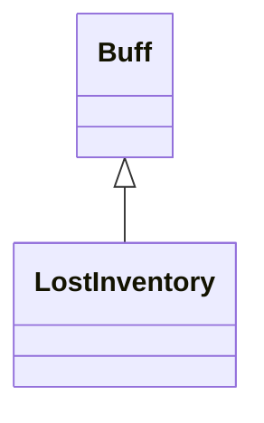

# LostInventory 类文档

## 1. 基本信息

| 属性 | 值 |
|------|-----|
| **文件路径** | core/src/main/java/com/shatteredpixel/shatteredpixeldungeon/actors/buffs/LostInventory.java |
| **包名** | com.shatteredpixel.shatteredpixeldungeon.actors.buffs |
| **类类型** | public class |
| **继承关系** | extends Buff |
| **代码行数** | 59 行 |
| **官方中文名** | 遗落行囊 |

## 2. 文件职责说明

LostInventory 类表示“遗落行囊”Buff。它的作用很直接：附着到英雄时把背包切换为“遗失”状态，移除时再恢复正常。

**核心职责**：
- 标记这是一个负面 Buff
- 附着到英雄时调用 `belongings.lostInventory(true)`
- 移除时调用 `belongings.lostInventory(false)`
- 提供无背包图标

## 3. 结构总览

```
LostInventory (extends Buff)
├── 初始化块
│   └── type = NEGATIVE
└── 方法
    ├── attachTo(Char): boolean
    ├── detach(): void
    └── icon(): int
```

## 4. 继承与协作关系

### 继承关系图



### 协作关系

| 协作类 | 协作方式 |
|--------|----------|
| **Buff** | 父类，提供附着与移除流程 |
| **Hero** | 真正会受到“遗失背包”影响的目标 |
| **Hero.belongings** | 切换背包遗失状态 |
| **BuffIndicator** | 提供 `NOINV` 图标 |

## 5. 字段与常量详解

LostInventory 没有自有字段。\n
### 初始化块

```java
{
    type = buffType.NEGATIVE;
}
```

## 6. 构造与初始化机制

LostInventory 没有显式构造函数。常见方式：

```java
Buff.affect(hero, LostInventory.class);
```

## 7. 方法详解

### attachTo(Char target)

若 `super.attachTo(target)` 成功：
- 若目标是 `Hero` 且 `belongings != null`，执行：

```java
((Hero) target).belongings.lostInventory(true);
```

然后返回 `true`。

### detach()

先 `super.detach()`，然后若目标是 `Hero` 且 `belongings != null`，执行：

```java
((Hero) target).belongings.lostInventory(false);
```

### icon()

返回 `BuffIndicator.NOINV`。

## 8. 对外暴露能力

| 方法 | 用途 |
|------|------|
| `attachTo(Char)` | 开启背包遗失状态 |
| `detach()` | 关闭背包遗失状态 |
| `icon()` | UI 图标显示 |

## 9. 运行机制与调用链

```
Buff.affect(hero, LostInventory.class)
└── LostInventory.attachTo(hero)
    └── hero.belongings.lostInventory(true)

Buff 移除
└── LostInventory.detach()
    └── hero.belongings.lostInventory(false)
```

## 10. 资源、配置与国际化关联

文件：`core/src/main/assets/messages/actors/actors_zh.properties`

```properties
actors.buffs.lostinventory.name=遗落行囊
actors.buffs.lostinventory.desc=你的行囊被遗落在了地牢中的某处！
```

## 11. 使用示例

```java
Buff.affect(hero, LostInventory.class);

if (hero.buff(LostInventory.class) != null) {
    // 当前处于遗落行囊状态
}
```

## 12. 开发注意事项

- 本类只切换 `belongings.lostInventory(...)`，并不自行处理 UI 或物品栏逻辑细节。
- 对非英雄目标附着时不会报错，但也不会产生实际背包效果。

## 13. 修改建议与扩展点

- 若后续需要细分“部分背包锁定”和“全部背包锁定”，可把当前布尔开关扩展成枚举态。
- 若背包遗失需要伴随更多 UI 反馈，可把提醒逻辑补到附着/移除时。

## 14. 事实核查清单

- [x] 已覆盖全部自有方法
- [x] 已验证继承关系 `extends Buff`
- [x] 已验证 `NEGATIVE` 初始化
- [x] 已验证附着/移除时对 `belongings.lostInventory()` 的调用
- [x] 已验证图标为 `BuffIndicator.NOINV`
- [x] 已核对官方中文名来自翻译文件
- [x] 无臆测性机制说明
