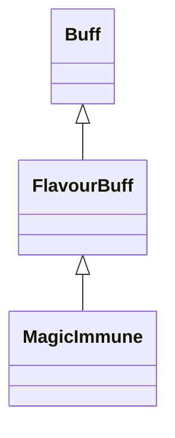

# MagicImmune 类文档

## 1. 基本信息

| 属性 | 值 |
|------|-----|
| **文件路径** | core/src/main/java/com/shatteredpixel/shatteredpixeldungeon/actors/buffs/MagicImmune.java |
| **包名** | com.shatteredpixel.shatteredpixeldungeon.actors.buffs |
| **类类型** | public class |
| **继承关系** | extends FlavourBuff |
| **代码行数** | 85 行 |
| **官方中文名** | 魔法免疫 |

## 2. 文件职责说明

MagicImmune 类表示“魔法免疫”Buff。它把 `AntiMagic.RESISTS` 中定义的一整组魔法相关类型加入免疫集合，并在附着时清除当前目标身上所有匹配这些免疫类型的 Buff。

**核心职责**：
- 定义默认持续时间 `20f`
- 继承 `AntiMagic.RESISTS` 作为免疫集合
- 附着时清除目标当前已存在的相应魔法 Buff
- 对英雄附着/移除时刷新最大生命值显示

## 3. 结构总览

```
MagicImmune (extends FlavourBuff)
├── 常量
│   └── DURATION: float = 20f
├── 初始化块
│   ├── type = POSITIVE
│   ├── announced = true
│   └── immunities.addAll(AntiMagic.RESISTS)
└── 方法
    ├── attachTo(Char): boolean
    ├── detach(): void
    ├── icon(): int
    ├── tintIcon(Image): void
    └── iconFadePercent(): float
```

## 4. 继承与协作关系

### 继承关系图



### 协作关系

| 协作类 | 协作方式 |
|--------|----------|
| **FlavourBuff** | 父类，提供时限型 Buff 行为 |
| **AntiMagic.RESISTS** | 作为免疫类型集合来源 |
| **Hero** | 附着/移除时调用 `updateHT(false)` |
| **BuffIndicator** | 使用 `COMBO` 图标 |
| **Image** | 图标染色 |

## 5. 字段与常量详解

### 常量

| 常量 | 类型 | 值 | 说明 |
|------|------|----|------|
| `DURATION` | float | `20f` | 默认持续时间 |

### 初始化块

第一段：

```java
{
    type = buffType.POSITIVE;
    announced = true;
}
```

第二段：

```java
{
    immunities.addAll(AntiMagic.RESISTS);
}
```

## 6. 构造与初始化机制

MagicImmune 没有显式构造函数。常见施加方式：

```java
Buff.affect(target, MagicImmune.class, MagicImmune.DURATION);
```

## 7. 方法详解

### attachTo(Char target)

若 `super.attachTo(target)` 成功：
1. 遍历目标当前所有 Buff。\n
2. 对每个 Buff，再遍历当前 `immunities` 集合；若满足：

```java
b.getClass().isAssignableFrom(immunity)
```

则把该 Buff `detach()`。\n
3. 若目标是英雄，调用 `updateHT(false)`。\n
4. 返回 `true`。

### detach()

先 `super.detach()`，若目标是英雄，再 `updateHT(false)`。

### icon() / tintIcon()

- 图标：`BuffIndicator.COMBO`
- 染色：`icon.hardlight(0, 1, 0)`

### iconFadePercent()

公式：

```java
Math.max(0, (DURATION - visualcooldown()) / DURATION)
```

## 8. 对外暴露能力

| 方法/成员 | 用途 |
|-----------|------|
| `DURATION` | 标准持续时间 |
| `immunities()` | 继承自 Buff，可获取当前免疫集合副本 |
| `attachTo(Char)` | 附着时清除匹配免疫集合的现有 Buff |

## 9. 运行机制与调用链

```
Buff.affect(target, MagicImmune.class, DURATION)
└── MagicImmune.attachTo(target)
    ├── super.attachTo(target)
    ├── 遍历目标当前 Buff
    ├── 匹配 immunities 后 detach()
    └── [Hero] updateHT(false)
```

## 10. 资源、配置与国际化关联

文件：`core/src/main/assets/messages/actors/actors_zh.properties`

```properties
actors.buffs.magicimmune.name=魔法免疫
actors.buffs.magicimmune.desc=任何魔法都奈何不了你，你对魔法完全免疫。
```

## 11. 使用示例

```java
Buff.affect(hero, MagicImmune.class, MagicImmune.DURATION);
```

## 12. 开发注意事项

- 本类对当前已有 Buff 的清理逻辑使用的是源码中的 `isAssignableFrom` 判断，文档必须按这个实际实现记录。
- 它直接复用 `AntiMagic.RESISTS`，因此若防魔法 glyph 的抵抗列表变化，本类行为也会同步变化。

## 13. 修改建议与扩展点

- 若需要更精确地控制清理规则，可把当前的类型匹配条件抽成单独工具方法。
- 若要避免 UI 图标与 `COMBO` 语义混淆，可考虑后续提供专用图标编号。

## 14. 事实核查清单

- [x] 已覆盖全部自有方法与常量
- [x] 已验证继承关系 `extends FlavourBuff`
- [x] 已验证 `POSITIVE` 与 `announced = true`
- [x] 已验证 `AntiMagic.RESISTS` 免疫来源
- [x] 已验证附着时对现有 Buff 的清理逻辑
- [x] 已验证英雄 `updateHT(false)` 联动
- [x] 已核对官方中文名来自翻译文件
- [x] 无臆测性机制说明
