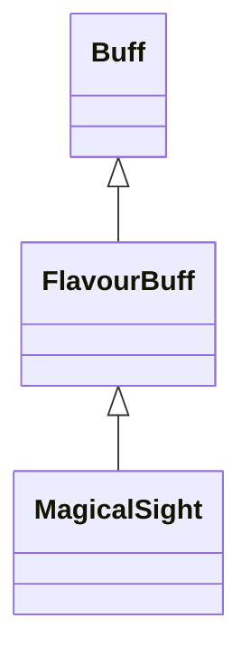

# MagicalSight 类文档

## 1. 基本信息

| 属性 | 值 |
|------|-----|
| **文件路径** | core/src/main/java/com/shatteredpixel/shatteredpixeldungeon/actors/buffs/MagicalSight.java |
| **包名** | com.shatteredpixel.shatteredpixeldungeon.actors.buffs |
| **类类型** | public class |
| **继承关系** | extends FlavourBuff |
| **代码行数** | 74 行 |
| **官方中文名** | 魔能透视 |

## 2. 文件职责说明

MagicalSight 类表示“魔能透视”Buff。它是一个正面 FlavourBuff，提供更远的透视感知能力，并且会对 `Blindness` 免疫，在附着时清掉现有失明，结束时刷新观察与迷雾。

**核心职责**：
- 定义持续时间与视距常量
- 提供 `Blindness` 免疫
- 附着时清理 `Blindness`
- 移除时刷新观察结果与迷雾

## 3. 结构总览

```
MagicalSight (extends FlavourBuff)
├── 常量
│   ├── DURATION: float = 50f
│   └── DISTANCE: int = 12
├── 初始化块
│   ├── type = POSITIVE
│   └── immunities.add(Blindness.class)
└── 方法
    ├── icon(): int
    ├── tintIcon(Image): void
    ├── iconFadePercent(): float
    ├── attachTo(Char): boolean
    └── detach(): void
```

## 4. 继承与协作关系

### 继承关系图



### 协作关系

| 协作类 | 协作方式 |
|--------|----------|
| **FlavourBuff** | 父类，提供时限型 Buff 行为 |
| **Blindness** | 被加入免疫并在附着时清除 |
| **Dungeon.observe()** | Buff 结束时刷新观察结果 |
| **GameScene.updateFog()** | Buff 结束时刷新迷雾 |
| **BuffIndicator** | 使用 `MIND_VISION` 图标 |
| **Image** | 图标染色 |

## 5. 字段与常量详解

### 常量

| 常量 | 类型 | 值 | 说明 |
|------|------|----|------|
| `DURATION` | float | `50f` | 默认持续时间 |
| `DISTANCE` | int | `12` | 魔能透视的固定感知距离常量 |

### 初始化块

第一段：

```java
{
    type = buffType.POSITIVE;
}
```

第二段：

```java
{
    immunities.add(Blindness.class);
}
```

## 6. 构造与初始化机制

MagicalSight 没有显式构造函数。常见施加方式：

```java
Buff.affect(hero, MagicalSight.class, MagicalSight.DURATION);
```

## 7. 方法详解

### icon()

返回 `BuffIndicator.MIND_VISION`。

### tintIcon(Image icon)

```java
icon.hardlight(1f, 1.67f, 1f);
```

### iconFadePercent()

公式：

```java
Math.max(0, (DURATION - visualcooldown()) / DURATION)
```

### attachTo(Char target)

若 `super.attachTo(target)` 成功：
- `Buff.detach(target, Blindness.class)`
- 返回 `true`

### detach()

先 `super.detach()`，再：
- `Dungeon.observe()`
- `GameScene.updateFog()`

## 8. 对外暴露能力

| 方法/成员 | 用途 |
|-----------|------|
| `DISTANCE` | 对外提供固定透视距离常量 |
| `attachTo(Char)` | 附着时移除失明 |

## 9. 运行机制与调用链

```
Buff.affect(target, MagicalSight.class, DURATION)
└── MagicalSight.attachTo(target)
    ├── super.attachTo(target)
    └── Buff.detach(target, Blindness.class)

Buff 结束
└── MagicalSight.detach()
    ├── super.detach()
    ├── Dungeon.observe()
    └── GameScene.updateFog()
```

## 10. 资源、配置与国际化关联

文件：`core/src/main/assets/messages/actors/actors_zh.properties`

```properties
actors.buffs.magicalsight.name=魔能透视
actors.buffs.magicalsight.desc=不知为何，即使闭上眼睛你也可以用心灵洞察到周围发生的一切。
```

## 11. 使用示例

```java
Buff.affect(hero, MagicalSight.class, MagicalSight.DURATION);
```

## 12. 开发注意事项

- 本类定义了 `DISTANCE = 12`，但具体如何在视野系统中使用不在该类源码里实现，文档不能把它写成直接改 `viewDistance` 的行为。
- 结束时必须刷新观察和迷雾，否则显示层会滞后。

## 13. 修改建议与扩展点

- 若未来需要不同层级的透视 Buff，可把 `DISTANCE` 变成实例字段。
- 若还有更多会与失明互斥的视觉 Buff，可抽成共用父类。

## 14. 事实核查清单

- [x] 已覆盖全部自有方法与常量
- [x] 已验证继承关系 `extends FlavourBuff`
- [x] 已验证 `POSITIVE` 初始化
- [x] 已验证 `Blindness` 免疫与附着时清理逻辑
- [x] 已验证结束时刷新观察与迷雾
- [x] 已验证图标与染色逻辑
- [x] 已核对官方中文名来自翻译文件
- [x] 无臆测性机制说明
