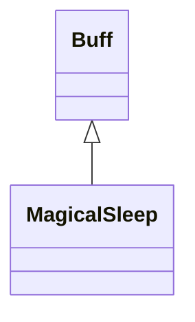

# MagicalSleep 类文档

## 1. 基本信息

| 属性 | 值 |
|------|-----|
| **文件路径** | core/src/main/java/com/shatteredpixel/shatteredpixeldungeon/actors/buffs/MagicalSleep.java |
| **包名** | com.shatteredpixel.shatteredpixeldungeon.actors.buffs |
| **类类型** | public class |
| **继承关系** | extends Buff |
| **代码行数** | 105 行 |
| **官方中文名** | 魔法睡眠 |

## 2. 文件职责说明

MagicalSleep 类实现“魔法睡眠”Buff。它让目标陷入受魔法控制的睡眠，附带麻痹；若目标是英雄或盟友，还会在睡眠期间持续恢复生命，并在满血时自动醒来。

**核心职责**：
- 附着时增加 `paralysed` 计数
- 让敌对 `Mob` 进入 `SLEEPING` 状态
- 让盟友目标每回合恢复 1 点生命
- 在合适时机自动唤醒并清理状态

## 3. 结构总览

```
MagicalSleep (extends Buff)
├── 常量
│   └── STEP: float = 1f
└── 方法
    ├── attachTo(Char): boolean
    ├── act(): boolean
    ├── detach(): void
    ├── icon(): int
    └── fx(boolean): void
```

## 4. 继承与协作关系

### 继承关系图



### 协作关系

| 协作类 | 协作方式 |
|--------|----------|
| **Buff** | 父类，提供附着与行动调度 |
| **Sleep** | 附着前通过 `target.isImmune(Sleep.class)` 做免疫检查 |
| **Hero** | 英雄在睡眠中可恢复生命并设置 `resting` |
| **Mob** | 可被置为 `SLEEPING` 或唤醒为 `WANDERING` |
| **GLog / Messages** | 输出入睡、抵抗、醒来提示 |
| **BuffIndicator** | 使用 `MAGIC_SLEEP` 图标 |
| **CharSprite.State.PARALYSED** | 关闭时用于清理视觉麻痹状态 |

## 5. 字段与常量详解

### 常量

| 常量 | 类型 | 值 | 说明 |
|------|------|----|------|
| `STEP` | float | `1f` | 每次行动消耗的时间单位 |

### 目标状态联动

本类没有自有字段，但直接操作目标的：

| 目标字段/状态 | 用途 |
|---------------|------|
| `target.paralysed` | 进入睡眠时增加，结束时减少 |
| `Hero.resting` | 盟友英雄睡眠期间设为 `true` |
| `Mob.state` | 对怪物切换 `SLEEPING/WANDERING` |

## 6. 构造与初始化机制

MagicalSleep 没有显式构造函数。通常通过：

```java
Buff.affect(target, MagicalSleep.class);
```

附着。

## 7. 方法详解

### attachTo(Char target)

前置条件：目标不能对 `Sleep.class` 免疫。\n
成功附着后：
- `target.paralysed++`
- 若目标阵营为 `ALLY`：
  - 若已满血：
    - 若是英雄，输出 `toohealthy`
    - 立即 `detach()`
    - 返回 `true`
  - 否则若是英雄，输出 `fallasleep`
- 若目标是 `Mob`：
  - 把 `state` 设为 `SLEEPING`

### act()

每回合逻辑：
1. 若目标是 `Mob` 且状态已不是 `SLEEPING`，则移除 Buff 并返回。
2. 若目标阵营为 `ALLY`：
   - `target.HP = Math.min(target.HP+1, target.HT)`
   - 若是英雄，`resting = true`
   - 若已经满血：
     - 若是英雄，输出 `wakeup`
     - `detach()`
3. `spend(STEP)`

### detach()

结束时：
- 若 `target.paralysed > 0`，则 `--`
- 若目标是英雄，`resting = false`
- 否则若目标是盟友 `Mob` 且仍处于 `SLEEPING`，改为 `WANDERING`
- 最后 `super.detach()`

### icon()

返回 `BuffIndicator.MAGIC_SLEEP`。

### fx(boolean on)

源码只在 `on == false` 且 `target.paralysed <= 1` 时：

```java
target.sprite.remove(CharSprite.State.PARALYSED);
```

用于避免和其他麻痹来源冲突。

## 8. 对外暴露能力

| 方法 | 用途 |
|------|------|
| `attachTo(Char)` | 附着时进入魔法睡眠流程 |
| `act()` | 推进睡眠与盟友治疗 |

## 9. 运行机制与调用链

```
Buff.affect(target, MagicalSleep.class)
└── MagicalSleep.attachTo(target)
    ├── 检查 Sleep 免疫
    ├── target.paralysed++
    ├── [ALLY + 满血] 立即结束
    └── [Mob] state = SLEEPING

每回合
└── MagicalSleep.act()
    ├── [盟友] 回复 1 HP
    ├── [满血] 输出 wakeup 并 detach()
    └── spend(STEP)
```

## 10. 资源、配置与国际化关联

文件：`core/src/main/assets/messages/actors/actors_zh.properties`

```properties
actors.buffs.magicalsleep.name=魔法睡眠
actors.buffs.magicalsleep.toohealthy=你十分健康，因此抵抗住了强烈的嗜睡感。
actors.buffs.magicalsleep.fallasleep=你深深地陷入了魔法睡眠。
actors.buffs.magicalsleep.wakeup=你醒来后，感觉浑身清爽并且十分健康。
actors.buffs.magicalsleep.desc=目标已深深陷入了魔法睡眠，不会自然醒来。
```

## 11. 使用示例

```java
Buff.affect(hero, MagicalSleep.class);
```

## 12. 开发注意事项

- 本类对盟友和敌对单位的处理明显不同：盟友走治疗路线，敌人走睡眠控制路线。
- `attachTo()` 中“满血盟友立即抵抗并结束”是显式逻辑，不是外部系统行为。
- 视觉层只处理麻痹状态的清理，不负责添加额外睡眠外观。

## 13. 修改建议与扩展点

- 若未来想给魔法睡眠加上显式图标文本或淡出展示，可补充相关 UI 方法。
- 若盟友恢复效果需要更复杂比例，可以把 `+1 HP` 抽成可配置参数。

## 14. 事实核查清单

- [x] 已覆盖全部自有方法与常量
- [x] 已验证继承关系 `extends Buff`
- [x] 已验证 `Sleep.class` 免疫检查
- [x] 已验证附着时 `paralysed` 计数与 Mob 睡眠状态设置
- [x] 已验证盟友每回合恢复逻辑与满血唤醒逻辑
- [x] 已验证 detach() 中的状态清理与 Mob 唤醒
- [x] 已核对官方中文名来自翻译文件
- [x] 无臆测性机制说明
