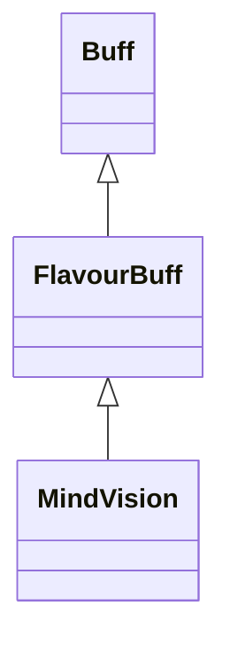

# MindVision 类文档

## 1. 基本信息

| 属性 | 值 |
|------|-----|
| **文件路径** | core/src/main/java/com/shatteredpixel/shatteredpixeldungeon/actors/buffs/MindVision.java |
| **包名** | com.shatteredpixel.shatteredpixeldungeon.actors.buffs |
| **类类型** | public class |
| **继承关系** | extends FlavourBuff |
| **代码行数** | 54 行 |
| **官方中文名** | 灵视 |

## 2. 文件职责说明

MindVision 类表示“灵视”Buff。它是一个正面 FlavourBuff，本类保留一个公开的 `distance` 字段，并在 Buff 结束时刷新观察与迷雾。

**核心职责**：
- 定义默认持续时间 `20f`
- 保存当前灵视距离字段 `distance`
- 提供灵视图标与淡出显示
- 在 Buff 结束时刷新观察结果和迷雾

## 3. 结构总览

```
MindVision (extends FlavourBuff)
├── 常量
│   └── DURATION: float = 20f
├── 字段
│   └── distance: int = 2
├── 初始化块
│   └── type = POSITIVE
└── 方法
    ├── icon(): int
    ├── iconFadePercent(): float
    └── detach(): void
```

## 4. 继承与协作关系

### 继承关系图



### 协作关系

| 协作类 | 协作方式 |
|--------|----------|
| **FlavourBuff** | 父类，提供时限型 Buff 行为 |
| **Dungeon.observe()** | Buff 结束时刷新观察结果 |
| **GameScene.updateFog()** | Buff 结束时刷新迷雾 |
| **BuffIndicator** | 使用 `MIND_VISION` 图标 |

## 5. 字段与常量详解

### 常量

| 常量 | 类型 | 值 | 说明 |
|------|------|----|------|
| `DURATION` | float | `20f` | 默认持续时间 |

### 实例字段

| 字段 | 类型 | 默认值 | 说明 |
|------|------|--------|------|
| `distance` | int | `2` | 当前灵视距离；源码中为公开字段 |

### 初始化块

```java
{
    type = buffType.POSITIVE;
}
```

## 6. 构造与初始化机制

MindVision 没有显式构造函数。常见施加方式：

```java
Buff.affect(target, MindVision.class, MindVision.DURATION);
```

外部系统也可以在附着后直接修改 `distance`。

## 7. 方法详解

### icon()

返回 `BuffIndicator.MIND_VISION`。

### iconFadePercent()

公式：

```java
Math.max(0, (DURATION - visualcooldown()) / DURATION)
```

### detach()

结束时：
1. `super.detach()`
2. `Dungeon.observe()`
3. `GameScene.updateFog()`

## 8. 对外暴露能力

| 方法/成员 | 用途 |
|-----------|------|
| `distance` | 外部系统可直接修改灵视距离 |
| `detach()` | 结束时刷新观察与迷雾 |

## 9. 运行机制与调用链

```
Buff.affect(target, MindVision.class, DURATION)
└── FlavourBuff 生命周期运行

Buff 结束
└── MindVision.detach()
    ├── super.detach()
    ├── Dungeon.observe()
    └── GameScene.updateFog()
```

## 10. 资源、配置与国际化关联

文件：`core/src/main/assets/messages/actors/actors_zh.properties`

```properties
actors.buffs.mindvision.name=灵视
actors.buffs.mindvision.desc=你可以在脑海中以某种方式看到这一层的所有生物。
```

## 11. 使用示例

```java
MindVision mv = Buff.affect(hero, MindVision.class, MindVision.DURATION);
mv.distance = 4;
```

## 12. 开发注意事项

- `distance` 是公开字段而不是私有字段或 getter/setter，这意味着外部逻辑可以直接改它。
- 本类源码本身没有直接使用 `distance` 做视野计算，文档不能把距离实现细节写到本类上。

## 13. 修改建议与扩展点

- 若后续需要更安全的状态封装，可把 `distance` 改成私有字段并增加访问器。
- 若灵视与魔能透视需要统一，可提取视觉感知类 Buff 公共父类。

## 14. 事实核查清单

- [x] 已覆盖全部自有字段、方法与常量
- [x] 已验证继承关系 `extends FlavourBuff`
- [x] 已验证 `POSITIVE` 初始化
- [x] 已验证 `distance` 的公开字段事实
- [x] 已验证结束时刷新观察与迷雾
- [x] 已验证图标与淡出公式
- [x] 已核对官方中文名来自翻译文件
- [x] 无臆测性机制说明
