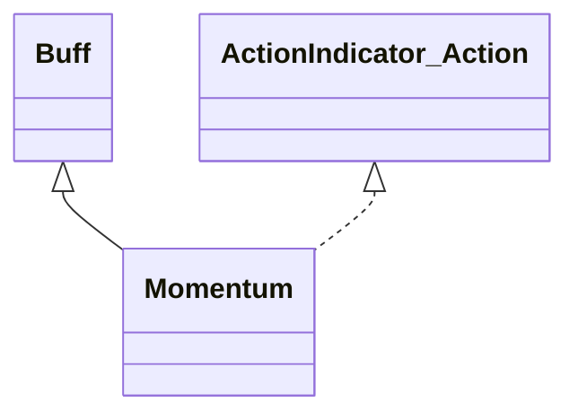

# Momentum 类文档

## 1. 基本信息

| 属性 | 值 |
|------|-----|
| **文件路径** | core/src/main/java/com/shatteredpixel/shatteredpixeldungeon/actors/buffs/Momentum.java |
| **包名** | com.shatteredpixel.shatteredpixeldungeon.actors.buffs |
| **类类型** | public class |
| **继承关系** | extends Buff implements ActionIndicator.Action |
| **代码行数** | 247 行 |
| **官方中文名** | 动量积蓄 / 逸动 / 恢复 |

## 2. 文件职责说明

Momentum 类实现疾行者的动量系统。它会在移动中积累 `momentumStacks`，玩家可通过 ActionIndicator 消耗这些层数进入 `freerunTurns` 驱动的逸动状态，并在结束后进入冷却。

**核心职责**：
- 维护动量层数、逸动持续时间与冷却
- 在每回合结算时衰减动量或推进逸动/冷却
- 为 UI 提供可触发动作与状态显示
- 根据天赋提供隐身联动、移速和闪避加成

## 3. 结构总览

```
Momentum (extends Buff implements ActionIndicator.Action)
├── 字段
│   ├── momentumStacks: int
│   ├── freerunTurns: int
│   ├── freerunCooldown: int
│   └── movedLastTurn: boolean
├── 初始化块
│   ├── type = POSITIVE
│   └── actPriority = HERO_PRIO + 1
└── 方法
    ├── act(): boolean
    ├── gainStack(): void
    ├── freerunning(): boolean
    ├── speedMultiplier(): float
    ├── evasionBonus(int,int): int
    ├── icon()/tintIcon()/iconFadePercent()/iconTextDisplay()
    ├── name()/desc()
    ├── storeInBundle()/restoreFromBundle()
    ├── actionName()/actionIcon()/secondaryVisual()/indicatorColor()/doAction()
```

## 4. 继承与协作关系

### 继承关系图



### 协作关系

| 协作类 | 协作方式 |
|--------|----------|
| **Buff** | 父类，提供计时与附着 |
| **ActionIndicator.Action** | 提供逸动主动按钮 |
| **Talent.SPEEDY_STEALTH** | 决定隐身联动与高速效果 |
| **Talent.EVASIVE_ARMOR** | 影响逸动闪避加成 |
| **Dungeon.hero** | 读取英雄天赋点数 |
| **ActionIndicator / BuffIndicator** | UI 刷新与动作按钮 |
| **HeroIcon** | 行动按钮图标 |
| **Speck / SpellSprite / Sample** | 开启逸动时的特效与音效 |

## 5. 字段与常量详解

### 实例字段

| 字段 | 类型 | 说明 |
|------|------|------|
| `momentumStacks` | int | 当前动量层数，上限 10 |
| `freerunTurns` | int | 当前逸动剩余回合 |
| `freerunCooldown` | int | 逸动结束后的冷却 |
| `movedLastTurn` | boolean | 上一回合是否移动过 |

### 初始化块

```java
{
    type = buffType.POSITIVE;
    actPriority = HERO_PRIO+1;
}
```

说明：该 Buff 会在英雄行动前处理。

### Bundle 键

| 常量 | 值 | 用途 |
|------|-----|------|
| `STACKS` | `stacks` | 保存动量层数 |
| `FREERUN_TURNS` | `freerun_turns` | 保存逸动回合 |
| `FREERUN_CD` | `freerun_CD` | 保存冷却回合 |

## 6. 构造与初始化机制

Momentum 没有显式构造函数。通常作为疾行者/相关天赋体系的长期 Buff 挂在英雄身上，由移动和主动触发共同驱动。

## 7. 方法详解

### act()

每回合逻辑：
1. 若 `freerunCooldown > 0`，先减 1。
2. 若 `freerunCooldown == 0`、当前不在逸动、目标隐形且 `SPEEDY_STEALTH >= 1`：
   - 动量 +2（上限 10）
   - `movedLastTurn = true`
   - 设置动作按钮并刷新 Buff 图标
3. 若 `freerunTurns > 0`：
   - 当目标不隐形或 `SPEEDY_STEALTH < 2` 时，逸动回合减 1
4. 否则若上一回合未移动：
   - `momentumStacks` 按 `gate(0, stacks-1, round(stacks*0.667f))` 衰减
   - 根据结果刷新或移除动作按钮
5. `movedLastTurn = false`
6. `spend(TICK)`

### gainStack()

移动后调用：
- 标记 `movedLastTurn = true`
- 若不在冷却且不在逸动：
  - `postpone(target.cooldown() + (1/target.speed()))`
  - 动量 +1（上限 10）
  - 刷新动作与 Buff 图标

### freerunning()

返回 `freerunTurns > 0`。

### speedMultiplier()

- 逸动中：返回 `2`
- 未逸动但目标隐形且 `SPEEDY_STEALTH == 3`：返回 `2`
- 否则返回 `1`

### evasionBonus(int heroLvl, int excessArmorStr)

仅在 `freerunTurns > 0` 时返回：

```java
heroLvl/2 + excessArmorStr * pointsInTalent(EVASIVE_ARMOR)
```

否则返回 0。

### icon()/tintIcon()/iconFadePercent()/iconTextDisplay()

- 图标：有动量或冷却时为 `MOMENTUM`，否则 `NONE`
- 染色：
  - 无冷却或逸动中 -> 黄色
  - 冷却中 -> 蓝色
- 淡出：
  - 逸动中：`(20 - freerunTurns) / 20f`
  - 冷却中：`freerunCooldown / 30f`
- 文本：显示逸动或冷却剩余回合

### name()/desc()

根据当前状态在以下三套文案之间切换：
- `momentum`
- `running`
- `resting`

### doAction()

触发逸动：
- `freerunTurns = 2 * momentumStacks`
- `freerunCooldown = 10 + 4 * momentumStacks`
- 播放音效、粒子、法术动画
- 清空动量层数
- 刷新 UI 并移除动作按钮

## 8. 对外暴露能力

| 方法 | 用途 |
|------|------|
| `gainStack()` | 在移动后增加动量 |
| `freerunning()` | 判断是否处于逸动 |
| `speedMultiplier()` | 返回当前速度倍率 |
| `evasionBonus(...)` | 返回逸动闪避加成 |
| `doAction()` | 主动触发逸动 |

## 9. 运行机制与调用链

```
移动
└── Momentum.gainStack()
    └── 增加 momentumStacks

每回合
└── Momentum.act()
    ├── 推进冷却/逸动
    ├── [未移动] 衰减动量
    └── 刷新 ActionIndicator / BuffIndicator

点击动作按钮
└── Momentum.doAction()
    ├── freerunTurns = 2 * stacks
    ├── freerunCooldown = 10 + 4 * stacks
    └── stacks = 0
```

## 10. 资源、配置与国际化关联

文件：`core/src/main/assets/messages/actors/actors_zh.properties`

```properties
actors.buffs.momentum.momentum=动量积蓄
actors.buffs.momentum.running=逸动
actors.buffs.momentum.resting=恢复
actors.buffs.momentum.action_name=逸动
```

## 11. 使用示例

```java
Momentum m = hero.buff(Momentum.class);
if (m != null) {
    m.gainStack();
    if (m.freerunning()) {
        float speed = m.speedMultiplier();
    }
}
```

## 12. 开发注意事项

- 动量系统依赖 `movedLastTurn`，不能只看 `momentumStacks`。
- 隐身与 `SPEEDY_STEALTH` 的特殊联动直接写在 `act()` 里，不是独立子系统。
- `doAction()` 会把当前所有层数一次性转换成逸动时长和冷却。

## 13. 修改建议与扩展点

- 若未来需要更多状态阶段，可把当前三态字符串切换抽成独立枚举。
- 若想统一 UI 逻辑，可把动作按钮与 Buff 图标刷新的重复代码提取成辅助方法。

## 14. 事实核查清单

- [x] 已覆盖全部字段、方法与 Action 接口实现
- [x] 已验证继承关系 `extends Buff implements ActionIndicator.Action`
- [x] 已验证动量积累、衰减、逸动和冷却逻辑
- [x] 已验证与 `SPEEDY_STEALTH`、`EVASIVE_ARMOR` 的联动
- [x] 已验证图标、名称和描述的三态切换
- [x] 已验证 `Bundle` 存档字段
- [x] 已核对官方中文名与文案来自翻译文件
- [x] 无臆测性机制说明
