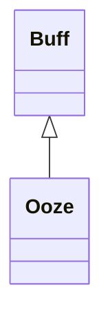

# Ooze 类文档

## 1. 基本信息

| 属性 | 值 |
|------|-----|
| **文件路径** | core/src/main/java/com/shatteredpixel/shatteredpixeldungeon/actors/buffs/Ooze.java |
| **包名** | com.shatteredpixel.shatteredpixeldungeon.actors.buffs |
| **类类型** | public class |
| **继承关系** | extends Buff |
| **代码行数** | 122 行 |
| **官方中文名** | 腐蚀淤泥 |

## 2. 文件职责说明

Ooze 类表示“腐蚀淤泥”Buff。它会在持续期间周期性造成伤害，并允许角色在进入水中且未飞行时将其洗掉。

**核心职责**：
- 维护剩余持续时间 `left`
- 记录是否已经造成过伤害 `acted`
- 按楼层深度造成不同强度伤害
- 在水中清除自身

## 3. 结构总览

```
Ooze (extends Buff)
├── 常量
│   └── DURATION: float = 20f
├── 字段
│   ├── left: float
│   └── acted: boolean
└── 方法
    ├── storeInBundle()/restoreFromBundle()
    ├── icon()/iconFadePercent()/iconTextDisplay()/desc()
    ├── set(float): void
    ├── extend(float): void
    └── act(): boolean
```

## 4. 继承与协作关系

### 继承关系图



### 协作关系

| 协作类 | 协作方式 |
|--------|----------|
| **Buff** | 父类，提供附着与计时 |
| **Dungeon.level.water** | 判断是否在水中洗掉淤泥 |
| **Dungeon.scalingDepth()** | 决定伤害强度 |
| **GLog / Messages** | 英雄被淤泥致死时输出消息 |
| **BuffIndicator** | 使用 `OOZE` 图标 |
| **Bundle** | 存档读写 |

## 5. 字段与常量详解

### 常量

| 常量 | 类型 | 值 | 说明 |
|------|------|----|------|
| `DURATION` | float | `20f` | 默认持续时间 |

### 实例字段

| 字段 | 类型 | 说明 |
|------|------|------|
| `left` | float | 剩余持续时间 |
| `acted` | boolean | 是否已经至少结算过一次伤害 |

### Bundle 键

| 常量 | 值 | 用途 |
|------|-----|------|
| `LEFT` | `left` | 保存剩余时间 |
| `ACTED` | `acted` | 保存是否已结算伤害 |

## 6. 构造与初始化机制

Ooze 没有显式构造函数。常见方式：

```java
Ooze ooze = Buff.affect(target, Ooze.class);
ooze.set(Ooze.DURATION);
```

## 7. 方法详解

### 图标与描述方法

- `icon()` -> `BuffIndicator.OOZE`
- `iconFadePercent()` -> `Math.max(0, (DURATION - left) / DURATION)`
- `iconTextDisplay()` -> `(int)left`
- `desc()` -> `Messages.get(this, "desc", dispTurns(left))`

### set(float left)

设置剩余时间并把 `acted = false`。

### extend(float duration)

执行 `left += duration`。

### act()

执行逻辑：
1. 若 `acted` 为真且目标在水中且未飞行，则直接移除。
2. 否则若目标存活：
   - `acted = true`
   - 深度 > 5：造成 `1 + scalingDepth()/5`
   - 深度 == 5：每回合固定 1 点伤害
   - 深度 < 5：50% 概率造成 1 点伤害
   - 若英雄因此死亡：`Dungeon.fail(this)` 并输出 `ondeath`
   - `spend(TICK)`
   - `left -= TICK`
   - `left <= 0` 时移除
3. 否则目标已死亡，直接移除。
4. 方法结尾再次检查“在水中且未飞行”并移除。

## 8. 对外暴露能力

| 方法 | 用途 |
|------|------|
| `set(float)` | 设置持续时间并重置 acted |
| `extend(float)` | 延长持续时间 |

## 9. 运行机制与调用链

```
Ooze.act()
├── [已结算过且在水中] detach()
├── [目标存活] 按深度造成伤害
├── left -= TICK
├── [left <= 0] detach()
└── [最后再次检查在水中] detach()
```

## 10. 资源、配置与国际化关联

文件：`core/src/main/assets/messages/actors/actors_zh.properties`

```properties
actors.buffs.ooze.name=腐蚀淤泥
actors.buffs.ooze.heromsg=淤泥在腐蚀你的身体。洗掉它！
actors.buffs.ooze.ondeath=你被彻底融化掉了...
actors.buffs.ooze.desc=这种粘稠的酸性淤泥正在紧贴你的骨肉，并缓慢地将它们腐蚀融化。
```

## 11. 使用示例

```java
Ooze ooze = Buff.affect(hero, Ooze.class);
ooze.set(Ooze.DURATION);
ooze.extend(5f);
```

## 12. 开发注意事项

- 本类有两处水洗判定：一次在开头，一次在结尾，文档必须忠实保留。
- 早期、Goo 楼层和更深层的伤害规则不同，不能写成单一固定伤害。
- `acted` 会影响第一次在水中时是否立刻清除。

## 13. 修改建议与扩展点

- 若要简化逻辑，可把“在水中清除”的双重判断整合并验证行为是否一致。
- 若后续有更多基于深度的持续伤害 Buff，可抽出统一的深度伤害工具。

## 14. 事实核查清单

- [x] 已覆盖全部字段、方法与常量
- [x] 已验证继承关系 `extends Buff`
- [x] 已验证深度分段伤害逻辑
- [x] 已验证 `acted` 标志的作用
- [x] 已验证水中清除与飞行豁免逻辑
- [x] 已验证英雄死亡处理
- [x] 已验证 `Bundle` 存档字段
- [x] 已核对官方中文名来自翻译文件
- [x] 无臆测性机制说明
