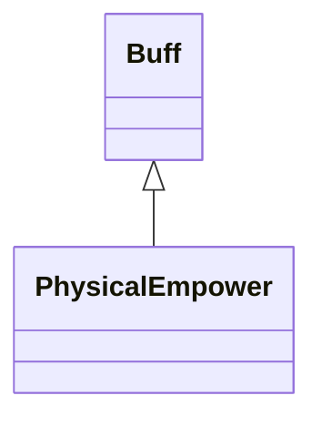

# PhysicalEmpower 类文档

## 1. 基本信息

| 属性 | 值 |
|------|-----|
| **文件路径** | core/src/main/java/com/shatteredpixel/shatteredpixeldungeon/actors/buffs/PhysicalEmpower.java |
| **包名** | com.shatteredpixel.shatteredpixeldungeon.actors.buffs |
| **类类型** | public class |
| **继承关系** | extends Buff |
| **代码行数** | 90 行 |
| **官方中文名** | 体能增幅 |

## 2. 文件职责说明

PhysicalEmpower 类表示“体能增幅”Buff。它记录额外物理伤害 `dmgBoost` 与剩余命中次数 `left`，并在外部系统重新设置时只保留“总收益更高”的方案。

**核心职责**：
- 保存额外伤害值与剩余次数
- 提供图标、图标文字和描述文本
- 在多来源重设时按 `dmg*hits` 与 `dmgBoost*left` 比较保留更优组合
- 支持存档恢复

## 3. 结构总览

```
PhysicalEmpower (extends Buff)
├── 字段
│   ├── dmgBoost: int
│   └── left: int
├── 初始化块
│   └── type = POSITIVE
└── 方法
    ├── icon(): int
    ├── tintIcon(Image): void
    ├── iconFadePercent(): float
    ├── iconTextDisplay(): String
    ├── desc(): String
    ├── set(int,int): void
    ├── storeInBundle(Bundle): void
    └── restoreFromBundle(Bundle): void
```

## 4. 继承与协作关系

### 继承关系图



### 协作关系

| 协作类 | 协作方式 |
|--------|----------|
| **Buff** | 父类，提供附着与持久化基础能力 |
| **Talent.STRENGTHENING_MEAL** | 图标淡出显示的上限基准 |
| **Dungeon.hero** | 读取天赋点数 |
| **BuffIndicator** | 使用 `UPGRADE` 图标 |
| **Image** | 图标染色 |
| **Messages** | 描述文本国际化 |
| **Bundle** | 存档读写 |

## 5. 字段与常量详解

### 实例字段

| 字段 | 类型 | 说明 |
|------|------|------|
| `dmgBoost` | int | 每次命中附加的额外伤害 |
| `left` | int | 剩余可触发次数 |

### 初始化块

```java
{
    type = buffType.POSITIVE;
}
```

### Bundle 键

| 常量 | 值 | 用途 |
|------|-----|------|
| `BOOST` | `boost` | 保存额外伤害 |
| `LEFT` | `left` | 保存剩余次数 |

## 6. 构造与初始化机制

PhysicalEmpower 没有显式构造函数。通常由外部效果创建后调用 `set(dmg, hits)` 初始化。

## 7. 方法详解

### icon()/tintIcon()

- 图标：`BuffIndicator.UPGRADE`
- 染色：`icon.hardlight(1, 0.5f, 0)`

### iconFadePercent()

计算基准：

```java
float max = 1 + Dungeon.hero.pointsInTalent(Talent.STRENGTHENING_MEAL);
return Math.max(0, (max-left) / max);
```

### iconTextDisplay()

返回 `left` 的字符串。

### desc()

```java
Messages.get(this, "desc", dmgBoost, left)
```

### set(int dmg, int hits)

只有当：

```java
dmg * hits > dmgBoost * left
```

时才更新为新的 `dmgBoost` 和 `left`。\n
也就是说，它比较的是“总潜在增伤值”。

### storeInBundle() / restoreFromBundle()

保存并恢复 `dmgBoost` 与 `left`。

## 8. 对外暴露能力

| 方法 | 用途 |
|------|------|
| `set(int,int)` | 设置或替换当前物理增幅参数 |
| `iconTextDisplay()` | 显示剩余次数 |

## 9. 运行机制与调用链

```
外部效果创建/刷新 PhysicalEmpower
└── set(dmg, hits)
    └── 仅在 dmg*hits 更优时覆盖旧值
```

## 10. 资源、配置与国际化关联

文件：`core/src/main/assets/messages/actors/actors_zh.properties`

```properties
actors.buffs.physicalempower.name=体能增幅
actors.buffs.physicalempower.desc=你的攻击已被强化，接下来的几次物理攻击击中敌人时将会造成额外伤害。
```

## 11. 使用示例

```java
PhysicalEmpower pe = Buff.affect(hero, PhysicalEmpower.class);
pe.set(5, 3);
```

## 12. 开发注意事项

- 本类不自己消耗 `left`，次数扣减逻辑在外部命中流程里实现。
- `set()` 的比较标准是总潜在收益，不是单次伤害或剩余次数单独比较。
- `iconFadePercent()` 读取的是英雄天赋点数，显示基准与实际剩余次数不一定同尺度。

## 13. 修改建议与扩展点

- 若后续要支持不同来源共存，可改成保存多个增幅实例而不是单一最优值。
- 若 UI 需要更直观，可把淡出基准从天赋推导改成记录初始次数。

## 14. 事实核查清单

- [x] 已覆盖全部字段与方法
- [x] 已验证继承关系 `extends Buff`
- [x] 已验证 `POSITIVE` 初始化
- [x] 已验证 `set()` 的总收益比较规则
- [x] 已验证图标、染色、文本与描述逻辑
- [x] 已验证 `Bundle` 存档字段
- [x] 已核对官方中文名来自翻译文件
- [x] 无臆测性机制说明
