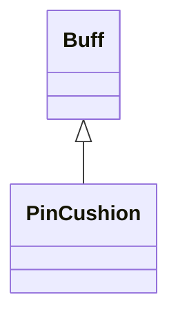

# PinCushion 类文档

## 1. 基本信息

| 属性 | 值 |
|------|-----|
| **文件路径** | core/src/main/java/com/shatteredpixel/shatteredpixeldungeon/actors/buffs/PinCushion.java |
| **包名** | com.shatteredpixel.shatteredpixeldungeon.actors.buffs |
| **类类型** | public class |
| **继承关系** | extends Buff |
| **代码行数** | 104 行 |
| **官方中文名** | 中矢 |

## 2. 文件职责说明

PinCushion 类表示“中矢”Buff。它用于记录插在目标身上的投掷武器，并在 Buff 结束时把这些武器掉落到目标脚下。

**核心职责**：
- 维护卡在目标身上的 `MissileWeapon` 列表
- 在新投射物命中时合并或追加同类投掷物
- 提供逐个取回、整体查看和 Buff 结束掉落逻辑
- 处理 `TippedDart.lostDarts` 的补回逻辑

## 3. 结构总览

```
PinCushion (extends Buff)
├── 字段
│   └── items: ArrayList<MissileWeapon>
├── 方法
│   ├── stick(MissileWeapon): void
│   ├── grabOne(): Item
│   ├── getStuckItems(): ArrayList<MissileWeapon>
│   ├── detach(): void
│   ├── storeInBundle()/restoreFromBundle()
│   ├── icon(): int
│   └── desc(): String
```

## 4. 继承与协作关系

### 继承关系图



### 协作关系

| 协作类 | 协作方式 |
|--------|----------|
| **Buff** | 父类，提供附着与移除 |
| **MissileWeapon** | 被卡在目标身上的投掷武器类型 |
| **Dart / TippedDart** | 处理遗失飞镖的补回逻辑 |
| **Dungeon.level.drop()** | Buff 移除时掉落卡住的物品 |
| **Messages** | 描述文本国际化 |
| **BuffIndicator** | 使用 `PINCUSHION` 图标 |
| **Bundle** | 存档读写 |

## 5. 字段与常量详解

### 实例字段

| 字段 | 类型 | 说明 |
|------|------|------|
| `items` | ArrayList<MissileWeapon> | 当前卡在目标身上的投掷武器列表 |

### Bundle 键

| 常量 | 值 | 用途 |
|------|-----|------|
| `ITEMS` | `items` | 保存卡住的投掷物集合 |

## 6. 构造与初始化机制

PinCushion 没有显式构造函数。通常在投掷武器命中后由外部系统创建或获取 Buff，再调用 `stick()` 追加物品。

## 7. 方法详解

### stick(MissileWeapon projectile)

逻辑：
1. 遍历 `items`。
2. 若新投射物与某个已有物品 `isSimilar()`：
   - `projectile.merge(items.get(i))`
   - 用合并后的 `projectile` 替换原项
   - 若 `TippedDart.lostDarts > 0`：
     - 创建普通 `Dart`
     - 设置数量为 `lostDarts`
     - 清零 `lostDarts`
     - 递归调用 `stick(d)`
   - 返回
3. 若没有相似项，直接加入列表

### grabOne()

移除并返回列表第一个物品。若移除后列表为空，则自动 `detach()`。

### getStuckItems()

返回 `items` 的副本：

```java
return new ArrayList<>(items);
```

### detach()

遍历所有 `items`，逐个调用：

```java
Dungeon.level.drop(item, target.pos).sprite.drop();
```

然后再 `super.detach()`。

### storeInBundle() / restoreFromBundle()

保存并恢复 `items` 集合。

### icon() / desc()

- 图标：`BuffIndicator.PINCUSHION`
- 描述：先读取基础 `desc`，再逐行追加每个物品的 `title()`

## 8. 对外暴露能力

| 方法 | 用途 |
|------|------|
| `stick(MissileWeapon)` | 追加或合并一件卡住的投射物 |
| `grabOne()` | 取出一件卡住的投射物 |
| `getStuckItems()` | 获取当前所有卡住投射物的副本 |

## 9. 运行机制与调用链

```
投掷武器命中目标
└── PinCushion.stick(projectile)
    ├── [相似物品] merge
    └── [无相似物品] add

Buff 移除
└── PinCushion.detach()
    └── 把所有 items 掉落到 target.pos
```

## 10. 资源、配置与国际化关联

文件：`core/src/main/assets/messages/actors/actors_zh.properties`

```properties
actors.buffs.pincushion.name=中矢
actors.buffs.pincushion.desc=你击中这个角色的投掷武器正卡在他们身上，打败他们后投掷武器将会掉在地上。
```

## 11. 使用示例

```java
PinCushion pc = Buff.affect(enemy, PinCushion.class);
pc.stick(dart);

Item recovered = pc.grabOne();
```

## 12. 开发注意事项

- `stick()` 有递归路径，用于处理 `TippedDart.lostDarts`。
- `grabOne()` 会在取空最后一件时自动移除 Buff。
- `detach()` 会直接把所有物品掉到地上，不能把它写成“自动回收到背包”。

## 13. 修改建议与扩展点

- 若未来需要按来源区分回收逻辑，可把 `items` 从简单列表升级成带元信息的结构。
- 若需要更安全的持久化，可增加恢复时的类型校验。

## 14. 事实核查清单

- [x] 已覆盖全部字段与方法
- [x] 已验证继承关系 `extends Buff`
- [x] 已验证相似投掷物合并逻辑
- [x] 已验证 `TippedDart.lostDarts` 补回逻辑
- [x] 已验证 `grabOne()` 取空后自动 detach
- [x] 已验证 `detach()` 的掉落行为
- [x] 已验证 `Bundle` 存档字段
- [x] 已核对官方中文名来自翻译文件
- [x] 无臆测性机制说明
