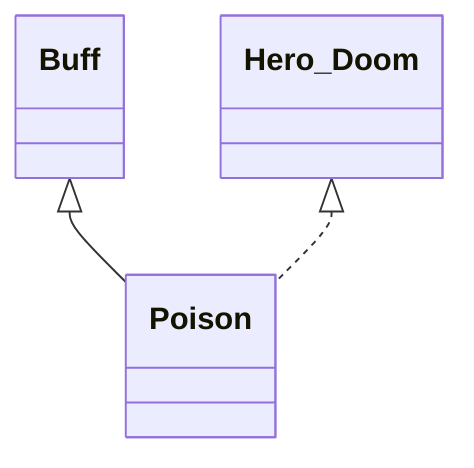

# Poison 类文档

## 1. 基本信息

| 属性 | 值 |
|------|-----|
| **文件路径** | core/src/main/java/com/shatteredpixel/shatteredpixeldungeon/actors/buffs/Poison.java |
| **包名** | com.shatteredpixel.shatteredpixeldungeon.actors.buffs |
| **类类型** | public class |
| **继承关系** | extends Buff implements Hero.Doom |
| **代码行数** | 123 行 |
| **官方中文名** | 中毒 |

## 2. 文件职责说明

Poison 类表示“中毒”Buff。它使用 `left` 表示剩余持续时间，并在每回合按 `left/3 + 1` 的规则对目标造成伤害；若英雄因此死亡，会触发毒死徽章和失败提示。

**核心职责**：
- 维护中毒剩余时间 `left`
- 每回合造成随剩余时长递减的毒伤
- 在附着时播放中毒粒子效果
- 处理英雄中毒死亡逻辑

## 3. 结构总览

```
Poison (extends Buff implements Hero.Doom)
├── 字段
│   └── left: float
├── 初始化块
│   ├── type = NEGATIVE
│   └── announced = true
└── 方法
    ├── storeInBundle()/restoreFromBundle()
    ├── set(float): void
    ├── extend(float): void
    ├── icon()/tintIcon()/iconTextDisplay()/desc()
    ├── attachTo(Char): boolean
    ├── act(): boolean
    └── onDeath(): void
```

## 4. 继承与协作关系

### 继承关系图



### 协作关系

| 协作类 | 协作方式 |
|--------|----------|
| **Buff** | 父类，提供附着与计时 |
| **Hero.Doom** | 处理中毒死亡结算 |
| **CellEmitter / PoisonParticle** | 附着时产生粒子效果 |
| **Badges** | 验证毒死徽章 |
| **Dungeon / GLog / Messages** | 失败与死亡提示 |
| **BuffIndicator** | 使用 `POISON` 图标 |
| **Bundle** | 存档读写 |

## 5. 字段与常量详解

### 实例字段

| 字段 | 类型 | 说明 |
|------|------|------|
| `left` | float | 剩余中毒持续时间 |

### 初始化块

```java
{
    type = buffType.NEGATIVE;
    announced = true;
}
```

### Bundle 键

| 常量 | 值 | 用途 |
|------|-----|------|
| `LEFT` | `left` | 保存剩余持续时间 |

## 6. 构造与初始化机制

Poison 没有显式构造函数。通常通过：

```java
Poison poison = Buff.affect(target, Poison.class);
poison.set(duration);
```

完成初始化。

## 7. 方法详解

### storeInBundle() / restoreFromBundle()

保存并恢复 `left`。

### set(float duration)

```java
this.left = Math.max(duration, left);
```

只会把持续时间提升到更大值。

### extend(float duration)

直接执行 `left += duration`。

### icon()/tintIcon()/iconTextDisplay()/desc()

- 图标：`BuffIndicator.POISON`
- 染色：`icon.hardlight(0.6f, 0.2f, 0.6f)`
- 图标文本：`(int)left`
- 描述：`Messages.get(this, "desc", dispTurns(left))`

### attachTo(Char target)

若 `super.attachTo(target)` 成功且目标有精灵，则：

```java
CellEmitter.center(target.pos).burst(PoisonParticle.SPLASH, 5);
```

### act()

每回合逻辑：
1. 若目标存活：
   - 造成 `((int)(left / 3) + 1)` 点伤害
   - `spend(TICK)`
   - `left -= TICK`
   - 若 `left <= 0`，移除 Buff
2. 否则目标已死，直接移除。

### onDeath()

若英雄因 Poison 死亡：
- `Badges.validateDeathFromPoison()`
- `Dungeon.fail(this)`
- 输出 `ondeath`

## 8. 对外暴露能力

| 方法 | 用途 |
|------|------|
| `set(float)` | 设置中毒时长（取更大值） |
| `extend(float)` | 叠加中毒时长 |

## 9. 运行机制与调用链

```
Poison.attachTo(target)
└── 播放中毒粒子

Poison.act()
├── damage((int)(left/3)+1, this)
├── left -= TICK
└── [left <= 0] detach()
```

## 10. 资源、配置与国际化关联

文件：`core/src/main/assets/messages/actors/actors_zh.properties`

```properties
actors.buffs.poison.name=中毒
actors.buffs.poison.heromsg=你中毒了！
actors.buffs.poison.ondeath=你被毒死了...
actors.buffs.poison.rankings_desc=毒发身亡
actors.buffs.poison.desc=毒素传遍全身，缓慢地损伤着各个脏器。
```

## 11. 使用示例

```java
Poison p = Buff.affect(enemy, Poison.class);
p.set(12f);
p.extend(3f);
```

## 12. 开发注意事项

- `set()` 与 `extend()` 的语义不同：一个取大值，一个直接累加。
- 伤害公式直接依赖 `left`，所以中毒越久，前期每跳越痛。
- 该 Buff 的死亡逻辑只在英雄死亡时通过 `Hero.Doom` 走失败分支。

## 13. 修改建议与扩展点

- 若需要更多毒类型，可以在此基础上抽象出“基于剩余时长掉血”的父类。
- 若想让毒伤曲线更平滑，可把当前整数截断规则换成累计伤害模型。

## 14. 事实核查清单

- [x] 已覆盖全部字段与方法
- [x] 已验证继承关系 `extends Buff implements Hero.Doom`
- [x] 已验证 `NEGATIVE` 与 `announced = true`
- [x] 已验证附着粒子效果
- [x] 已验证伤害公式与时长递减逻辑
- [x] 已验证 `set()` / `extend()` 差异
- [x] 已验证英雄死亡处理
- [x] 已验证 `Bundle` 存档字段
- [x] 已核对官方中文名来自翻译文件
- [x] 无臆测性机制说明
