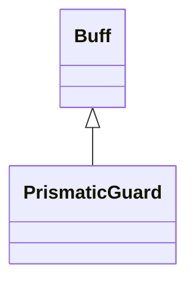

# PrismaticGuard 类文档

## 1. 基本信息

| 属性 | 值 |
|------|-----|
| **文件路径** | core/src/main/java/com/shatteredpixel/shatteredpixeldungeon/actors/buffs/PrismaticGuard.java |
| **包名** | com.shatteredpixel.shatteredpixeldungeon.actors.buffs |
| **类类型** | public class |
| **继承关系** | extends Buff |
| **代码行数** | 184 行 |
| **官方中文名** | 虹光守卫 |

## 2. 文件职责说明

PrismaticGuard 类表示“虹光守卫”Buff。它不会直接在附着时生成守卫，而是每回合检查英雄附近的可见敌人，找到满足条件的最近目标后，尝试在英雄旁边召唤一个 `PrismaticImage` 分身并把自己消耗掉。

**核心职责**：
- 保存待生成虹光守卫的生命值 `HP`
- 维护 `PowerOfMany` 强化剩余时间
- 自动寻找最近的可见威胁并在合适距离内召唤分身
- 在未触发前缓慢自然回复自身存储的生命值

## 3. 结构总览

```
PrismaticGuard (extends Buff)
├── 字段
│   ├── HP: float
│   └── powerOfManyTurns: float
├── 方法
│   ├── act(): boolean
│   ├── set(int): void
│   ├── set(PrismaticImage): void
│   ├── maxHP(): int
│   ├── maxHP(Hero): int$
│   ├── isEmpowered(): boolean
│   ├── icon()/tintIcon()/iconFadePercent()/iconTextDisplay()/desc()
│   ├── storeInBundle()/restoreFromBundle()
```

## 4. 继承与协作关系

### 继承关系图



### 协作关系

| 协作类 | 协作方式 |
|--------|----------|
| **Buff** | 父类，提供附着与计时 |
| **Hero** | 作为目标并提供等级、可见敌人列表 |
| **Mob** | 用于筛选最近可见敌人 |
| **PrismaticImage** | 实际被召唤出来的虹光守卫分身 |
| **PowerOfMany.PowerBuff** | 可被复制到分身上 |
| **ScrollOfTeleportation** | 让分身在目标格显现 |
| **Regeneration.regenOn()** | 控制未触发前的生命回复 |
| **BuffIndicator** | 使用 `ARMOR` 图标 |
| **Image** | 图标染色 |
| **Messages** | 描述文本国际化 |
| **Bundle** | 存档读写 |

## 5. 字段与常量详解

### 实例字段

| 字段 | 类型 | 说明 |
|------|------|------|
| `HP` | float | 当前存储的守卫生命值 |
| `powerOfManyTurns` | float | 若守卫带有 `PowerOfMany` 强化，则记录其剩余回合 |

### Bundle 键

| 常量 | 值 | 用途 |
|------|-----|------|
| `HEALTH` | `hp` | 保存存储生命值 |
| `POWER_TURNS` | `power_turns` | 保存强化剩余回合 |

## 6. 构造与初始化机制

PrismaticGuard 没有显式构造函数。外部一般通过：

```java
guard.set(int hp)
```

或：

```java
guard.set(PrismaticImage img)
```

把守卫初始生命与强化状态写入 Buff。

## 7. 方法详解

### act()

每回合流程：
1. 把 `target` 视为 `Hero`。
2. 遍历 `hero.visibleEnemies()`，寻找最近的有效敌人：
   - 目标必须存活
   - 不能对 `PrismaticImage.class` 无敌
   - 状态不能是 `PASSIVE` / `WANDERING` / `SLEEPING`
   - 不能出现在 `hero.mindVisionEnemies` 中
3. 若最近敌人存在且距离 `< 5`：
   - 在英雄周围 8 格里寻找一个离敌人最近的可通行空位
   - 若找到位置：
     - 创建 `PrismaticImage`
     - `duplicate(hero, floor(HP))`
     - 若 `powerOfManyTurns > 0`，附加 `PowerOfMany.PowerBuff`
     - 设置状态为 `HUNTING`
     - 加入场景并用 `ScrollOfTeleportation.appear()` 显现
     - `detach()` 自身
   - 否则仅 `spend(TICK)`
4. 若最近敌人不存在或不够近，则 `spend(TICK)`
5. 若 `HP < maxHP()` 且 `Regeneration.regenOn()`，每回合恢复 `0.1f`
6. 若 `powerOfManyTurns > 0`，每回合减 1，归零后刷新英雄 Buff 图标

### set(int HP)

把存储生命值设为给定值，并把 `powerOfManyTurns = 0`。

### set(PrismaticImage img)

从现有 `PrismaticImage` 复制：
- `HP = img.HP`
- 若其有 `PowerOfMany.PowerBuff`，则把剩余冷却时间 `+1` 保存到 `powerOfManyTurns`

### maxHP() / maxHP(Hero hero)

最大生命公式：

```java
10 + (int)Math.floor(hero.lvl * 2.5f)
```

### isEmpowered()

返回 `powerOfManyTurns > 0`。

### icon()/tintIcon()/iconFadePercent()/iconTextDisplay()/desc()

- 图标：`BuffIndicator.ARMOR`
- 染色：
  - 强化中：`hardlight(3f, 3f, 2f)`
  - 普通：`hardlight(1f, 1f, 2f)`
- 淡出：`1f - HP / maxHP()`
- 文本：显示 `(int)HP`
- 描述：基础 `desc(hp, maxHP)`，强化中再拼接 `desc_many(powerOfManyTurns)`

### storeInBundle() / restoreFromBundle()

保存并恢复 `HP` 和 `powerOfManyTurns`。

## 8. 对外暴露能力

| 方法 | 用途 |
|------|------|
| `set(int)` | 直接设置待召唤守卫生命值 |
| `set(PrismaticImage)` | 从已有守卫复制状态 |
| `maxHP()` / `maxHP(Hero)` | 查询最大生命上限 |
| `isEmpowered()` | 判断是否带有众志成城强化 |

## 9. 运行机制与调用链

```
PrismaticGuard.act()
├── 查找最近有效敌人
├── [距离 < 5] 搜索召唤落点
├── [有落点] 创建 PrismaticImage 并 detach()
└── [未触发] 继续恢复 HP 与推进强化时间
```

## 10. 资源、配置与国际化关联

文件：`core/src/main/assets/messages/actors/actors_zh.properties`

```properties
actors.buffs.prismaticguard.name=虹光守卫
actors.buffs.prismaticguard.desc=你正在被一个目前看不见的虹光守卫所保护。
actors.buffs.prismaticguard.desc_many=该虹光幻像已被万物一心强化。剩余回合数：%d
```

## 11. 使用示例

```java
PrismaticGuard g = Buff.affect(hero, PrismaticGuard.class);
g.set(20);

if (g.isEmpowered()) {
    int cap = g.maxHP();
}
```

## 12. 开发注意事项

- 这个 Buff 不是“立刻召唤”，而是“等敌人接近后自动召唤”。
- `hero.mindVisionEnemies` 被排除在可触发目标之外，文档必须按源码保留这一条件。
- `HP` 使用 `float` 存储，但实际生成分身时会取 `floor(HP)`。

## 13. 修改建议与扩展点

- 若后续需要不同召唤策略，可把“寻找最近敌人”和“寻找最佳落点”拆成独立方法。
- 若 `powerOfManyTurns` 还需影响别的显示或数值，可把其封装为更明确的强化状态对象。

## 14. 事实核查清单

- [x] 已覆盖全部字段与方法
- [x] 已验证继承关系 `extends Buff`
- [x] 已验证最近敌人筛选条件
- [x] 已验证召唤落点搜索与显现逻辑
- [x] 已验证 `HP` 恢复与 `powerOfManyTurns` 递减逻辑
- [x] 已验证最大生命公式
- [x] 已验证图标、染色、淡出与描述逻辑
- [x] 已验证 `Bundle` 存档字段
- [x] 已核对官方中文名来自翻译文件
- [x] 无臆测性机制说明
