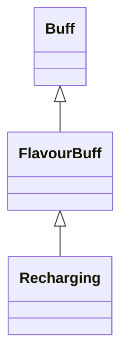

# Recharging 类文档

## 1. 基本信息

| 属性 | 值 |
|------|-----|
| **文件路径** | core/src/main/java/com/shatteredpixel/shatteredpixeldungeon/actors/buffs/Recharging.java |
| **包名** | com.shatteredpixel.shatteredpixeldungeon.actors.buffs |
| **类类型** | public class |
| **继承关系** | extends FlavourBuff |
| **代码行数** | 58 行 |
| **官方中文名** | 充能 |

## 2. 文件职责说明

Recharging 类表示“充能”Buff。它是一个正面 FlavourBuff，本类唯一的特殊逻辑是通过 `remainder()` 暴露“剩余的有效分数回合”，供法杖/魔杖等充能系统按部分回合结算收益。

**核心职责**：
- 定义充能 Buff 的标准持续时间
- 提供图标、染色与淡出显示
- 暴露剩余有效分数回合

## 3. 结构总览

```
Recharging (extends FlavourBuff)
├── 常量
│   └── DURATION: float = 30f
├── 初始化块
│   └── type = POSITIVE
└── 方法
    ├── icon(): int
    ├── tintIcon(Image): void
    ├── iconFadePercent(): float
    └── remainder(): float
```

## 4. 继承与协作关系

### 继承关系图



### 协作关系

| 协作类 | 协作方式 |
|--------|----------|
| **FlavourBuff** | 父类，提供时限型 Buff 行为 |
| **BuffIndicator** | 使用 `RECHARGING` 图标 |
| **Image** | 图标染色 |
| **法杖/魔杖充能系统** | 可通过 `remainder()` 读取分数回合收益 |

## 5. 字段与常量详解

### 常量

| 常量 | 类型 | 值 | 说明 |
|------|------|----|------|
| `DURATION` | float | `30f` | 默认持续时间 |

### 初始化块

```java
{
    type = buffType.POSITIVE;
}
```

## 6. 构造与初始化机制

Recharging 没有显式构造函数。常见施加方式：

```java
Buff.affect(target, Recharging.class, Recharging.DURATION);
```

## 7. 方法详解

### icon()/tintIcon()/iconFadePercent()

- 图标：`BuffIndicator.RECHARGING`
- 染色：`icon.hardlight(1, 1, 0)`
- 淡出：`Math.max(0, (DURATION - visualcooldown()) / DURATION)`

### remainder()

返回：

```java
Math.min(1f, this.cooldown())
```

源码注释强调两个目的：
1. 若 Buff 只剩半回合，应只提供半回合收益。
2. 因为 Buff 执行顺序随机，外部系统不应只检查“Buff 是否存在”，而应直接读取剩余时间。

## 8. 对外暴露能力

| 方法 | 用途 |
|------|------|
| `remainder()` | 返回剩余的有效分数回合充能时间 |

## 9. 运行机制与调用链

```
Buff.affect(target, Recharging.class, DURATION)
└── FlavourBuff 生命周期运行

充能系统
└── Recharging.remainder()
    └── 根据 cooldown() 返回 0~1 的剩余有效时长
```

## 10. 资源、配置与国际化关联

文件：`core/src/main/assets/messages/actors/actors_zh.properties`

```properties
actors.buffs.recharging.name=充能
actors.buffs.recharging.desc=魔力在你体内奔腾而过，提高你的法杖与魔杖的充能速率。
```

## 11. 使用示例

```java
Recharging r = Buff.affect(hero, Recharging.class, Recharging.DURATION);
float partial = r.remainder();
```

## 12. 开发注意事项

- 本类的重要性主要在 `remainder()`，而不是额外的战斗或每回合逻辑。
- 源码注释明确说外部不要只看“是否仍附着”，因为随机执行顺序会导致结算不一致。

## 13. 修改建议与扩展点

- 若未来有更多需要部分回合结算的 Buff，可抽取通用“fractional effect”接口。
- 若充能对象继续扩大，可在文档或调用处统一说明 `remainder()` 的消费规则。

## 14. 事实核查清单

- [x] 已覆盖全部自有方法与常量
- [x] 已验证继承关系 `extends FlavourBuff`
- [x] 已验证 `POSITIVE` 初始化
- [x] 已验证图标、染色与淡出公式
- [x] 已验证 `remainder()` 返回 `min(1f, cooldown())`
- [x] 已按源码注释记录分数回合结算目的
- [x] 已核对官方中文名来自翻译文件
- [x] 无臆测性机制说明
