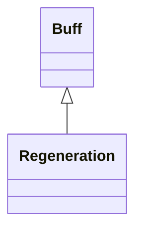

# Regeneration 类文档

## 1. 基本信息

| 属性 | 值 |
|------|-----|
| **文件路径** | core/src/main/java/com/shatteredpixel/shatteredpixeldungeon/actors/buffs/Regeneration.java |
| **包名** | com.shatteredpixel.shatteredpixeldungeon.actors.buffs |
| **类类型** | public class |
| **继承关系** | extends Buff |
| **代码行数** | 137 行 |

## 2. 文件职责说明

Regeneration 类实现自然生命恢复机制。它通过 `partialRegen` 累积小数回复量，并在满足条件时把生命逐步恢复到 `regencap()`；回复速度会受到圣杯、能量戒指、盐立方、魔法免疫、楼层封锁和金库层等系统影响。

**核心职责**：
- 以固定基准速度积累生命回复
- 根据 Chalice、Ring、SaltCube 等效果修正回复延迟
- 在禁止回复的场景中停用自然恢复
- 支持部分回复量的存档恢复

## 3. 结构总览

```
Regeneration (extends Buff)
├── 字段
│   └── partialRegen: float
├── 常量
│   └── REGENERATION_DELAY: float = 10
├── 初始化块
│   └── actPriority = HERO_PRIO - 1
└── 方法
    ├── act(): boolean
    ├── regencap(): int
    ├── regenOn(): boolean$
    ├── storeInBundle(Bundle): void
    └── restoreFromBundle(Bundle): void
```

## 4. 继承与协作关系

### 继承关系图



### 协作关系

| 协作类 | 协作方式 |
|--------|----------|
| **Buff** | 父类，提供附着与调度 |
| **Hero** | 仅英雄会参与饥饿、休息等逻辑 |
| **Hunger** | 饥饿英雄无法自然恢复 |
| **LockedFloor** | 可关闭自然恢复 |
| **VaultLevel** | 金库层彻底关闭自然恢复 |
| **ChaliceOfBlood.chaliceRegen** | 提供回复加速或减速 |
| **SpiritForm.SpiritFormBuff** | 读取化灵状态中的 Chalice 信息 |
| **RingOfEnergy** | 调整神器相关回复倍率 |
| **SaltCube** | 调整生命回复倍率 |
| **ChaoticCenser** | 每回合可能附加 `CenserGasTracker` |
| **MagicImmune** | 阻止 Chalice 回复分支生效 |
| **Bundle** | 存档读写 |

## 5. 字段与常量详解

### 实例字段

| 字段 | 类型 | 说明 |
|------|------|------|
| `partialRegen` | float | 尚未凑成整数生命值的小数回复量 |

### 常量

| 常量 | 类型 | 值 | 说明 |
|------|------|----|------|
| `REGENERATION_DELAY` | float | `10` | 基础回复速度：每 10 回合 1 点生命 |

### 初始化块

```java
{
    actPriority = HERO_PRIO - 1;
}
```

与 `Healing` 相同，尽量让回复在其他效果前结算。

### Bundle 键

| 常量 | 值 | 用途 |
|------|-----|------|
| `PARTIAL_REGEN` | `partial_regen` | 保存小数回复累计值 |

## 6. 构造与初始化机制

Regeneration 没有显式构造函数。它通常作为英雄长期存在的基础 Buff，由 `act()` 每回合推进自然恢复。

## 7. 方法详解

### act()

核心逻辑：
1. 若目标存活：
   - 如果 `ChaoticCenser.averageTurnsUntilGas() != -1`，附加 `CenserGasTracker`
   - 若 `regenOn()`、`target.HP < regencap()` 且英雄不饥饿：
     - 读取是否存在 `ChaliceOfBlood.chaliceRegen` 或 `SpiritForm` 中的 Chalice
     - 若没有 `MagicImmune`，根据圣杯等级和诅咒状态调整 `delay`
     - 若没有 `LockedFloor` Buff，再用 `SaltCube.healthRegenMultiplier()` 调整 `delay`
     - `partialRegen += 1f / delay`
     - 当 `partialRegen >= 1`：
       - 增加整数部分生命值
       - 若达到 `regencap()`，并且目标是英雄，则 `resting = false`
   - `spend(TICK)`
2. 否则目标死亡，`diactivate()`

### regencap()

默认返回 `target.HT`。

### regenOn()

静态方法。规则：
- 若英雄有 `LockedFloor` 且 `!lock.regenOn()`，返回 `false`
- 若当前楼层是 `VaultLevel`，返回 `false`
- 否则返回 `true`

### storeInBundle() / restoreFromBundle()

保存并恢复 `partialRegen`。

## 8. 对外暴露能力

| 方法 | 用途 |
|------|------|
| `regencap()` | 返回自然恢复上限 |
| `regenOn()` | 判断当前是否允许自然恢复 |

## 9. 运行机制与调用链

```
Regeneration.act()
├── [Censer 可用] 附加 CenserGasTracker
├── [regenOn && 未满血 && 非饥饿]
│   ├── 计算 delay
│   ├── partialRegen += 1/delay
│   └── [partialRegen >= 1] 实际恢复生命
└── spend(TICK)
```

## 10. 资源、配置与国际化关联

Regeneration 本类没有独立的翻译键、图标或描述文本。它属于后台基础机制 Buff，不直接通过描述面向玩家展示。

## 11. 使用示例

```java
Regeneration regen = hero.buff(Regeneration.class);
boolean canRegen = Regeneration.regenOn();
int cap = regen.regencap();
```

## 12. 开发注意事项

- 本类回复速度受多个系统共同影响，尤其是 Chalice、RingOfEnergy、SaltCube、LockedFloor、VaultLevel 和 MagicImmune。
- `MagicImmune` 会让圣杯相关回复分支失效，这条交互必须按源码保留。
- `partialRegen` 是关键的小数累积值，不能在存档或重构时丢失。

## 13. 修改建议与扩展点

- 若后续自然恢复规则继续扩展，可把 delay 计算拆成独立方法，降低 `act()` 复杂度。
- 若需要为特殊形态覆盖回复上限，可让子类覆写 `regencap()`。

## 14. 事实核查清单

- [x] 已覆盖全部字段、常量与方法
- [x] 已验证继承关系 `extends Buff`
- [x] 已验证高优先级 `HERO_PRIO - 1`
- [x] 已验证 `partialRegen` 累积回复逻辑
- [x] 已验证 `regenOn()` 对 LockedFloor 和 VaultLevel 的判断
- [x] 已验证与 Chalice / RingOfEnergy / SaltCube / MagicImmune 的联动
- [x] 已验证 `Bundle` 存档字段
- [x] 已注明本类无独立翻译键这一事实
- [x] 无臆测性机制说明
