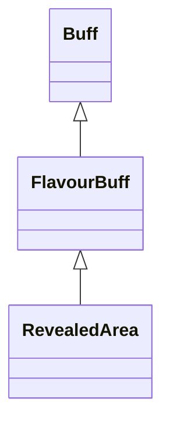

# RevealedArea 类文档

## 1. 基本信息

| 属性 | 值 |
|------|-----|
| **文件路径** | core/src/main/java/com/shatteredpixel/shatteredpixeldungeon/actors/buffs/RevealedArea.java |
| **包名** | com.shatteredpixel.shatteredpixeldungeon.actors.buffs |
| **类类型** | public class |
| **继承关系** | extends FlavourBuff |
| **代码行数** | 86 行 |
| **官方中文名** | 区域揭示 |

## 2. 文件职责说明

RevealedArea 类表示“区域揭示”Buff。它记录某个被揭示区域所在的分支、楼层和中心格位置，并在 Buff 结束时调用 `GameScene.updateFog(pos, 2)` 刷新该区域的迷雾显示。

**核心职责**：
- 保存被揭示区域的位置上下文
- 提供区域揭示图标与时间显示
- 在移除时刷新指定位置附近的迷雾

## 3. 结构总览

```
RevealedArea (extends FlavourBuff)
├── 字段
│   ├── pos: int
│   ├── depth: int
│   └── branch: int
├── 初始化块
│   └── type = POSITIVE
└── 方法
    ├── detach(): void
    ├── icon(): int
    ├── tintIcon(Image): void
    ├── iconFadePercent(): float
    ├── desc(): String
    ├── storeInBundle(): void
    └── restoreFromBundle(): void
```

## 4. 继承与协作关系

### 继承关系图



### 协作关系

| 协作类 | 协作方式 |
|--------|----------|
| **FlavourBuff** | 父类，提供时限型 Buff 行为 |
| **GameScene** | 结束时调用 `updateFog(pos, 2)` |
| **Dungeon.hero** | 图标淡出基准读取 `Talent.SEER_SHOT` 点数 |
| **Talent.SEER_SHOT** | 决定图标淡出基准时长 |
| **BuffIndicator** | 使用 `MIND_VISION` 图标 |
| **Image** | 图标染色 |
| **Bundle** | 存档读写 |

## 5. 字段与常量详解

### 实例字段

| 字段 | 类型 | 说明 |
|------|------|------|
| `pos` | int | 区域揭示中心格位置 |
| `depth` | int | 所在楼层深度 |
| `branch` | int | 所在分支 |

### 初始化块

```java
{
    type = Buff.buffType.POSITIVE;
}
```

### Bundle 键

| 常量 | 值 | 用途 |
|------|-----|------|
| `BRANCH` | `branch` | 保存分支 |
| `DEPTH` | `depth` | 保存楼层 |
| `POS` | `pos` | 保存中心格 |

## 6. 构造与初始化机制

RevealedArea 没有显式构造函数。通常由外部侦测/揭示类效果创建，再写入 `pos`、`depth`、`branch`。

## 7. 方法详解

### detach()

先执行：

```java
GameScene.updateFog(pos, 2);
```

然后 `super.detach()`。\n
它只刷新以 `pos` 为中心、半径参数为 `2` 的迷雾区域。

### icon() / tintIcon()

- 图标：`BuffIndicator.MIND_VISION`
- 染色：`icon.hardlight(0, 1, 1)`

### iconFadePercent()

公式：

```java
float max = 5 * Dungeon.hero.pointsInTalent(Talent.SEER_SHOT);
return Math.max(0, (max - visualcooldown()) / max);
```

### desc()

```java
Messages.get(this, "desc", (int)visualcooldown())
```

### storeInBundle() / restoreFromBundle()

保存并恢复 `depth`、`branch`、`pos`。

## 8. 对外暴露能力

| 方法/成员 | 用途 |
|-----------|------|
| `pos/depth/branch` | 保存区域揭示的空间上下文 |
| `detach()` | 结束时刷新对应区域迷雾 |

## 9. 运行机制与调用链

```
外部效果创建 RevealedArea
├── 写入 pos / depth / branch
└── FlavourBuff 倒计时

Buff 结束
└── RevealedArea.detach()
    ├── GameScene.updateFog(pos, 2)
    └── super.detach()
```

## 10. 资源、配置与国际化关联

文件：`core/src/main/assets/messages/actors/actors_zh.properties`

```properties
actors.buffs.revealedarea.name=区域揭示
actors.buffs.revealedarea.desc=揭示地牢中一片区域的视野，无论你身处这层中的何处都能对那里一览无遗。
```

## 11. 使用示例

```java
RevealedArea ra = Buff.affect(hero, RevealedArea.class, 10f);
ra.pos = targetCell;
ra.depth = Dungeon.depth;
ra.branch = Dungeon.branch;
```

## 12. 开发注意事项

- `iconFadePercent()` 的基准直接依赖 `SEER_SHOT` 天赋点数，若该天赋点数为 0，外部不应错误地给此 Buff 配上需要正常显示倒计时的场景。
- 本类自己不负责“如何揭示区域”，只负责保存信息和结束时刷新迷雾。

## 13. 修改建议与扩展点

- 若后续需要跨层追踪已揭示区域，可把 `depth/branch/pos` 封装成专门结构。
- 若更多区域型 Buff 也要在结束时刷新迷雾，可抽出公共辅助方法。

## 14. 事实核查清单

- [x] 已覆盖全部字段与方法
- [x] 已验证继承关系 `extends FlavourBuff`
- [x] 已验证 `POSITIVE` 初始化
- [x] 已验证 `GameScene.updateFog(pos, 2)` 的结束行为
- [x] 已验证图标淡出依赖 `SEER_SHOT` 天赋
- [x] 已验证 `Bundle` 存档字段
- [x] 已核对官方中文名来自翻译文件
- [x] 无臆测性机制说明
