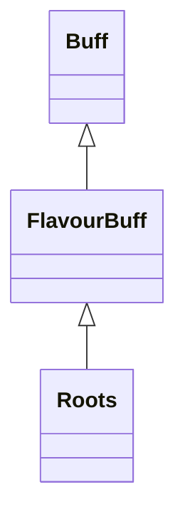

# Roots 类文档

## 1. 基本信息

| 属性 | 值 |
|------|-----|
| **文件路径** | core/src/main/java/com/shatteredpixel/shatteredpixeldungeon/actors/buffs/Roots.java |
| **包名** | com.shatteredpixel.shatteredpixeldungeon.actors.buffs |
| **类类型** | public class |
| **继承关系** | extends FlavourBuff |
| **代码行数** | 61 行 |
| **官方中文名** | 缠绕 |

## 2. 文件职责说明

Roots 类表示“缠绕”Buff。它会在目标未飞行时把目标设置为 `rooted = true`，使其无法移动；结束时再清除该标记。

**核心职责**：
- 定义缠绕持续时间
- 附着时设置 `target.rooted = true`
- 飞行目标无法被附着
- 移除时清除 `rooted`

## 3. 结构总览

```
Roots (extends FlavourBuff)
├── 常量
│   └── DURATION: float = 5f
├── 初始化块
│   ├── type = NEGATIVE
│   └── announced = true
└── 方法
    ├── attachTo(Char): boolean
    ├── detach(): void
    ├── icon(): int
    └── iconFadePercent(): float
```

## 4. 继承与协作关系

### 继承关系图



### 协作关系

| 协作类 | 协作方式 |
|--------|----------|
| **FlavourBuff** | 父类，提供时限型 Buff 行为 |
| **Char** | 通过 `target.rooted` 标记移动限制 |
| **BuffIndicator** | 使用 `ROOTS` 图标 |

## 5. 字段与常量详解

### 常量

| 常量 | 类型 | 值 | 说明 |
|------|------|----|------|
| `DURATION` | float | `5f` | 默认持续时间 |

### 初始化块

```java
{
    type = buffType.NEGATIVE;
    announced = true;
}
```

## 6. 构造与初始化机制

Roots 没有显式构造函数。常见施加方式：

```java
Buff.affect(target, Roots.class, Roots.DURATION);
```

## 7. 方法详解

### attachTo(Char target)

只有在目标**未飞行**且 `super.attachTo(target)` 成功时才会附着：

```java
if (!target.flying && super.attachTo(target)) {
    target.rooted = true;
    return true;
}
```

### detach()

先：

```java
target.rooted = false;
```

再调用 `super.detach()`。

### icon() / iconFadePercent()

- 图标：`BuffIndicator.ROOTS`
- 淡出：`Math.max(0, (DURATION - visualcooldown()) / DURATION)`

## 8. 对外暴露能力

| 方法/成员 | 用途 |
|-----------|------|
| `DURATION` | 标准持续时间 |
| `attachTo(Char)` | 设置 rooted 状态 |

## 9. 运行机制与调用链

```
Buff.affect(target, Roots.class, DURATION)
└── Roots.attachTo(target)
    ├── [!flying] target.rooted = true
    └── [flying] 附着失败

Buff 结束
└── Roots.detach()
    └── target.rooted = false
```

## 10. 资源、配置与国际化关联

文件：`core/src/main/assets/messages/actors/actors_zh.properties`

```properties
actors.buffs.roots.name=缠绕
actors.buffs.roots.heromsg=你不能移动了！
actors.buffs.roots.desc=一些根系(不论是自然或魔法产生)缠到了脚上，牢牢将其缚在地面。
```

## 11. 使用示例

```java
Buff.affect(enemy, Roots.class, Roots.DURATION);
```

## 12. 开发注意事项

- `Roots` 的判定只检查 `flying`，没有额外免疫列表逻辑。
- `detach()` 无条件把 `rooted` 设回 `false`，因此若未来有多个来源共用 `rooted` 标记，需要重新审查叠加行为。

## 13. 修改建议与扩展点

- 若后续存在多来源缠绕，可把 `rooted` 从布尔改成计数。
- 若想给缠绕添加视觉状态，可覆写 `fx(boolean)`。

## 14. 事实核查清单

- [x] 已覆盖全部自有方法与常量
- [x] 已验证继承关系 `extends FlavourBuff`
- [x] 已验证 `NEGATIVE` 与 `announced = true`
- [x] 已验证飞行目标无法附着
- [x] 已验证 `rooted` 开关逻辑
- [x] 已核对官方中文名来自翻译文件
- [x] 无臆测性机制说明
