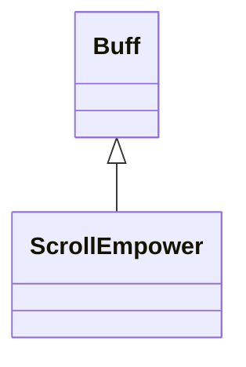

# ScrollEmpower 类文档

## 1. 基本信息

| 属性 | 值 |
|------|-----|
| **文件路径** | core/src/main/java/com/shatteredpixel/shatteredpixeldungeon/actors/buffs/ScrollEmpower.java |
| **包名** | com.shatteredpixel.shatteredpixeldungeon.actors.buffs |
| **类类型** | public class |
| **继承关系** | extends Buff |
| **代码行数** | 94 行 |
| **官方中文名** | 卷轴赋能 |

## 2. 文件职责说明

ScrollEmpower 类表示“卷轴赋能”Buff。它记录剩余有效施法次数 `left`，并在次数减少或 Buff 结束时刷新快捷栏显示。

**核心职责**：
- 保存卷轴赋能剩余次数
- 通过 `reset()` 以更大值刷新剩余次数
- 通过 `use()` 消耗一次赋能
- 在变化时刷新快捷栏

## 3. 结构总览

```
ScrollEmpower (extends Buff)
├── 字段
│   └── left: int
├── 初始化块
│   └── type = POSITIVE
└── 方法
    ├── reset(int): void
    ├── use(): void
    ├── detach(): void
    ├── icon()/tintIcon()/iconFadePercent()/iconTextDisplay()/desc()
    ├── storeInBundle(): void
    └── restoreFromBundle(): void
```

## 4. 继承与协作关系

### 继承关系图



### 协作关系

| 协作类 | 协作方式 |
|--------|----------|
| **Buff** | 父类，提供附着与存档基础能力 |
| **Item** | 通过 `Item.updateQuickslot()` 刷新快捷栏 |
| **BuffIndicator** | 使用 `WAND` 图标 |
| **Image** | 图标染色 |
| **Messages** | 描述文本国际化 |
| **Bundle** | 存档读写 |

## 5. 字段与常量详解

### 实例字段

| 字段 | 类型 | 说明 |
|------|------|------|
| `left` | int | 剩余有效施法次数 |

### 初始化块

```java
{
    type = buffType.POSITIVE;
}
```

### Bundle 键

| 常量 | 值 | 用途 |
|------|-----|------|
| `LEFT` | `left` | 保存剩余次数 |

## 6. 构造与初始化机制

ScrollEmpower 没有显式构造函数。外部通常创建后调用 `reset(left)` 设定次数。

## 7. 方法详解

### reset(int left)

逻辑：

```java
this.left = Math.max(this.left, left);
Item.updateQuickslot();
```

只会把剩余次数提升到更大值。

### use()

执行：
- `left--`
- 若 `left <= 0` 则 `detach()`

### detach()

先 `super.detach()`，再调用 `Item.updateQuickslot()`。

### icon()/tintIcon()/iconFadePercent()/iconTextDisplay()/desc()

- 图标：`BuffIndicator.WAND`
- 染色：`icon.hardlight(0.84f, 0.79f, 0.65f)`
- 淡出：`Math.max(0, (3f - left) / 3f)`
- 文本：显示 `left`
- 描述：`Messages.get(this, "desc", 2, left)`

描述中第一个参数固定写入 `2`，按源码保持。

### storeInBundle() / restoreFromBundle()

保存并恢复 `left`。

## 8. 对外暴露能力

| 方法 | 用途 |
|------|------|
| `reset(int)` | 以更大值刷新剩余次数 |
| `use()` | 消耗一次赋能 |

## 9. 运行机制与调用链

```
外部效果触发
└── ScrollEmpower.reset(left)
    └── Item.updateQuickslot()

使用受赋能法杖
└── ScrollEmpower.use()
    ├── left--
    └── [left <= 0] detach()
```

## 10. 资源、配置与国际化关联

文件：`core/src/main/assets/messages/actors/actors_zh.properties`

```properties
actors.buffs.scrollempower.name=卷轴赋能
actors.buffs.scrollempower.desc=法师阅读卷轴时产生的能量会暂时强化他的法杖！
```

## 11. 使用示例

```java
ScrollEmpower se = Buff.affect(hero, ScrollEmpower.class);
se.reset(3);
se.use();
```

## 12. 开发注意事项

- `reset()` 不是覆盖，而是取更大值。
- 快捷栏刷新发生在 `reset()` 和 `detach()` 中，但 `use()` 本身不直接刷新，只有在用尽时依靠 `detach()` 刷新。
- `desc()` 里第一个参数常量 `2` 是源码事实，不应擅自解释成动态等级。

## 13. 修改建议与扩展点

- 若后续需要展示实际强化等级，可把当前固定参数改成字段。
- 若快捷栏刷新需要更即时，也可在 `use()` 中增加刷新调用。

## 14. 事实核查清单

- [x] 已覆盖全部字段与方法
- [x] 已验证继承关系 `extends Buff`
- [x] 已验证 `POSITIVE` 初始化
- [x] 已验证 `reset()` 的更大值规则
- [x] 已验证 `use()` 的次数消耗逻辑
- [x] 已验证快捷栏刷新行为
- [x] 已验证 `Bundle` 存档字段
- [x] 已核对官方中文名来自翻译文件
- [x] 无臆测性机制说明
